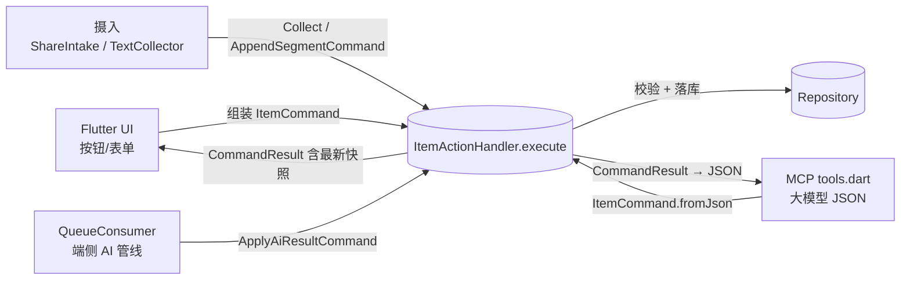

# Human-AI 对称性（无头架构）设计

> UI 与 AI 操作一致性的单一事实源。改动 `lib/action/`（命令 / 动作层 / 校验）前先读本文档。

## 0. 目标与试金石

把 App 变成**无头（Headless）系统**：UI 和 AI 只是它的两个**平等客户端**，二者之间不存在「只有 UI 才懂」的逻辑。

**试金石（每次动到写路径都拿来问自己）**：假设明天把整个 Flutter UI 删掉，只保留后台逻辑，接一个微信机器人（纯文字聊天控制）。如果**不需要修改任何一行核心业务代码**，只写一个「解析微信消息 → 组装 `ItemCommand` → 调 `ItemActionHandler.execute`」的外壳就能完美运行且不产生脏数据——设计就达标了。

今天可以自测的三条：

1. 核心层有没有任何 `if (isFromUi)` 式分支？（有即不合格）
2. 新增一个客户端，是否需要复制一份校验逻辑？（需要即不合格）
3. AI 能否调用一个「UI 上被置灰」的动作并成功？（能即不合格）

## 1. 分层与数据流

`ItemActionHandler` 是**唯一写入口**。三个客户端的差异只剩两点：

- **入参怎么来**：UI 组装对象 / MCP 反序列化 JSON / 管线构造产出；
- **主体是谁**（`CommandActor`）：决定越权边界，**由传输层注入，不由命令载荷携带**。

## 2. 四项增强（落地状态）

### §1 命令模式：统一入参

- 落点：`lib/action/commands.dart`（`ItemCommand` sealed 家族 + `CommandResult` + `ActionException`）
- 动作层只接收命令对象，不再有零散可选命名参数（`edit(id, title:, tldr:, ...)` 已废弃）
- `ItemCommand.fromJson` 是 AI 侧唯一入口；`toJson` 供日志/回放/未来的聊天机器人外壳复用
- 命令字：`update` `delete` `set_vault` `reclassify` `reprocess` `unlock_edit` `restore` `delete_forever` `collect` `append_segment` `apply_ai_result`
- **摄入路径同样命令化**（2026-09-28 补齐）：`ShareIntake`（分享附件/文本）与 `TextCollector`（分散/合并模式）不再直连 `Repository`，一律经 `CollectCommand` / `AppendSegmentCommand`。此前「人类连续速记能自动并链、AI 却不能」是不对称缺口，现已补齐——MCP `append_segment` 与手机端受**同一套**模式/窗口约束。

### §2 防呆下沉：领域规则只在动作层

UI 把按钮置灰只是**快路径**，不是安全边界——AI 是瞎子，看不到按钮灰没灰。

动作层内拦截的规则：

| 规则 | 位置 | 被拒时的 code |
|---|---|---|
| 条目可见性（Vault / 已删） | `_require` | `not_found` |
| 编辑锁 `edit_locked=1` | `_update` | `edit_locked` |
| 重分类白名单（image→chatlog/document） | `_reclassifyError` | `reclassify_denied` |
| machine_json 领域 Schema | `validateMachineJson` | `schema_invalid` |
| 移出保险箱需 UI 主体 | `_setVault` | `forbidden` |
| 彻底删除 / 管线回写 的主体门控 | `_gate` | `forbidden` |
| collect 必须有正文或附件 | `_collect` | `invalid_request` |
| 追加段：必须 merge 模式 + 末段在窗口内 + 非空 | `_append` | `invalid_request` |

> **合并条目 `edit_locked=1` 仍允许 `append_segment`**：追加是链的持续生长，不等同于改写已有内容——这是显式领域豁免，不是绕过校验。

**本轮修掉的真实越权缺口**（此前规则写在 MCP 层，换个入口即可绕过）：

- `set_vault(on=false)` 的「AI 不可移出」原先只在 `tools.dart` 判断 → 现下沉到 `_setVault`
- `add_item` 的「content 非空」原先只在 `tools.dart` 判断 → 现下沉到 `_collect`
- `applyAiResult` 原先任何调用方都能用、且不受 `edit_locked` 约束 → 现门控为 `pipeline` 独享

**主体 × 命令矩阵**：

| 命令 | ui | ai | pipeline |
|---|---|---|---|
| update / delete / reprocess / unlock_edit / collect / append_segment / restore / set_vault(on) | ✓ | ✓ | — |
| set_vault(off) 移出保险箱 | ✓ | ✗ 需生物识别 | — |
| delete_forever 彻底删除 | ✓ | ✗ 不可逆 | — |
| apply_ai_result 管线回写 | ✗ | ✗ | ✓ 独享重分类特权 |

> 为什么 `pipeline` 能看见 Vault 条目：端侧管线本机运行、不属于对外暴露面；否则 Vault 条目入队后必然死信。

### §3 状态可见性：写后必回最新快照

- 所有命令返回 `CommandResult`，携带落库后的**最新条目快照**（`itemToJson`）
- MCP 写工具（`update_item`/`delete_item`/`set_vault`/`reprocess_item`/`unlock_edit`/`add_item`/`batch_items`）一律回传该快照
- 快照序列化与 `get_item` 共用 `itemToJson`——AI 上下文里只有**一种** item 形状
- **隐私边界**：条目移出可见域（如 AI 把它移入保险箱）后 `item` 为 `null`，不回传内容

这样大模型的短期记忆（Context）与数据库真实状态对齐，下一步不会基于旧数据胡言乱语。

### §4 原子性：复合操作全成功或全回滚

- `ItemActionHandler.executeAll(List<ItemCommand>)` 走 `Repository.transaction`，一条失败整批回滚
- MCP 暴露 `batch_items`（`commands[]`，1–20 条），供大模型一次发出「解锁 + 改字 + 打标签」
- UI 复杂表单走同一接口，不做第二条实现
- **不可逆命令禁止进批量**：`delete_forever` 会删附件文件，文件删除不随 SQLite 事务回滚

## 3. 错误契约（AI 自我纠正的关键）

`ActionException{ message, code, hint }`：

- UI：catch 后弹 SnackBar（只用 `message`）
- MCP：`tools.dart::_guarded` 转 JSON-RPC `error.data = {code, hint}`

大模型读到 `edit_locked` + `hint: 先执行 unlock_edit(...)` 就能自我纠正，而不是撞墙后乱猜。

## 4. 并发防护（抹平「人类串行」与「AI 并发」的物理差异）

人类受限于操作速度是**串行单步**的；大模型基于规划，天生**并发 + 组合拳**。两套机制各管一个时间尺度，**缺一不可**：

| 机制 | 时间尺度 | 防的是什么 |
|---|---|---|
| **FIFO 串行锁** | 毫秒级 | 并发请求在 `await` 处交错 →「基于过期快照做校验」+「后写覆盖先写」（TOCTOU） |
| **乐观锁 `version`** | 秒～分钟级 | 人类打开编辑器慢慢打字期间 AI 改了条目，人类保存时**静默覆盖**（无报错、无痕迹，最难发现的一类脏数据） |

> 关键认知：串行锁**挡不住**长窗口覆盖——人类 10 秒前读的快照，与"当前是否有别人在写"无关。这两件事必须两套机制分别解决。

### 4.1 FIFO 串行锁

- 落点：`Repository.synchronized`；**零依赖**（Future 链，不引 `pool` / `synchronized` 包）
- sqflite 只保证**单条 SQL** 原子，保证不了动作层 `_require`(读) → 校验 → 写 这个跨 `await` 的复合操作
- **锁必须挂在所有客户端共享的对象上（`Repository`）**——放在 `ItemActionHandler` 上会**失效**：MCP 每次调用都 `new ItemActionHandler(repo)`，实例锁各锁各的
- 只包**写路径**；**读查询不得入队**，否则 MCP 写会阻塞 UI 列表刷新
- 锁内禁止重活（大文件 IO / 网络），否则堵死全局写队列
- 已在批量事务中时不再排队（`txn != null` 直接派发），避免自锁
- 已由单测守卫：摘掉锁后「并发追加」用例立刻由 2 段掉到 1 段（证实竞态真实存在）

### 4.2 乐观锁（version）

- `inbox_items.version`（schema v5，幂等 ALTER 迁移，存量行取 0）：**任何写 +1**
- 命令携带**可选** `expectedVersion`：非空即 CAS（`UPDATE … WHERE id=? AND version=?`，影响 0 行 = 冲突）
- 冲突抛 `ActionException(code: version_conflict, hint: 重新读取取最新 version 再重试)`
- `CommandResult` 与 `get_item` 均回传最新 `version`，AI 下一步带上即可
- **不带 = 不校验**：既有调用零改动，按场景渐进接入
- 例外：`delete_forever` 不做 CAS（行都删了，版本语义无意义）；`restore` 只递增不校验

### 4.3 耗时路径 Job 化

大模型规划的长路径（抓取网页 → 解析 Markdown → 提取摘要）可能长达十秒以上，做成同步 Action 会导致 MCP 超时、UI 假死。

- 做法：动作层只把 Job 插入 `ai_task_queue` 并**立即返回**（`CommandResult` 带 `job_id`），由 `QueueConsumer` 后台跑并更新状态（`pending → processing → completed/failed`）；UI 经仓库通知 / `pendingCount()` 显示进度，AI 按 `job_id` 查状态
- **耗时推理绝不能在 `Repository.synchronized` 锁内 `await`**——会堵死全局写队列
- 现状：`ai_task_queue` + `QueueConsumer` 底座已在；**仍缺**「`job_id` 回传 + `get_job_status` 查询工具」，待有真实长任务场景再补，不提前建框架

### 4.4 责任边界

谁后提交谁撞冲突，责任清晰：人类 → UI 提示「数据已刷新，请确认」；AI → 收到 `version_conflict` 后重新读取最新状态再决策（而不是硬写覆盖）。

## 5. 已知边界

- 附件文件删除（`deleteForever`）是文件系统副作用，不随事务回滚——故禁止混入批量
- FIFO 串行锁是**单 isolate 内**的进程级机制：本项目所有 DB 访问都在主 isolate（当年刻意没把 `QueueConsumer` 搬进后台 isolate 就是为避免 sqflite 双写竞争），故有效；**若将来引入跨 isolate 写库，需另加跨进程锁**
- 乐观锁只在"发起方主动携带 `expectedVersion`"时生效；不带的写入仍会无条件覆盖——**长窗口编辑入口必须显式带上**（见规范 skill 自查清单）
- 事务内不 `notifyListeners`，提交后统一广播一次（避免 UI 抖动）
- `Repository.transaction` 内的读写必须走传入的 `txn`，否则读不到同一事务里上一条命令的未提交改动（如「先解锁再编辑」）
