# AI 写回可逆与用户接管设计稿

> 状态：**active**——设计已收敛并拍板（2026-10-04），经多轮严格推演补强（去除 `pre_restore` 冗余、移除 `[接受]`、Settle 计时器竞态、Diff 只读、Undo 折损声明），**已实现**（Phase 1 数据层 / Phase 2 状态机 / Phase 3 UI，2026-10-04）。落点见 §12。
>
> 本稿承接 [rich-text-gfm.md](rich-text-gfm.md) 的「AI 写入三层处理链」：那稿解决「AI 写回**内容不丢、无残壳」，**本稿解决「AI 写回后**用户能否无焦虑地撤销 / 找回 / 接管」**。两稿互补，前者管写入质量，后者管写入后的可控性。

## 1. 背景与痛点

`apply_ai_result`（`lib/action/item_action_handler.dart:833`）当前是**直接覆盖** `human_md`，只靠 `version` 字段做乐观锁防并发，**不保留「AI 动笔前的人类原文」任何快照**。后果：

- **跨写回的旧 `human_md` 不可还原**：一旦 AI 写回落库，被替换的人类原文永久丢失（整机云备份 `backup_service` 粒度太粗，非按写回撤销）。
- **用户失控感**：笔记类应用中，AI 介入时用户的核心痛点是「怕丢内容、怕被覆盖」。缺乏可逆机制会抑制用户使用 AI。

设计目标：**用最轻代价，让用户能一键还原到「AI 动笔前」、并能安心地手动接管，绝不弹窗打断写作流。**

## 2. 核心原则（拍板）

1. **方案选型 = 单基线快照（方案 A）**。否决全版本历史（B，过度）、事件溯源（C，架构过重）、纯云备份（D，粒度错）。方案 A 以「每篇 1 份确认基线」的轻量存储，精准命中「还原到 AI 动笔前」。
2. **人类接管即闭环（User Takeover）**。用户一旦手动改字，即视为「我自己来」，本次 AI 会话自然结束——立即退场、收起悬浮条、作废会话内切换态。
3. **打字绝不弹窗，退场果断；恢复走历史，静默可追溯**。任何在用户输入时弹出的「是否保留 AI」确认框都是 UX 灾难（打断心流、不信任用户决定、制造认知疲劳）。恢复能力靠**非阻断留痕**提供，而非阻断式对话框。

## 3. 架构三件套

| 组件 | 角色 | 生命周期 |
|---|---|---|
| `human_md_baseline`（列） | **锚点**：AI 动笔前的人类文本，用于一键还原 | `auto首捕` 仅在为空时写入；会话关闭（接管/Settle）置 `null` |
| `doc_meta_json.ai_session_state`（枚举） | **会话态标记**：`idle`/`pending`/`restored`，仅一个短串，**绝不存文本** | 随状态翻转更新 |
| `ai_revisions`（有界日志表） | **持久后路 + 恢复源**：每次 AI 写回追加一条快照；`RESTORED` 态点 `[恢复 AI 改动]` 时直接 `SELECT snapshot ... ORDER BY ts DESC LIMIT 1` 取最新 AI 版（本地 <1ms），无需在 Meta 冗余存长文本 | 追加写入；有界保留（最近 N 条或 TTL） |

### 3.1 关键不变量

> **`human_md_baseline` 非空 ⟺ 存在一个未关闭的 AI 会话。**

由此推导：
- `auto首捕` 只在 `baseline` 为空时触发（锚住「当时的人类文本」），保证「还原」永远回到「上次 AI 动笔前」。
- **会话关闭（接管 / Settle）统一动作：将 `baseline` 置 `null`**（而非把基线重锚到 AI 版）。重锚会导致下次 `auto首捕` 因非空而不触发，使「还原」跳回旧 AI 版而非真正的「动笔前」——这是早期方案的错误，已纠正。原 `[接受]` 按钮已移除（见 §7），用户满意时靠「继续打字接管」或「关文档 Settle」自然闭环。

### 3.2 为何不在 Meta 冗余存 AI 版（废弃 `pre_restore`）

早期方案曾在 `doc_meta_json` 增 `pre_restore` 字段暂存 AI 版，但 `ai_revisions` 日志表**已 100% 包含该数据**（每次写回都 append）。`meta_json` 会在文档列表页（Home）被批量反序列化，若一篇 5 万字笔记把全文塞进 `pre_restore`，将引发严重内存膨胀与列表卡顿。故**废弃 `pre_restore` 字段**：`RESTORED` 态的恢复源改为实时查 `ai_revisions` 最新条（SQLite <1ms）。Meta 中只保留极小的 `ai_session_state` 枚举串。

## 4. 状态机

```mermaid
stateDiagram-v2
    [*] --> CLOSED: 初始/普通编辑
    CLOSED --> AI_PENDING: AI 写回<br/>(auto首捕 baseline)
    AI_PENDING --> RESTORED: 用户点[还原]<br/>(取ai_revisions最新条;清空Editor Undo)
    AI_PENDING --> CLOSED: 用户手动改字(接管)
    RESTORED --> AI_PENDING: 用户点[恢复AI改动]<br/>(取ai_revisions最新条;清空Editor Undo)
    RESTORED --> CLOSED: 用户手动改字(接管)
    CLOSED --> AI_PENDING: 下次AI写回<br/>(auto首捕重新抓)
```



| 状态 | `human_md` | `baseline` | `ai_session_state` | 悬浮条按钮 |
|---|---|---|---|---|
| `AI_PENDING` | AI 版 | 旧人类文本（非空） | `pending` | 查看对比 / 还原 |
| `RESTORED` | 旧人类文本（=baseline） | 旧人类文本（非空） | `restored` | 恢复 AI 改动 |
| `CLOSED` | 当前文本 | null | `idle` | 无（普通编辑） |

> `RESTORED` 的恢复源不在 Meta，而在 `ai_revisions` 最新条（见 §3.2）。

## 5. 接管逻辑（核心边界场景）

**场景**：用户还原到原始后动手改字，若不处理，之后误点「恢复 AI 改动」会静默冲掉手动编辑。接管机制彻底关闭该风险。

`onContentChange`（编辑器 `onChanged` / 防抖保存）中，当处于 `AI_PENDING` 或 `RESTORED` 且**文本相对切换前版本确实变化**时，执行：


实现要点：
- **判定用「内容真变化」**，排除纯焦点/选区变化的空回调，避免误关会话。
- **落库延迟（settle）**：状态翻转与 `null` 提交延迟到「编辑停顿 ~1.5s 空闲」才执行。手滑多打的字符在窗口内删掉则会话毫发无损；`Ctrl+Z` 也只需恢复文本，无需重建会话态。接管判定公式与生命周期 flush 见 §8.2、§8.3。
- **非阻断**：绝不弹确认框。恢复能力交给 `ai_revisions` 历史 + Toast 软提示。
- **显式操作优先，取消 pending 计时器**：悬浮条任意按钮（`[还原]`/`[恢复 AI 改动]`）点击时，必须第一时间 `cancel()` 掉正在 pending 的 1.5s settle 计时器并阻断其落库回调；计时器回调也须以「当前实时 `ai_session_state` + `human_md`」为基准判定，绝不依赖闭包捕获的旧状态（防竞态见 §8.7）。

## 6. 数据库 Schema（提案）

```sql
-- inbox_items 新增列
ALTER TABLE inbox_items ADD COLUMN human_md_baseline TEXT NULL;

-- doc_meta_json 新增字段（原已有确认态，复用其语义；仅存极短枚举，绝不存长文本）
-- {
--   "ai_session_state": "idle"|"pending"|"restored"
-- }
-- （session_start_text 等全文快照不进 Meta，避免 §3.2 内存陷阱；改由 baseline 列 / ai_revisions 推导）

-- 新增有界日志表
CREATE TABLE ai_revisions (
  id          INTEGER PRIMARY KEY,
  doc_id      TEXT NOT NULL,
  ts          INTEGER NOT NULL,          -- 写回时间
  snapshot    TEXT NOT NULL,             -- 该次AI输出的人类文本
  source      TEXT NOT NULL,             -- 如 'ai_writeback'
  meta_json   TEXT NULL,                 -- 覆盖率/降级项/确认态等
  FOREIGN KEY (doc_id) REFERENCES inbox_items(id)
);
-- 有界保留：仅留最近 N=20 条或 30 天 TTL，避免无限增长
```

实现锚点：
- `apply_ai_result`：在**同一事务**内 `旧 human_md → human_md_baseline`（仅当为空）后，再覆盖写 `human_md`。写回中断也不丢锚。
- `onChanged`/防抖保存：接管检测（见 §5）。

## 7. UI 交互

- **AI_PENDING 悬浮条**：
  - `[查看对比]` 展开 Inline Diff（绿增/红删，对象固定 `baseline ↔ 当前 human_md`）；展开时**自动平滑滚动到首个差异段落**（Scroll to View），避免中长篇里手动翻找；悬浮条同时展示**变更概览统计**（如「新增 12 字 · 删除 3 字」），让用户不开 Diff 也能感知 AI 动作幅度。
  - `[还原]`。（注：移除 `[接受]` 按钮——用户满意时自然动作是继续打字触发接管、或关文档触发 Settle，悬浮条随之退场；显式 `[接受]` 行为上等价于「不编辑直接关闭」，属冗余。若未来客诉「满意后无仪式感确认」，可在 Roadmap 加极简 `[完成]`。）
- **RESTORED**：`[恢复 AI 改动]`（一键换回 AI 版）。
- **接管 Toast（3s 自动消失，不阻断）**：`已切换手动编辑 · 查看 AI 历史`，可点入历史。
- **历史检索面（底部 sheet）**：列出 `ai_revisions` 快照（时间戳 + 来源），支持「复制 / 打开」。这是 `ai_revisions` 的必需配套 UI（MVP 极简方案见 §9 拍板 1）。

## 8. 边界与防护 / 工程补强（实现必读）

### 8.1 基础防护表

| 场景 | 处理 |
|---|---|
| 手滑打错一字 | settle 1.5s 才落库翻转；窗口内删除/Ctrl+Z 无损 |
| 同一轮多次 AI 写回 | `auto首捕` 仅 baseline 空时触发；接管/Settle 统一置 null，下次重新抓 |
| 剪切板粘贴大段 | 同样判为接管，清空会话态，以粘贴后内容为准 |
| 样式确认范围 | **仅文本级基线**（见 §9 拍板 2）；渲染偏好属 View 层，不进 Document 数据 |

### 8.2 真内容变化判定（防手滑误触）

接管落库（settle 1.5s）时，以**进入状态时的快照**为基准判定，而非「上一次看到文本」：

```
IsTakeover = (currentText.trim() != sessionStartText.trim())
```

- `RESTORED` 态：`sessionStartText = baseline`（原始）。
- `AI_PENDING` 态：`sessionStartText =` 进入时的 AI 版 —— **直接取 `ai_revisions` 最新一条**（即刚写回的 AI 文本），无需在 Meta 存全文（避免 §3.2 的内存陷阱）。
- 用户手滑打字又删回原样 → 判定**未接管**，保留悬浮条，维持会话。
- **忽略纯空白变化**：首尾空格/换行误触不触发接管（`trim` 比较已涵盖）；光标/选区移动不产生 `onChanged`，不计入。

### 8.3 Settle 窗口期的生命周期丢失

settle 把「状态翻转 + null 提交」延迟了 1.5s，期间若 App 被杀/切后台，DB 仍停在旧 `ai_session_state`（如 `RESTORED`），重开时文本已是手改版却仍挂悬浮条 → 状态/文本 mismatch。

**补强**：在以下生命周期点**强制 Flush/Settle**（若当前文本与 `sessionStartText` 不一致，立即提交 `CLOSED` 事务；flush 须**同时落库当前文本与状态翻转**）：
- 编辑器 `dispose`；
- 路由离开 `Route.deactivate`；
- `AppLifecycleState.paused`（切后台）。

### 8.4 编辑器原生 Undo 栈脱节

【还原】/【恢复 AI】是**程序化替换** `human_md`；若用户随后按 `Cmd/Ctrl+Z`，编辑器原生 Undo 会把文本退回旧版，但状态机未捕捉 → UI 态与文本 mismatch。

**补强**：每次程序化替换文本时，**清空/重置编辑器原生 Undo 历史**（如 `undoController.clear()`，具体 API 依编辑器而定）。这同时**取代方案 3（程序化压入 undo 节点）**——跨「状态机 + 原生 Undo 栈」同步极脆弱，清空才能保证确定性（见 §9 拍板 4）。

**已知产品折损（须显式声明）**：清空 Undo 栈会一并丢弃用户在 AI 操作**之前**的原生打字历史。例：用户手打 1000 字 → AI 续写 → 点 `[还原]` 回到手写态，此时 `Cmd/Ctrl+Z` 无法撤销那 1000 字中的任何一句（Undo 栈已清）。这是「用原生 Undo 历史换取 AI 状态一致性」的不可避免 Trade-off，MVP 接受。Roadmap 优化：不 `clear()`，而是插入自定义 Undo Boundary（如 Flutter `UndoHistory` 节点），使 Undo 在 AI 替换点截断但保留此前历史——属较深基础设施改造，列入 Roadmap。

### 8.5 未闭环时的连续 AI 写回

AI 完成第一次写回进入 `AI_PENDING`，用户不【接受】也不手改，直接再次发起 AI（第二次写回）：因「`auto首捕` 仅 baseline 空时触发」，第二次写回 **不重置** `baseline`，仍是最初人类文本 → 无论几轮连续润色，【还原】永远退回最原始「人类动笔前」。各中间 AI 版由 `ai_revisions` 兜底（每次写回都追加）。

### 8.6 Diff 视图必须只读

`[查看对比]` 展开 Inline Diff 时，文本被拆成带 `<ins>`/`<del>` 着色的片段渲染；若允许在此状态下直接打字接管，覆盖保存可能把 Diff 标记语法一并写入 `human_md` 原文，污染 Markdown。

**补强**：
- Diff 视图为**只读**：进入对比即禁用编辑器输入；要接管必须先点 `[退出对比]` 回到纯 Markdown 渲染态。
- 一旦监听到键盘输入意图，立即**自动退出 Diff 渲染**（恢复纯文本 Markdown），再将该次输入作用于干净原文；推荐前者（对比时禁用编辑）以降低实现复杂度。

### 8.7 竞态：Settle 计时器 vs 显式按钮

settle 的 1.5s 计时器一旦 scheduling，若在到期前用户点击了悬浮条显式按钮，会发生冲突：
- 场景 A：`AI_PENDING` 手滑敲字（起 1.5s 倒计时）→ 0.5s 点 `[还原]`（文本换回 baseline、`RESTORED`）→ 1.5s 计时器到期，若回调盲目以旧 `sessionStartText`（AI 版）比较，会把 `RESTORED` 误判为接管，错误写入 `ai_revisions` 并置 `CLOSED`。
- 场景 B：`RESTORED` 手动改字（起计时器）→ 点 `[恢复 AI 改动]`（文本换回 AI 版、`AI_PENDING`）→ 计时器到期以旧 `sessionStartText`（baseline）比较 → 误判接管。

**补强**：显式按钮点击即刻 `cancel()` pending 计时器并标记「本次接管判定作废」；计时器回调须 re-read 当前 `ai_session_state` 与 `human_md` 实时值再判定，不依赖闭包旧值（见 §5 实现要点）。

## 9. 待确认项拍板（2026-10-04）

1. **历史检索 UI（MVP 极简）**：若 App 暂无版本历史浏览器，**不重度开发历史面板**。后端照常写 `ai_revisions`；前端仅在接管 Toast（3s）提供 `[复制上次 AI 版本]`，点击弹出**极简 BottomSheet**（仅展示刚被接管覆盖的那 1 条 AI 文本，带「复制 / 插入」）。完整历史列表留待后续版本。
2. **样式确认 = 仅文本级基线**：渲染偏好（主题/字号/衬线开关）属 View 层全局/用户偏好，非 Document 数据；除非支持单篇 YAML Frontmatter 且 AI 会改它，否则不增样式字段。
3. **`ai_revisions` 保留策略 = 双上限**：每篇最近 N=20 条 **且** 30 天 TTL。写入时顺手清理：
   `DELETE FROM ai_revisions WHERE doc_id=? AND id NOT IN (SELECT id FROM ai_revisions WHERE doc_id=? ORDER BY ts DESC LIMIT 20)`；
   应用启动全局清理 `ts < now-30d`。
4. **摒弃方案 3（程序化 undo 节点）**：采用「接管即断开 + 清空编辑器 Undo 栈」。跨系统状态同步脆弱，清空原生 Undo 确保确定性（见 §8.4）。

## 10. 未来增强（Roadmap，非 MVP）

以下增强**不进入 MVP**（保持 MVP 极简、避免范围蔓延），但需在架构上预留空间，列入产品规划：

1. **部分接受 / 选择性应用（Partial Accept）**：MVP 维持「全盘接受 / 一键还原」二元。未来可在展开的 Inline Diff 视图中，对单个 Diff 块提供 `[丢弃此改动]`，实现段落级选择性合并。当前痛点（AI 改写多段、部分不佳）已被 `ai_revisions` 的「复制 / 插入」临时缓解。
2. **多轮 AI 中间态切换**：§8.5 已保证连续写回时各中间 AI 版落入 `ai_revisions`。未来可让悬浮条在 `还原` 之外提供 `历史(N)` 切换，允许用户在同一次提示词迭代中恢复到**任意一次**中间生成版本（而非仅退回原点）。MVP 中用户可经极简 BottomSheet 的「复制 / 插入」手动取回某版，已部分覆盖。

## 12. 实现落点（2026-10-04）

| 组件 | 落点 |
|---|---|
| 数据层（Phase 1） | `human_md_baseline` 列 + `ai_revisions` 表（schema v19，`lib/data/db.dart`）；`Repository.insertAiRevision / pruneAiRevisions / latestAiRevision / listAiRevisions` |
| 写回首捕（Phase 1） | `ItemActionHandler._applyAiResult`：`auto首捕` 仅基线为空时锚定，同事务追加 AI 版快照并置 `ai_session_state=pending` |
| 会话态命令（Phase 2） | `AiSessionCommand`（`lib/action/commands.dart`）+ `ItemActionHandler._aiSession`：三态不变量全下沉，**仅 ui actor** |
| 状态机（Phase 2） | `lib/ui/ai_session.dart`：`AiSessionController`（settle 计时器 / 实时读库判定 / 生命周期 flush）+ `aiSessionPhaseOf` + `isAiTakeover` |
| 对比视图（Phase 3） | `lib/ui/ai_diff.dart`：行级 LCS + 改动行词元级（中文逐字）Inline Diff，只读、展开自动滚到首差 |
| UI（Phase 3） | 悬浮条 `AiSessionBar`（骑在详情公共操作条上）；接管 Toast 3s + `lib/ui/ai_revision_sheet.dart` 极简历史面板（复制 / 插入） |
| 编辑器（Phase 3） | `NoteComposerEditorState.replaceAll`：程序化整篇替换 + 清空撤销栈（§8.4） |

**实现期修正（回写设计）**：`apply_ai_result` 在 `guarded`（AI 删了行内媒体、正文保留原文）时**不再置 pending**——没有真正落地的 AI 改动就不该有待决会话，否则会挂出「点了还原毫无变化」的空会话，直接违反 §3.1 不变量。

**未做 / 待验**：真机验收（悬浮条显隐、还原↔恢复往返、打字 1.5s 接管 Toast、切后台 flush）；Roadmap 项（§10 部分接受 / 多轮中间态切换、§8.4 自定义 Undo Boundary 保留历史）。

## 11. 与既有机制关系

- `doc_meta_json` 已有的「确认态」字段**复用其语义**承载 `ai_session_state`，状态在 meta、内容在列，不重复造。
- 云备份 `backup_service` 是整机备份，**不替代**本稿的按写回粒度撤销。
- 归一化（`lib/doc/rich_text.dart`）保证写回文本语义不丢；本稿在其之上补「可控性」一层。
