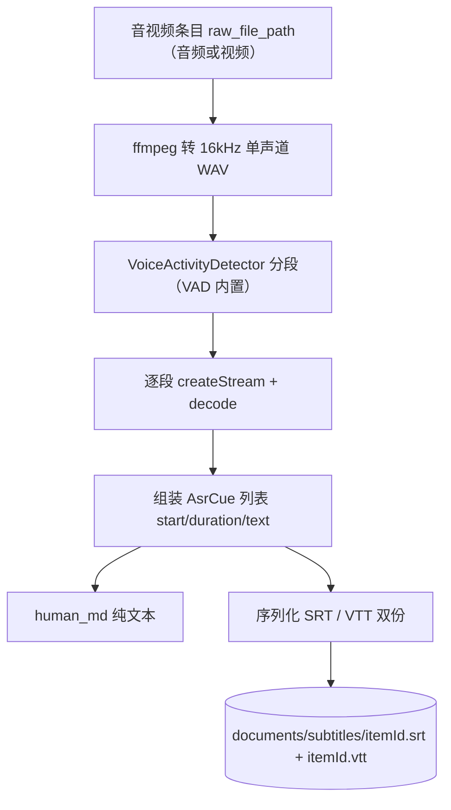
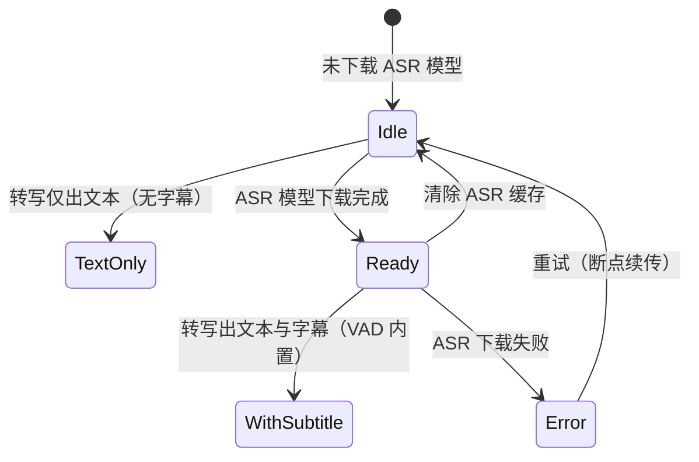
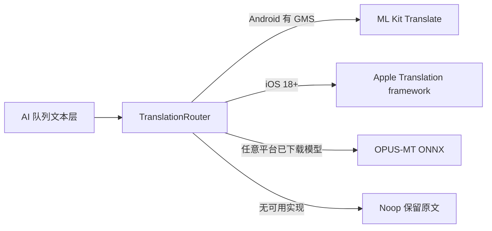

# 音频转写与字幕生成设计

> 离线音频双产物：**纯文本**（`human_md`）+ **字幕文件**（SRT / VTT 双份）。VAD 随 App 内置（assets，~2.3MB），字幕默认开启，无需下载；与 OCR 一致的「占位不卡死」策略。

## 1. 背景与现状

音频链路已于 2026-09-28 落地（`lib/ai/asr.dart`、`lib/ai/model_manager.dart`、`lib/ai/asr_reconstructor.dart`）：入库音频经队列 → ffmpeg 转 16kHz 单声道 WAV → worker isolate 跑 sherpa-onnx 识别 → 文本写入 `human_md`。该管线**只有文本产物**，没有时间轴。

时间轴不由模型自身提供：`OfflineSenseVoiceModelConfig` / `OfflineParaformerModelConfig` 无时间戳开关（`OfflineWhisperModelConfig` 虽有 `enableTokenTimestamps` / `enableSegmentTimestamps`，但官方字幕脚本并未使用）。sherpa-onnx 官方 `python-api-examples/generate-subtitles.py` 对**所有**模型族（含 Whisper）统一采用 **VAD 分段**路线——时间戳由语音段提供，即 `SpeechSegment.start / sampleRate`，与模型无关。本设计沿用该官方路线。

## 2. 能力矩阵

产物由 **ASR 模型是否已下载** 决定（VAD 已内置，字幕默认开启，不再作为独立条件）：

| ASR 模型 | 产物 |
|---|---|
| 未下载 | 占位：`raw_content` 原样入 `human_md`，无字幕 |
| 已下载 | `human_md` 文本 + `{itemId}.srt` / `{itemId}.vtt`（VAD 内置即生效） |

已生成的字幕文件在清除 ASR 模型后保留（历史产物不撤销）。

## 3. 转写流程



VAD 分段在**同一 worker isolate** 内执行：sherpa decode 是同步 FFI，不得占用主 isolate（既有约定不变）。

## 4. VAD 资源清单

| 项 | 值 |
|---|---|
| 资源 id | `silero-vad-v5` |
| 文件 | `silero_vad_v5.onnx` |
| 来源 | `csukuangfj/vad`（参考；2026-09-28 决策改为**随 App 内置 assets**，不再运行时下载） |
| 体积 | 2,313,101 B |
| 分发 | 随 App 打包（assets），字幕默认开启，无需下载 |
| 是否必选 | 内置——随包分发，字幕默认可用（不再作为可选下载项） |

同仓库另有 `silero_vad.onnx`（1,807,522 B），本期**不接入**，仅记此备查。

VAD 参数与官方脚本一致：`threshold=0.2`、`minSilenceDuration=0.25`、`minSpeechDuration=0.25`、`maxSpeechDuration=5`、`windowSize=512`、`sampleRate=16000`、`bufferSizeInSeconds=100`（Dart 侧对应 `SileroVadModelConfig` 与 `VoiceActivityDetector(config:, bufferSizeInSeconds:)`）。

## 5. 分发与门控

- VAD 改为**随 App 内置**（assets，~2.3MB），2026-09-28 决策：免去下载 / 断点续传 / 大小校验 / 清除逻辑，字幕开箱即用；
- 因此 §2「未下载 VAD」分支不再存在——只要 ASR 模型已下载，字幕即默认可用；
- ASR 三档模型仍走既有 `ModelManager` 下载通道（hf-mirror / 后续 R2），**本设计的接口不依赖具体下载通道**；
- 设置页「语音转写模型」区不再含 VAD 下载卡片，改为「VAD 已内置」状态提示。



## 6. 数据结构与文件格式

**中间态**

```dart
class AsrCue {
  final double start;    // 秒
  final double duration; // 秒
  final String text;
}
```

**序列化**

- SRT：`HH:MM:SS,mmm --> HH:MM:SS,mmm`，序号从 1 起，条目之间空行；
- VTT：首行 `WEBVTT`，时间戳用 `.mmm`，无序号；
- **SRT 与 VTT 双份生成**（2026-09-28 确认，序列化成本接近零）；
- 空结果过滤：官方脚本丢弃 `.` / `The.` 一类无信息产物，本实现同样跳过 `trim()` 后为空的 cue；
- VAD 边界处被切断的长句（`maxSpeechDuration=5s` 是硬上限）本期不合并，留作后续字幕美化项。

**存放**

- 路径：`documents/subtitles/{itemId}.srt`（`.vtt` 同名并列）；
- **不新增 items 表字段**：字幕是否存在按路径判定，详情页据此显示导出入口，避免为可选能力扩张主 schema；
- `machine_json` 不落字幕全量（体量大且无机器消费方），保持既有留空。

**字幕形态（由设置项决定，用户拍板）**

| 设置值 | 产物 | 说明 |
|---|---|---|
| `bilingual`（默认） | `{itemId}.srt` | 每条 cue 两行：原文在上、译文在下 |
| `separate` | `{itemId}.srt` + `{itemId}.{lang}.srt` | 原文与译文各一份，便于只用其二 |
| `source-only` | `{itemId}.srt` | 不做翻译 |

未启用翻译能力时行为恒等于 `source-only`：设置项可见但置灰并说明原因，不静默降级。

## 7. 代码落点

| 文件 | 改动 |
|---|---|
| `lib/ai/asr_model.dart` | 保留三档 `AsrModel`；VAD 作为内置 assets，无需远程描述 |
| `lib/ai/model_manager.dart` | VAD 不再经 ModelManager 下载；ASR 三档模型下载逻辑不变 |
| `lib/ai/asr.dart` | worker 侧走 VAD 的识别通道（返回 `List<AsrCue>`）；现有 `transcribe` 纯文本通道保持不动；入口同时接受音频与视频输入（视频经同一 `_toWav16k` 抽取音轨，见 §11） |
| `lib/ai/subtitle.dart` | 新增：`AsrCue` 定义 + SRT / VTT 双份序列化 + 写盘到 `documents/subtitles/` |
| `lib/ai/asr_reconstructor.dart` | 走带时间戳通道并落字幕文件（VAD 内置即启用）；字幕失败**不影响** `human_md` |
| `lib/pages/settings_page.dart` | 「语音转写模型」区改为「VAD 已内置」状态提示，移除下载卡片 |
| 音频/视频详情页 | 字幕文件存在时显示「导出字幕」入口，布局与 M3 规范遵循 [ui-spec.md](ui-spec.md) |

## 8. 翻译层

翻译作用于**文本层**（拿到 cue 文本之后），因此在 VAD 缺位、只有纯文本的场景下同样可用。采用与既有 `AiReconstructor` / `ReconstructorRegistry` 同构的「接口 + 按可用性路由」设计。



**契约**

```dart
abstract class TranslationEngine {
  Future<bool> get isAvailable;                                  // 平台与系统、GMS、语言包门禁
  Future<Set<String>> supportedTargets();                        // 支持的目标语种
  Future<String?> translate(String text, {required String from, required String to});
}
```

**实现与平台映射**

| 实现 | 平台 | 端侧能力 | 入口 |
|---|---|---|---|
| `MlKitTranslationEngine` | Android（需 GMS） | ML Kit Translate，约 58 语种，语言包可预下载 | `google_mlkit_translation_no_ios` |
| `AppleTranslationEngine` | iOS 18+ | Apple Translation framework（`TranslationSession`），系统托管 | Swift channel，或 `apple_native_translate` |
| `OpusMtTranslationEngine` | 跨平台兜底 | OPUS-MT int8 自管模型 | `flutter_onnxruntime` |
| `NoopTranslationEngine` | 全平台兜底 | 返回原文，**保证翻译永不卡死队列** | 内建 |

**必处理项**

- **句子级切分**：MT API 均有输入长度上限，须按中英标点拆句逐句翻译，再按 cue 回填，不得整段直灌；
- **语言码映射**：ML Kit 用 ISO-639-1（`TranslateLanguage`）、Apple 用 BCP-47，需一层统一映射表，否则 iOS 上线才暴露；
- **离线前置**：ML Kit 语言包须预下载、Apple 须系统已安装语言，设置页明示状态并给出下载指引；
- **降级**：单次翻译失败保留该句原文，整篇失败则退化为原文产物，复用 §2 的「占位不卡死」策略；**不重入队**：失败不回投 `ai_task_queue` 重试，避免阻塞队列与延迟整体产出，与「占位不卡死」一致（已确认，见 §10）。

**排除项**

OPUS-MT 退居兜底：实测 `onnx-community/opus-mt-en-zh` 的 encoder int8 为 52,875,078 B、decoder_merged int8 为 193,290,224 B，**单个语言对约 246MB**，与本项目按需轻量下载取向不符；且需自实现自回归解码与 tokenizer，第二个 ONNX Runtime 与 sherpa-onnx 自带 ORT 的重复打包风险尚未验证。

## 9. 跨平台（iOS / Android）

- **模型共用**：`.onnx` 为跨平台格式，Sherpa 三档模型与 `silero_vad_v5.onnx` 在 iOS / Android **同一份通用**，无需按平台重新导出；
- **依赖**：`sherpa_onnx_ios` 已随 `sherpa_onnx` 依赖链解析就位，iOS 构建无需追加依赖；
- **存储差异**：两平台 `path_provider` API 一致但路径不同；iOS 的 Documents 会被 iCloud 备份，数百 MB 模型应改放 `Library/Application Support` 或标记 `NSURLIsExcludedFromBackupsKey`；
- **执行窗口**：Android 由前台服务保活；iOS 无等价常驻机制，长音频转写受系统调度限制（`BGTaskScheduler` 时长受限），10 分钟超时策略需按 iOS 实际配额复核；
- **替代路线**：若要求 iOS 端「零下载」，可改用系统 Speech framework 的端侧识别（`requiresOnDeviceRecognition`，见 `docs/product/v2-requirements.md`），代价是语种覆盖窄、长音频与文件转写受限。本项目不采用。
- **接口边界（YAGNI）**：字幕生成核心——ASR 识别、VAD 分段、SRT/VTT 序列化——经 sherpa-onnx 这一**跨平台统一引擎**实现，**不按平台分流**。与 §8 翻译层不同：翻译借力系统 API（ML Kit 仅 Android / Apple Translation 仅 iOS），系统侧能力分裂才需平台分流；字幕是自托管模型、引擎本身跨平台。字幕的「平台差异」只落在上述外围工程（目录与 iCloud 备份、执行窗口、自托管下载），与引擎无关、双端通用。若未来要引入「iOS/Android 系统原生 STT」作为可选引擎，再抽 `TranscriptionEngine` 接口不迟；当前仅 sherpa-onnx 一个实现，提前抽象属过度设计。

## 10. 待定项

- [已确认] SRT 与 VTT **双份都生成**（同出接近零成本）；
- [已确认] VAD 随 App 内置 assets（~2.3MB），字幕默认开启，不再作为下载项；
- 字幕是否需要在音频详情内原文展示（本期只做导出/复制，播放同步高亮留 V2）；
- MCP 工具是否需要暴露字幕内容（`lib/mcp/tools.dart` 摘要态是否附带字幕字段）；
- [已确认] 翻译失败**不重入队**：单句失败保留原文、整篇失败退化为原文产物，不回投 `ai_task_queue` 重试，避免阻塞队列（见 §8 降级条）。

## 11. 视频字幕（复用现有转码通道，零新增）

现状已落地：`pubspec.yaml` 依赖 `ffmpeg_kit_flutter_new_min`（轻量 min 变体），`lib/ai/asr.dart._toWav16k` 已实现 `ffmpeg -i $in -ar 16000 -ac 1 -c:a pcm_s16le $out`。该命令对**视频输入同样成立**：ffmpeg 自动 demux 视频容器、取首条音频流、以 pcm_s16le 写入 WAV，视频流因 WAV 容器不支持而被丢弃。

因此视频字幕**不新增 ffmpeg 调用、不新增依赖、不新增平台分流**：

- 入口按扩展名 / MIME 判定输入为视频时，仍调用既有 `_toWav16k(videoPath, wavPath)` 得到 16kHz 单声道 WAV；
- 后续 VAD 分段 / cue 组装 / SRT·VTT 序列化（`lib/ai/subtitle.dart`）与音频字幕**完全一致**，公共模块零改动；
- 仅在 `asr.dart` 入口与详情页「导出字幕」可见性上做输入类型识别（视频条目同样展示字幕产出）。

平台结论与 §9 一致：ffmpeg min 二进制按平台分发但 Dart 调用统一，字幕引擎不分流。

注意：min 变体含常见 demux（mp4 / mkv / mov / flv / webm）与音频解码（aac / mp3 / opus / pcm），非常见封装（如 AV1+Opus 的 webm、FLAC-in-video）需在真机实测；此类边界失败按 §2「占位不卡死」降级为纯文本，不阻断。
