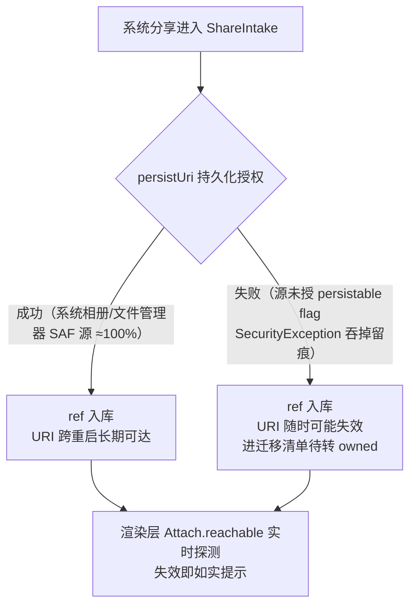

# 附件持有机制说明（attach-ownership）

> 回答两个常见问题：**App 内导入是不是移动？分享到 App 是不是临时记录？** 并说明 Android 端「引用 + 持久化授权 + 迁移兜底」的完整链路、范围拍板与 **iOS 缺口留位**。
> 策略 SSOT（为什么引用、状态机定义、提醒与快捷导入）见 [content-pipeline.md](content-pipeline.md) §6/§7；本文是**机制实施说明**，回答「现在到底怎么运作」。

## 1. 语义总表：导入 ≠ 移动，分享 ≠ 临时记录

| 入口 | 语义 | 源文件下场 | `attach_state` | 可靠性 |
|---|---|---|---|---|
| **App 内导入**（拍照/相册/文件选择器） | **复制**（`copyToAppDir` → `documents/shares/`） | 留在原处不动，App 持独立副本 | `owned`（已持有） | 永远可达，与源解耦 |
| **分享进来**（系统分享面板） | **引用**（只记源 URI，不复制） | 原件留在源 app | `ref`（引用中） | 见 §2 分支 |
| **便签行内媒体 / 拍摄 / 录音** | 自产自持 | 本就是 App 私有文件 | `owned` | 永远可达 |

- **没有「移动」语义**：App 只拿到分享源的只读授权，SAF 下无删除通道，「拷贝后删原件」技术上不可行、产品上也危险（破坏性动作不采纳，见 content-pipeline §6 硬约束）。
- **分享条目不是临时记录**：文本/标题/元数据即刻永久入库；处于「引用态」的只有**附件本体**——授权持久化成功则长期可达，失败才有失效风险，且有迁移兜底（§3）。
- 复制的固有代价是「双份文件」；大视频恰恰走引用 + 迁移，不双份。

**按类型分档（2026-10-02 拍板，SSOT：content-pipeline §6）**：

| 类型 | 转换保真 | 持有策略 |
|---|---|---|
| txt / md / 纯文本 | 无损 | 转换后释放副本（零占用） |
| 结构完整网页 HTML | 接近无损 | 释放 + 缩略图自持兜底视觉记忆 |
| **PDF** | 有损 | **一律持有 owned 作事实来源** + 抽取文本为派生视图（可重跑 reprocess） |
| 图 / 音 / 视频 | 不可文本化 | 引用 + 迁移兜底（§2/§3） |

PDF 分档的 HCI 依据：有损转换 × 释放不可逆 = 一次丢内容即信任击穿；一律持有后**零决策、零确认弹窗**；原件在 → 抽取链路升级可追溯应用到存量条目；体积有界（数百 MB 量级）无需防御性门槛。

## 2. Android 机制链路：persist 结果决定可达性

摄入时对 `content://` URI 立即尝试 `takePersistableUriPermission`（MethodChannel `goodshare/attach` → `MainActivity.persistUri`）：

要点：

- **授权失败不阻断、不崩**：异常吞为 `false` 留 `[ShareIntake] persistable grant unavailable` 日志，条目照常入库为 ref。
- **持久授权数量有系统上限**（通常 128/512 个 grant）：对收集器量级足够，暂不做淘汰管理。
- **file:// 绝对路径 / 非 content://**：无需持久化，`persistUri` 直接返回 true。

## 3. 迁移兜底：ref → owned 的一键升级

引用条目可随时转持有（复制进私有目录）：

- **动作层**：`MigrateAttachCommand`（op=`migrate_attach`）——大文件复制由 `AttachMigrationService` 在写锁**外**完成，命令内只做三道防呆（仅 ref 态可迁移 / 副本文件必须已存在 / 乐观锁 CAS）+ DB 交换（rawFilePath 换副本路径、attach_state 转 owned）。
- **数据层**：`Repository.listRefs()` 查全部 ref 态未删条目。
- **UI**：设置页「附件迁移」清单页——一键迁移全部（进度条）/ 可迁移与失效分组 / 单条失败不中断 / 完成后刷新。

失效来源条目（URI 已死）**无法被迁移拯救**，清单页如实标「原件已不可访问」——不假成功（R1）。

## 4. 范围拍板（2026-10-02）：不考虑微信/QQ 等第三方分享源

行业事实：微信/QQ 等经 FileProvider 分享只授临时读权限，persistable flag ≈ 0%，且 URI 寿命极短（进程被杀/清缓存/重启即失效）——对此类源，「迁移兜底」来不及，「失败即静默拷贝」（策略 A）才能保住文件。

**拍板：不做策略 A，不考虑微信/QQ 源。** 理由：

- 目标源是系统相册/文件管理器（SAF），persist ≈ 100% 成功，引用模式在其上完整成立；
- 策略 A 会让大视频复制双份，违背「不占用户存储」的引用模式初衷；
- 低频失败源走迁移清单页兜底即可，不为边缘源引入全量复制成本。

连带决策：persist 授权率真机验收**只验 SAF 源**，不验第三方源。

## 5. 边界与已知限制

- **存量 ref 条目**：机制上线前入库的引用条目行为不变（可达性由渲染层实时探测；失效不可救）。
- **persist 成功 ≠ 永久**：源 app 仍可撤销授权或用户删除原件——引用的本质风险保留，UI 以失效态如实呈现。
- **S3 备份不含 ref 附件**：引用原件不进备份（见 s3-backup 白名单口径），迁移为 owned 后才入备份范围。**PDF 例外**：PDF 摄入即 owned，副本进备份（事实来源随包走）。
- **iOS 不适用 persistUri**：该 channel 仅 Android 实现，iOS 调用走 `MissingPluginException` 降级留痕，不阻断。

## 6. iOS 缺口（预留，未实施）

iOS 端附件链路整体未适配（runner 已生成未改造）。与 Android 的机制差异与待落地项：

| 项 | iOS 事实 | 待落地 |
|---|---|---|
| 分享接收 | 系统分享时**已由 iOS 把文件复制进 App 沙盒**（tmp / `Documents/Inbox` 中转），不存在 `content://` 临时授权问题 | `ShareIntake` iOS 分支：把中转文件 move/copy 进 `documents/shares/`，**直接标 owned**（系统已付一次复制成本，无需二段引用） |
| 中转目录清理 | 行业规范：Inbox/tmp 属临时中转，用完即删；存储告急时系统可清空 | 摄入完成后清理 Inbox 残留（防孤儿文件） |
| persistable 授权 | **无此概念**，`goodshare/attach` channel 不需要 iOS 实现 | 无 |
| 引用模式的 iOS 等价物 | `Open in Place` + Security-Scoped Bookmark（就地打开不复制） | V2+ 评估位：若做，书签存 `attach_state=ref` 同一列，渲染/迁移链路复用；MVP 直接 owned |
| 路径稳定性 | 沙盒容器 UUID 段随升级/恢复变动 | 已由 `local://` 相对标记 + `resolveLocalMediaSrc` 动态解析规避（rich-text-media §2），iOS 落地时直接受益 |

> 实施时更新本表并同步 [content-pipeline.md](content-pipeline.md) §6/§7 与 `goodshare-index` 文档落点列。
