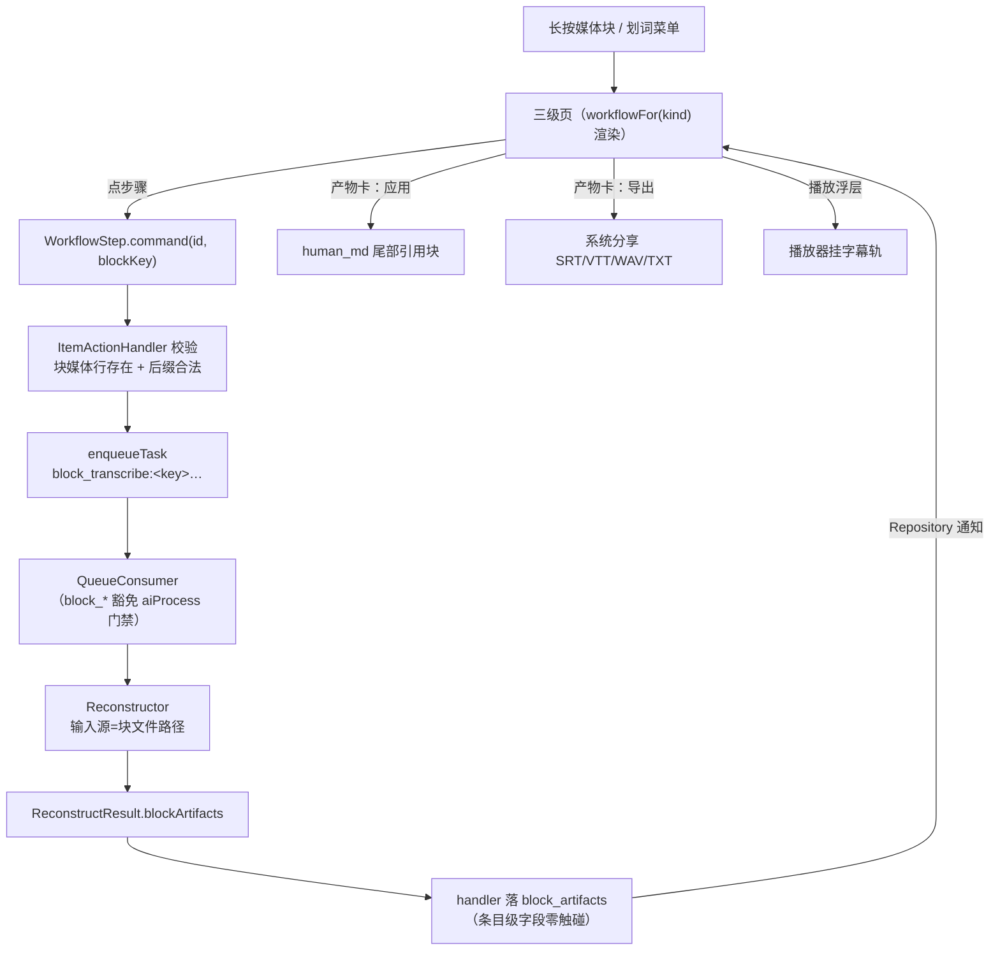

# 块附件通道与工作流式三级能力页设计

> SSOT 声明：本文档是「行内媒体块 AI 能力（块附件通道）+ 三级能力页工作流化」的**设计拍板 SSOT**。与 [detail-two-zone.md](detail-two-zone.md) 的关系：§5.3「块附件通道（预警补丁，未落地）」由本文正式落地并**取代**其过渡态接线口径（产出落条目级字段的 MVP 过渡）；detail-two-zone 的触发手势（§5.1 划词/长按）、嵌套禁令（§5.4）继续有效，冲突时本文对**能力执行与产物**部分优先。ASR/字幕机制见 [asr-subtitle.md](asr-subtitle.md)，存储口径见 [vector-embeddings.md](vector-embeddings.md)（派生数据同构先例）。

## 1. 背景与问题

### 1.1 缺陷现场（2026-10-05 用户报障）

含行内视频的混排便签（item_type=`note`）长按视频块 → 三级能力页点「转写」→ 报错「只有音频 / 视频能转写（当前类型：note）」。

根因：三级页按**块类型**出能力链（视频块 → TranscribeCapability），但 `TranscribeCommand` 在动作层校验**条目类型**（note ≠ audio/video → 拒绝）。块类型与条目类型错配，能力链对行内媒体块整体是死的——图片块 OCR、音频块转写同病。

### 1.2 为什么不是一行修掉

- **旧拍板（rich-text-media §2）**：「行内媒体是用户领地，媒体段不做 AI 处理」——因为现行回写通道只有条目级字段（human_md/translated_md），转写文本回写会**冲刷掉图文混排正文**；
- detail-two-zone §5.3 已预告解法「产出落块附件通道」，但未落地，现行接线是过渡态（`loadPersistedOutputs: () => const {}`）；
- 队列任务只有 item_id + 动作串，没有「以块内媒体文件为源」的路径通道（`rawFilePath` 恒为条目级附件）。

**结论**：这是设计缺口，用户拍板（2026-10-05）**打通块附件通道，且三级页一并重新设计**。

### 1.3 三级页现行形态的问题（用户设想驱动）

现行三级页 = 预览 + 线性链式卡 + 独立能力 chips。缺陷：

- **产物没有形态**：链式卡只展示「当前步按钮 + 累计文本」，字幕不是字幕的样子（不能导出）、音频不是能播的样子、文本不能单独预览保存；
- **链是线性的**：音频「提取文本」「提取字幕」会被摆成两步 → 两次 ASR 长任务（实际一次运行双产出）；视频「提取音频」后无法继承音频能力；
- **中断续跑是隐式机制**：页面上看不出哪些步骤已有产出。

## 2. 核心模型：块产物（Block Artifact）+ 工作流（Workflow）

### 2.1 块身份：block_key

块附件通道的首要问题是「一条 note 内多行媒体，产物归谁」。拍板：

> **block_key = 媒体行的 `local://` 相对路径**（如 `local://media/2026/10/a.mp4`）。

依据：human_md 内天然唯一（同一文件不会出现两行——作曲器每次插入新文件）；parse→serialize→parse 往返幂等已由 note_composer 保证；行内块与顶级条目可统一（顶级条目 block_key 固定为 `"item"`，见 §2.6）。

**重复引用（2026-10-05 五轮评审拍板）**：编辑态下粘贴同一路径可能出现两行同路径媒体——**合法且共享同一产物集**（同 key → 同 transcript/字幕；同一文件内容相同，不存在「同一文件需要两份不同转写」的场景，从任一行进三级页看到/编辑的是同一份产物）。**不做** `#1` 序号防重（`#` 是 URI fragment，破坏 resolveLocalMediaSrc 解析；且 key 必须与 human_md 字面逐字相等——序号化后 diff GC 失效）；**不做**重复报错（挡合法编辑态）。GC 按键集合 diff 天然正确：删一行剩一行 → key 仍在集合 → 不清；删光才清。

### 2.2 存储层：block_artifacts 独立派生表（拍板 2026-10-05）

仿 clips_json/item_embeddings 派生数据口径，**独立表**（用户拍板 JSON 附属字段 vs 独立表 → 选独立表）：

```sql
-- schema v21（db version 20 后顺延；幂等迁移。原稿 v16 为版本号误记，2026-10-05 落码时对齐实际）
CREATE TABLE block_artifacts (
  rowid INTEGER PRIMARY KEY AUTOINCREMENT,
  item_id TEXT NOT NULL,
  block_key TEXT NOT NULL,          -- 'local://…' 媒体行路径；顶级条目恒 'item'
  kind TEXT NOT NULL,               -- 产物类型，见 §2.3
  text TEXT,                        -- 文本类产物内容（transcript/translation/summary/ocr_text/subtitle_text）
  file_path TEXT,                   -- 文件类产物路径（subtitle SRT/VTT、extracted audio、exported 文件）
  meta_json TEXT,                   -- 类型化元数据（字幕 cue 数/时长/译文语言/源 block_key 等）
  created_at INTEGER NOT NULL,
  updated_at INTEGER NOT NULL,
  UNIQUE(item_id, block_key, kind)
);
CREATE INDEX idx_block_artifacts ON block_artifacts(item_id, block_key);
```

派生数据四条纪律（与 item_embeddings 完全同构）：

1. **不进 S3 备份**（备份恢复后产物丢失可重算，源媒体是事实来源）；
2. **恢复即清**（`restoreFrom` 全量替换后置空本表）；
3. **同 (item_id, block_key, kind) 重跑覆盖**（重跑 Reset 的存储侧语义，UNIQUE upsert）;
4. 删除条目（软删/硬删）级联清理本表行；
5. **孤儿 GC（编辑侧，2026-10-05 评审补）**：用户在便签里删掉一行媒体（条目还在）时，其块产物成为孤儿——`UpdateItemCommand` 生效处（handler 写 human_md）**diff 前后 block_key 集合**，被移除的媒体行静默清理对应产物行。落点在动作层而非 serialize 纯函数（纯函数不识存储层）；编辑器「移除媒体回收站」撤销恢复媒体行时产物已清，属「重算即可」可接受损失（撤销不复活产物，同 undo 不复活文件的既有边界）；
6. **按路径寻址的抗剪贴性（2026-10-05 五轮评审固化）**：block_key 是路径字符串不是行位置——剪切粘贴媒体行到新位置、前后文重排，key 集合 diff 不变，**GC 不误杀**（按路径寻址的设计红利，改按行号寻址即失效，禁止）；
7. **文件产物磁盘联动删除（2026-10-05 五轮评审补）**：`kind ∈ {subtitle, audio_file}` 且有 file_path 的产物，凡删行必删盘——Reset / 孤儿 GC / 覆盖重跑（旧文件被新文件顶替）/ 恢复即清 / 条目级联五条路径统一走 BlockArtifactStore 删除入口：**先删 DB 行，后异步删物理文件**（文件删除失败仅记日志不阻断——产物是派生缓存可重算，孤儿文件可接受；与媒体回收站「宁滞留不丢」口径相反，因为那边是用户事实数据、这边是缓存）。audio_file 体积可达数百 MB（1GB 视频音轨），磁盘联动是硬要求非优化项。

### 2.3 产物类型（kind 封闭集合）

| kind | 内容 | text | file_path | 产生步骤 |
|---|---|---|---|---|
| `transcript` | 转写文本 | ✅ | — | 转写 |
| `subtitle` | 字幕（cue 序列） | cue 纯文本（预览用） | SRT/VTT 文件 | 转写（与 transcript 同步产出） |
| `ocr_text` | OCR 文本 | ✅ | — | 识别文字 |
| `translation` | 译文 | ✅ | — | 翻译（消费 transcript/ocr_text 或 subtitle） |
| `summary` | 摘要 | ✅ | — | 摘要 |
| `audio_file` | 提取的音轨 | — | WAV/AAC 文件 | 提取音频 |

kind 是编译期封闭集合（同 BlockKind 口径：出现第五种再升级），新 kind 须同步工作流 spec 与产物卡渲染 switch。

### 2.4 队列动作串：block 前缀

队列无参数列，「单次参数编码进动作串」是既有口径（translate:/clip:/transcribe_audio: 同构）。新增（**分隔符拍板**：blockKey 含 `://` 冒号，禁用 naive `split(':')`——见下）：

```
block_transcribe:<blockKey>|<mode>|<lang>   行内块转写（一步双产物：transcript + subtitle）
block_ocr:<blockKey>                        行内图片块 OCR
block_translate:<blockKey>|<lang>|<srcKind> 块产物翻译（srcKind=transcript|ocr_text|subtitle）
block_summarize:<blockKey>                  块产物摘要
block_extract_audio:<blockKey>              行内视频块提取音轨（产 audio_file）
```

**解析规则（block 串与既有串的唯一差异）**：

- **前缀后首个 `:` 切出动作名与 payload；payload 内一律按 `|` 分段，首段恒为 blockKey**——`block_transcribe:local://media/a.mp4|sourceOnly|zh` → blockKey=`local://media/a.mp4`、mode=`sourceOnly`、lang=`zh`。blockKey 之后的参数才用 `|`，动作名与 blockKey 之间的 `:` 是唯一裸冒号；
- ⚠️ 已废弃的备选「payload 内仍按 `:` 分段、blockKey 取 join 回」不可行：`local://` 自带冒号，任何按冒号的多段切分都会拦腰截断路径（2026-10-05 评审修正，原稿「路径不含冒号」论断有误）；
- 防呆：解析出的 blockKey 必须以 `local://` 开头且不含 `|`，否则任务置 failed + note（防伪造 key 下滑到文件路径拼接）；
- 顶级媒体条目沿用现有裸动作（`transcribe_audio` 等，block_key 恒 `item`），**对外 MCP 契约零破坏**；MCP 侧新增 block 变体工具属扩展，见 §7。

### 2.5 管线：输入源与回写双分叉

`ReconstructInput` 增加 `blockKey` + `blockFilePath`（从动作串解析 + 读块媒体路径）；`ReconstructResult` 增加 `blockArtifacts: List<BlockArtifact>`（仿 `clip` 先例）：

- **输入源分叉**：`block_*` 动作 → 用块媒体路径（human_md 解析出的 `local://` 绝对化）替代 `rawFilePath`。视频块转写 = 对块文件走既有 `_toWav16k` 抽音轨链，**零新机制**；`block_extract_audio` 走 media-toolkit 既有 exportAudio 能力；
- **回写分叉**：result.blockArtifacts 非空 → handler 落 block_artifacts 表（upsert），**human_md / translated_md / summary_md 等条目级字段零触碰**（rich-text-media「行内媒体是用户领地」拍板在新通道下正式成立：不是不做，是回写到块级）；
- **一步双产物（拍板 2026-10-05）**：块转写一次 ASR 同时落 transcript + subtitle 两个 artifact（`AsrEngine.transcribeToCues` 本就一次产出文本 + cue，零额外算力）。「提取文本」「提取字幕」在工作流图上是**一个步骤的两个产物视图**，不是两个步骤；
- **双产物原子落库（2026-10-05 五轮评审补，防半态）**：一步双产物的两行（transcript + subtitle）必须**单事务全有或全无**——handler 侧先写字幕 SRT/VTT 物理文件、再单事务 upsert 两行；事务失败整任务 failed + note（R1 可重试），**不留一行成功一行缺失的半态**（半态下按产物反推续点会误判「转写已完成」→ 字幕永远缺失）。⚠️ 既有 asr_reconstructor「字幕落盘失败仅记日志继续」口径**只对条目级通道成立**，块级双产物路径必须收口为失败即整任务失败（字幕可降级为有文本无文件，但行级无半态）；
- 翻译/摘要消费块产物：动作串携带 srcKind，重建器从 block_artifacts 读源文本（无源产物 → 任务 failed + note 明说，不静默）；
- 失败/超时/占位口径不变：note 落 `ai_task_queue.last_note`，R1 同源。

### 2.6 门禁：手动即授权，MCP 不豁免（拍板 2026-10-05，评审修订）

`aiProcess` 门禁对 `block_*` 动作**按来源区分**：

- **UI 手动触发（actor=ui）豁免**：用户在块上手动点转写/OCR 本身就是显式授权（与顶级音频条目点「转写」按钮同一心智）；产出落块附件不触碰 human_md，无「冲刷人类笔记」风险（该门禁的存在理由）；
- **MCP / AI 管线发起（actor=ai / pipeline）不豁免**：大模型自主调用块能力必须满足 `aiProcess=true`，否则动作层**入队前直接拒绝**（ActionException，不走「任务 skip」路径——未授权任务根本不进队列，无「处理一半发现没授权」的空耗）。落点在动作层命令校验（actor 由传输层指定、命令载荷无法伪造，见 queue_consumer 既有红线），QueueConsumer 不区分来源，门禁零下沉；
- 拒绝 note 明说：「AI 未获「允许 AI 处理」授权，块能力调用被拒绝」。

### 2.7 顶级条目与行内块的统一

| 维度 | 顶级媒体条目 | 行内媒体块 |
|---|---|---|
| block_key | 恒 `item` | `local://…` |
| 触发 | 长按媒体区（现行） | 长按媒体块（现行） |
| 动作串 | 裸动作（不变，MCP 兼容） | `block_*` 前缀 |
| 源文件 | rawFilePath | human_md 媒体行解析 |
| 回写 | 条目级字段（现行，不变） | block_artifacts |

两态共用同一工作流 spec 与同一张三级页，页面零分叉（Host 传 blockKey，页内无 if）。

## 3. 工作流模型：spec 驱动（通用抽象，拍板 2026-10-05）

### 3.1 WorkflowSpec

把「有什么能力、什么顺序」从代码里游离的 if 升格为**按块类型的声明式 spec**：

```dart
/// 工作流步骤：消费产物 → 产出产物（DAG 表达，非线性表）
class WorkflowStep {
  final String id;                 // 'transcribe' / 'ocr' / 'translate' / …
  final String label;
  final Set<ArtifactKind> consumes;   // 依赖的源产物（空 = 以块本体为源）
  final Set<ArtifactKind> produces;   // 产出的产物（可多产物：transcribe 双产物）
  final ItemCommand Function(String itemId, String blockKey) command;
}

/// 按块类型的工作流定义（编译期封闭，页面零类型判断）
class WorkflowSpec {
  final BlockKind kind;
  final List<WorkflowStep> steps;     // 展示顺序 = 推荐执行顺序
}
const kWorkflowSpecs = [ imageSpec, audioSpec, videoSpec, textSpec ];
WorkflowSpec workflowFor(BlockKind kind) => …;
```

- **能力对象不废**：`ContentCapability.command()` 出口对接命令层的 R2 红线原样保留，WorkflowStep 是能力对象的编排视图（spec 持有 capability，不复制实现）；
- **产物 DAG 而非线性链**：步骤的 `consumes/produces` 决定可执行性——「翻译」在 transcript 或 subtitle 任一存在时即可执行（并可选源），不强制等「摘要」完成；
- `CapabilityChain` 状态机保留（步骤推进/产出/续跑语义），步骤来源从 `capabilitiesFor(kind)` 线性表换为 spec；「链指针从已有产物反推续点」（detail-two-zone §5.3）从补丁语义升格为存储查询（§3.3）。

**实现参考边界（2026-10-05 三轮评审定）**：外部评审提出的「Capability/Artifact/WorkflowContext 组合式抽象」与本 spec 概念同构（Artifact=block_artifacts、Capability=ContentCapability、组合不继承=锚点切换），可作心智参考；但**四处不得照搬**，均为本项目硬红线：

1. ❌ `Capability.execute()` 页内直跑 / `Workflow.run()` 链式 await——写必走 `ItemCommand` → 动作层 → ai_task_queue FIFO（arch 硬规则，禁止绕队列自建并发）；且 MCP 与 UI 必须同一出口（R2 对称）。WorkflowStep 只持有 `command()` 入队出口，执行由 QueueConsumer 消费、经 Repository 通知回流页面（现行 `_runCapabilityStep` 接线不变）；
2. ❌ `WorkflowStep.renderUI()` 内嵌渲染——UI 禁内联业务（分层红线）；状态归 CapabilityChain（纯状态机），渲染归 widget，经 BlockCapabilityExecutor 回调桥接；
3. ❌ `Artifact.actions[]` 数据携带操作声明——数据与视图耦合；改为视图层 `actionsFor(kind)` 静态派生（同 capabilitiesFor 口径）；
4. ❌ 预览 Sticky 悬浮（媒体固定、时间轴滚动）——竖屏挤压工作流轨；维持限高 280 + 点按全屏（2026-10-04 真机取证定稿）；
5. ❌ 页内 `WorkflowContext` 事件总线 / `ArtifactCreatedEvent` 内存广播——状态唯一事实源恒为 **block_artifacts 表 + Repository 通知**（进程被杀不丢，UI/MCP/队列页多入口读同一份）；页内事件总线会造出第二份状态源，与 DB 漂移且死即失。播放器「订阅产物更新」= 订阅 Repository 通知后查表挂载（§3.5）；
6. ❗「调度员」已存在且是全局的——`WorkflowSpec`（声明编排）+ `CapabilityChain`（页内状态）+ `ai_task_queue`/`QueueConsumer`（跨页全局串行调度），**不是**一个页内 `Workflow` 对象串联执行（外部评审的「车间调度员」比喻照搬即违 FIFO/R2）。

采纳项：统一产物卡三段式、执行中骨架屏/呼吸动效、播放器订阅产物更新（= Repository 通知驱动，§3.5 已覆盖）、分支依赖管理（= consumes/produces + srcKind 选源，§3.2 已覆盖）、**字幕→播放跳帧联动**（§3.5，四轮评审补）、**翻译选源嵌入式 segmented control**（§4，四轮评审补）。

### 3.2 三类块的工作流内容（用户设想定稿）

**图片块**（`image`）：

```
识别文字(ocr) ──→ ocr_text
翻译(translate: ocr_text) ──→ translation
摘要(summarize: ocr_text|translation) ──→ summary
每产物：预览 + 应用/导出
```

**音频块**（`audio`）：

```
转写(transcribe) ──→ transcript + subtitle（一步双产物）
翻译(translate: transcript|subtitle 二选源) ──→ translation
摘要(summarize: transcript) ──→ summary
字幕产物：导出 SRT/VTT + 播放器挂载（§3.5）
```

**视频块**（`video`）：

```
提取音频(extract_audio) ──→ audio_file
转写(transcribe: 源=块本体或 audio_file) ──→ transcript + subtitle
翻译/摘要 —— 继承音频（源可再选字幕）
audio_file 产物卡：内联播放 + 导出 + 「以此继续处理」
```

**文本块**（`text`）：**维持条目级链式卡，不迁工作流轨**（拍板 15）——划词文本是选区不是持久块，没有可挂载 `block_artifacts` 的 `block_key`（UNIQUE 三元组缺主键），且它的「应用」语义本就是回注条目字段而非插入引用块。强行迁轨要造合成 key（行号 / 文本 hash），既违反 §3.1「行号寻址禁止」，又随编辑失效让 GC 失准，收益为零。spec 中 text 类步骤 consumes=∅ produces=∅（纯视图态，命令出口仍是条目级 `TranslateCommand`/`SummarizeCommand`），`workflowFor(kind).steps` 对文本块只作**能力清单与顺序**的声明，不产物化。

### 3.3 中断续跑与 Reset（正式语义）

- 打开三级页时按 `(item_id, block_key)` 查 block_artifacts → 已有产物渲染为**完成态产物卡**，spec 中 consumes 已满足的步骤**可执行态**，其余**待解锁态**（灰显，标明缺什么）；
- 每步完成立即静默落库（拍板不变），卡片关闭/杀进程不丢重算力产出；再次长按 → 从产物反推续点续跑；
- Reset：清该 block_key 全部产物（危险二次确认 + 触觉），表行删除即归零；
- **产物唯一性（拍板 2026-10-05 评审补）**：`UNIQUE(item_id, block_key, kind)` 隐含「一种产物只存一份」——**多次翻译不同语言直接覆盖上一版 translation，不保留多语言历史**（与「重算即覆盖」的 Reset 心智一致；真要多语言并存是 kind 扩展位 `translation:<lang>` 的事，本期不做，出现第五种再升级同 kind 口径）。

### 3.4 产物的「应用 / 导出」动词体系（拍板 2026-10-05）

「保存」单动词废弃——它混叠了三件事（回注/导出/已自动保留），用户会误读「不点就丢」。拍板拆分：

| 动词 | 语义 | 去向 |
|---|---|---|
| **应用** | 回注 | 显式选目标：追加为从属块（默认，保护源媒体）/ 替换原块（仅文本块）/ 灵感区；块产物应用 = **就近插入源媒体行（block_key）正下方**（引用块形态，如 `> 📝 转写文本`——「这条文本属于这个视频」的从属关系直接可见，不追加全文尾部打断图文混排上下文，2026-10-05 评审修订） |
| **导出** | 文件输出 | subtitle → 分享 SRT/VTT；audio_file → 分享音频文件；文本产物 → 分享 .txt（轻出口复制常驻） |
| （已存） | 默认态 | 产物完成即落 block_artifacts，卡片角标「已存」——不出现「保留」动词 |

### 3.5 字幕挂播放（拍板 2026-10-05：本期做）

- 定位：**播放器行为，不是工作流步骤**——工作流页不放「用于播放」开关；
- 块级字幕产物存在时，行内视频/音频块的播放浮层自动加载 SRT 渲染字幕轨（subtitle.dart 既有解析复用）；
- **字幕→播放跳帧联动（2026-10-05 四轮评审补）**：字幕产物卡内点某句 cue → 播放浮层打开并**定位到该 cue 起点播放**（AsrCue.start 现成，播放器加初始位置参数）——「从哪句点的就从哪看」的产物回溯源媒体闭环；
- 无产物不显示任何字幕 UI（零痕迹）；重跑转写覆盖产物后下次播放生效（播放器不热更）。

### 3.6 「以此继续处理」= 锚点切换（拍板 2026-10-05）

视频 → 音频产物 → 继承音频能力的形态，受 §5.4 嵌套禁令约束（**不开新页**）：

- audio_file 产物卡内联三操作：**播放 / 导出 / 以此继续处理**；
- 点「以此继续处理」= 同一页内把工作流**锚点**切到该产物（页头来源锚点文案更新「来自：提取的音频」；spec 切换为 audioSpec，源标记 = audio_file 产物）；线性推进，返回栈深度不变；
- 锚点切换不删前步产物（视频块的原产物仍在，页头提供切回）。

## 4. 三级页重设计：结构保留只换芯（拍板 2026-10-05）

页面骨架不动（预览限高 280 + 主体 + 独立能力），**换的是主体区的渲染模型**：

```
┌──────────────────────────┐
│  预览（限高，点按全屏）      │  ← 不变
├──────────────────────────┤
│ ●── 转写      已存 ✓       │  ← 工作流轨（左侧细进度线 + 节点）
│ │   ┌ 文本产物卡 ─────────┐ │
│ │   │ 转写文本预览…       │ │  ← 产物卡：折叠摘要行，点开全文
│ │   │ [应用] [导出] [编辑] │ │
│ │   └───────────────────┘ │
│ │   ┌ 字幕产物卡 ─────────┐ │
│ │   │ 12 段 · 03:24       │ │
│ │   │ [导出 SRT] [导出 VTT]│ │
│ │   └───────────────────┘ │
│ ○── 翻译      待执行        │  ← 消费 transcript|subtitle，可执行
│ ○── 摘要      待解锁（缺源） │
├──────────────────────────┤
│ 独立能力 chips（不变）       │
└──────────────────────────┘
```

- **工作流轨**：左细进度线 + 节点圆点（完成实心 / 执行中呼吸动效 / 待解锁空心），替代现行线性链式卡的单按钮推进——每步结果就地展示为产物卡；
- **步骤展示策略（拍板 2026-10-05 三轮：全显+折叠）**：全部步骤常显于工作流轨，**未解锁步骤折叠为紧凑单行**（灰显 + 缺源标记，点开看依赖什么）；完成步骤的产物卡默认折叠摘要行。信息密度可控且能力全景可见——不采用「初始只显示第一步、瀑布流出」的渐进隐藏（与 2026-10-01「页内呈现该块全部适用能力」拍板冲突，可发现性优先）；
- **产物卡三段式（拍板 2026-10-05 三轮）**：**卡头**（类型胶囊 + 耗时 + 状态角标「已存」）/ **中部预览**（按 kind 分化：文本=全文预览可编辑、字幕=段数+时长摘要、音频=波形播放条）/ **底部操作区**（应用/导出/复制 chips，按 `actionsFor(kind)` 视图层静态派生 affordance——数据层不携带操作声明，与 capabilitiesFor 同口径）；产物生成时卡片平滑展开、chips 浮现；执行中骨架屏扫光或呼吸灯（执行中恒展开）；
  - **卡头耗时口径（拍板 15 细化）**：耗时 = **执行侧实测**（`Stopwatch` 包 `reconstruct`，合入产物 `meta_json.elapsed_ms`，不取 `updated_at - created_at`——重算只刷 updated_at，差值会掺入闲置时间）；**步骤名由轨节点行承载**（同一步的多产物共用，卡内不重复），卡头只补「耗时 + 已存」；**未记录（旧产物 / 非块通道写入）整段缺席，不编造「0s」**；耗时**不放中部摘要行**（避免与卡头重复，摘要行只留 kind 自身语义：段数 / 文件名）。
- **产物卡默认折叠**：摘要行（类型胶囊 + 首行预览 + 状态）防长页失控；正在执行的步骤恒展开；文本产物点开 = 全文预览 + 编辑（走既有 onEditOutput 三级文本页覆盖态，嵌套禁令的从属工具页豁免）；
- **美学口径**：暗色卡片 / Radii / Insets 令牌 / 类型胶囊全部复用现行 mymind 语言，不新造组件；媒体产物卡（播放条）是页面唯一重元素锚点；
- **执行中状态**：节点呼吸 + 卡内进度占位（三态硬规则），失败态卡内「重试」+ 轨尾 Reset 双入口（R1）；
- **翻译选源交互（2026-10-05 四轮评审拍板）**：翻译步骤的源选择（transcript / subtitle / ocr_text）用**卡片内嵌 segmented control**——选择与「开始翻译」同在一个操作流内完成，**不弹窗打断**（chrome 极低基线）；
- 触发手势、页头锚点文案、独立能力区、返回手势三态全部不变。

## 5. 数据流总览



## 6. 校验与防呆（下沉动作层，UI 换入口绕不过）

1. `block_*` 命令：条目存在 + human_md 中**确有该 block_key 的本地媒体行**（防伪造 key）+ blockKey 格式防呆（`local://` 前缀、不含 `|`，§2.4）+ 后缀属于该步骤允许集（转写 = 音视后缀；OCR = 图片后缀）；
2. `block_translate/summarize`：源产物（srcKind）在该 (item, block) 下**已存在非空**；
3. `block_extract_audio`：块为视频后缀 + media-toolkit 能力可用；
4. **门禁分叉（§2.6）**：`block_*` 命令 actor=ai/pipeline 时校验 `aiProcess=true`，否则 ActionException 拒绝入队（actor=ui 豁免）；
5. Vault 条目：块产物不进 FTS 索引（detail-two-zone §5.3 物理隔离口径延伸）；Vault 内块能力是否可用随 Vault 既有门禁（seeVault 一致）；
6. **入队互斥（2026-10-05 六轮评审细化）**：`block_*` 命令入队前查 `ai_task_queue`，已存在 **pending/processing** 且同 `(item_id, blockKey, 动作头)` 的任务 → ActionException 拒绝（「该块同任务已在队列，等待完成或先取消」）。互斥键用**动作头**（`:` 前段，如 `block_transcribe`）而非 kind——transcribe 一步产 transcript+subtitle 两个 kind，按 kind 匹配须展开 produces 集合，动作头等价且解析零成本；参数差异（mode/lang 不同）同样拒绝（换参数语义由取消/Reset 承载）。注：队列消费本就 FIFO 单线程串行（arch 规则 7），执行侧并发架构上不存在——本锁防的是**重复入队刷任务**（模型连发/双击 = 排队多遍 ASR 数小时空耗），不是执行并发；批量调用不同块/不同条目无需互斥；
7. **编辑 GC**：`UpdateItemCommand` 写 human_md 生效处 diff 前后 block_key 集合，移除的媒体行级联清产物（§2.2 纪律 5）。

## 7. 对外契约（MCP）与联动

- **MCP**：`get_item` 响应增 `block_artifacts` 摘要数组（block_key/kind/size，正文内联规则同字幕 256KB 帽）；**块能力工具五种**（2026-10-05 用户拍板「工具面铺开」）——`block_transcribe_item` / `block_ocr_item` / `block_translate_item` / `block_summarize_item` / `block_extract_audio_item`，逐一对应三级页的五个步骤（转写 / 识别文字 / 翻译 / 摘要 / 提取音轨），入参与块命令同名字段（`block_key` 必填，翻译另需 `source_kind`），**异步入队同 UI 入口（R2 对称）**；**现有工具行为零改动**（顶级条目走裸动作不变）。统一返回 `{status:"queued", task_id, message, …CommandResult}`（原「只开转写一种、其余经 batch_items」的收敛口径作废——对称的是同一动作层，工具面铺开让模型不必背 batch_items 的载荷格式）；
- **批量调用状态可见性（2026-10-05 六轮评审补，AI 自我抑制的软引导）**：`block_*` 工具调用即返 `{"status":"queued","task_id":…,"message":"…check artifacts later"}`（transcribe_item 既有 job_id 模式同构）；`get_item` 响应增兄弟字段 **`block_tasks`**（该条目 pending/processing 的 block 任务摘要：block_key/动作头/enqueued_at）——模型看到任务在跑即抑制重复发起。⚠️ in-progress 提示**不混入 block_artifacts 数组**（产物表保持纯数据，任务态归队列）；与 §6.6 入队互斥（硬拒绝）构成「硬锁 + 软引导」双保险；
- **FTS**：块产物文本进检索为 V2 FTS5 前置契约（detail-two-zone §5.3），本表结构已按 item_id/block_key 可查预留，FTS 落地时补索引管道；
- **备份**：block_artifacts 不进 `restoreFrom` 表清单（派生数据）；
- **机器码**：块产物不出现在 machine_json（独立通道，非三层结构字段）。

## 8. 实施排期（自底向上）

| # | 项 | 落点 | 依赖 |
|---|---|---|---|
| 1 | schema v21 迁移 + BlockArtifactStore CRUD（upsert/查询/级联清理/恢复即清/**文件产物磁盘联动删除** §2.2 纪律 7） | `lib/data/db.dart` `lib/data/block_artifacts.dart`（新） | — |
| 2 | 动作串解析（`|` 分段规则 §2.4）+ 五命令加 blockKey + 动作层校验（§6：格式防呆/门禁分叉/源产物存在） | `lib/action/commands.dart` `item_action_handler.dart` | 1 |
| 3 | `ReconstructInput.block*` / `ReconstructResult.blockArtifacts` + ASR/OCR/LLM 重建器双分叉 + 一步双产物**原子落库**（§2.5） | `lib/ai/reconstructor.dart` `asr_reconstructor.dart` `ocr_reconstructor.dart` 等 | 1,2 |
| 4 | QueueConsumer：block_* 门禁豁免（UI 来源，§2.6）+ handler 回写分叉（单事务）+ 编辑 GC（UpdateItemCommand diff 清理 + 磁盘联动，§2.2 纪律 5/7） | `lib/ai/queue_consumer.dart` `lib/action/item_action_handler.dart` | 3 |
| 5 | WorkflowSpec 模型 + 四类块 spec + CapabilityChain 改造 | `lib/ai/workflow.dart`（新）`capability.dart` | — |
| 6 | 三级页工作流轨 + 产物卡（折叠/应用/导出）+ 锚点切换 + 续跑接线 | `lib/ui/block_capability_page.dart` `block_capability_card.dart`（改造） | 1-5 |
| 7 | 播放器字幕轨挂载 | `lib/ui/media_blocks.dart` 播放浮层 | 3 |
| 8 | MCP 契约 + `test/mcp_server_test.dart` 同步 + 全量回归 | `lib/mcp/tools.dart` | 1-6 | ✅ 2026-10-05 已落：`get_item` 双字段 + `block_transcribe_item`（queued 返回）+ 测试同步 |

**验证口径**：analyze 0 / 全量测试绿 / arch-guard / docs-lint；真机侧载验收（行内视频块转写出双产物、应用不冲刷正文、字幕挂播放、提取音频锚点切换、中断续跑、Reset）。

## 9. 拍板记录（2026-10-05）

1. 打通块附件通道（不做隐藏入口/提示降级），三级页一并重新设计；
2. 存储 = **独立派生表**（非 JSON 附属字段）；
3. 块级任务**手动即授权**（豁免 aiProcess 门禁）；
4. 本期范围 = **三级页面内所有能力**（转写/OCR/翻译/摘要/提取音频）；
5. 音频「文本 vs 字幕」= **一步双产物**（不跑两遍 ASR）；
6. 视频继承音频 = **锚点切换**（同页线性推进，不开新页）；
7. 产物动词 = **应用/导出**拆分（废弃统一「保存」；已存为默认态）；
8. 字幕播放挂载**本期做**（播放器行为，非工作流步骤）；
9. 页面重设计程度 = **结构保留只换芯**（骨架不动，主体换工作流轨）；
10. 评审修订（2026-10-05 二轮）：动作串 payload `|` 分段（`local://` 冒号冲突，原「路径不含冒号」论断作废）/ 编辑侧孤儿 GC（UpdateItemCommand diff）/ 翻译产物覆盖不存多语言历史 / 应用就近插入源媒体行正下方 / MCP 不豁免 aiProcess 门禁（actor=ai 拒绝入队）；
11. 步骤展示 = **全显+折叠**（未解锁紧凑单行灰显；「瀑布渐进隐藏」与 2026-10-01「页内全部能力」拍板冲突被否）+ 产物卡**三段式**（卡头耗时/kind 分化预览/操作 chips）+ 骨架屏动效（三轮）；
12. 实现参考边界（三轮+四轮评审固化 §3.1）：页内直跑/Workflow.run、renderUI 内嵌、Artifact.actions 数据携声明、预览 Sticky、**页内 WorkflowContext 事件总线**五处不得照搬（调度员=ai_task_queue 全局串行，非页内对象）；采纳**字幕→播放跳帧联动**与**翻译选源嵌入式 segmented control**；
13. 五轮评审补：**双产物单事务原子落库**（防半态，asr 字幕容错口径仅条目级通道）；**重复媒体引用合法共享产物**（不做 `#1` 序号——`#` 破坏 URI 解析且 key≠字面致 GC 失效；不做重复报错）；**按路径寻址抗剪贴**固化（行号寻址禁止）；**文件产物磁盘联动删除**（删行必删盘，先 DB 后异步文件，缓存可重算口径）；
14a. Step 8 落码口径（2026-10-05）：①`block_tasks` **只列 active（pending/processing）**——任务态字段回答「还在跑吗」，已产出/失败态归 `block_artifacts` 与 `last_note` 两条通道，字段=`job_id/action/block_key/status/enqueued_at/note?`（带 `job_id` 便于 AI 轮询/取消，`enqueued_at` 取 `updated_at`）；②**块能力工具面铺开为五种**（2026-10-05 用户拍板）：`block_transcribe_item`（+ subtitle_mode/target_lang 覆盖）、`block_ocr_item`、`block_translate_item`（`source_kind` 必填：transcript/ocr_text/subtitle 选源）、`block_summarize_item`、`block_extract_audio_item`——与三级页五步骤一一对应，模型无需再背 `batch_items` 的载荷格式（`batch_items` 通道**保留可用**，不废弃）；工具总数 34；③五工具共用同一返回契约（抽 `tools.dart::_blockQueued`）：融合既有 `CommandResult` 与 §7 queued 语义 `{status:"queued", task_id, message, ok, op, item…}`（`transcribe_item` 的 job_id 模式同构），`message` 统一指明产出落点与「重复调用会被拒绝」；④门禁与互斥**零新增逻辑**——MCP 层只做参数序列化，AI 未授权的拒绝码 `forbidden`、重复入队 `invalid_request` 全部由动作层 §2.6/§6.6 发出（Human-AI 对称：换入口绕不过）。
14. 六轮评审（AI 批量调用防线）：**入队互斥键=动作头**（非 kind——双产物须展开 produces，动作头等价零成本；参数差异同样拒绝，换参数由取消/Reset 承载）；互斥定位=防**重复入队**非执行并发（FIFO 串行架构上已无并发，不同块/条目批量无需互斥）；**get_item 增 block_tasks 兄弟字段**（任务态不混产物数组，硬锁+软引导双保险）；**EXCLUSIVE 事务锁不采纳**（sqflite 单连接+单事务原子落库+UNIQUE 已三重覆盖，过度指定）。
15. 七轮核对收尾（2026-10-05，AI 诚实核对后补）：①**产物卡卡头耗时**（§4）——执行侧实测 `elapsed_ms` 上卡头，未记录则整段缺席；耗时从摘要行撤下防重复；卡头增「已存」角标（步骤名仍在轨节点行，卡内不重复）。②**Reset 触觉**（§3.3）补齐：二次确认后 `HapticFeedback.mediumImpact`，与「开始」的 lightImpact 分档。③**文本块不迁工作流轨**（§3.2）——选区非持久块，无 block_key 可挂 `block_artifacts`；合成 key（行号/hash）违反「行号寻址禁止」且随编辑失效。**双轨定性为终态而非过渡债**：`BlockCapabilityExecutor` 的 `onReset/loadPersistedOutputs` 空实现只服务链式卡（文本块/未注入块通道的顶级媒体区），链式卡的 Reset 语义就是「归零卡内状态、不碰条目数据」，与块通道 Reset（清表行+删盘）是两条不同链路，不必强行合一。④**动效（产物展开/chips 浮现/骨架屏）**列为打磨项，不在本批——`pumpAndSettle` 与无限动画的组合已在本仓踩过挂死坑（workflow skill「测试超时」），引入前需配有限时长的 `AnimatedSize`/`FadeTransition` 并单独验 widget 测试收敛。
