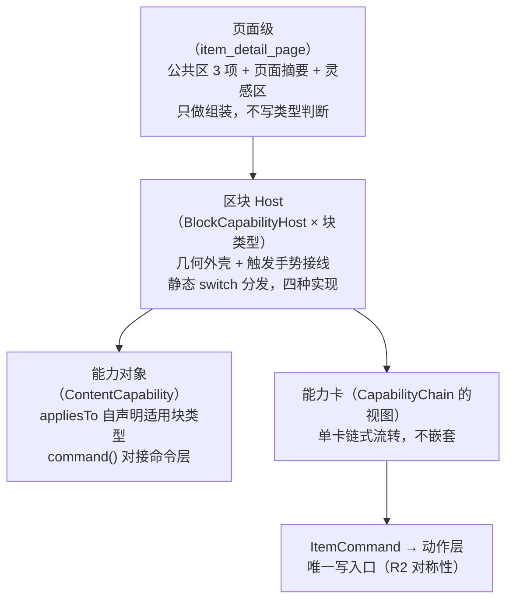

# 详情页两区改版与区块能力平台设计

> SSOT 声明：本文档是「详情页两区改版 + 区块能力分发 + 能力卡 + 分享分流」的**设计拍板与架构 SSOT**；页面层视觉口径见 [ui-spec.md](ui-spec.md) §4.3，富文本渲染见 [rich-text-component.md](rich-text-component.md)，行内媒体见 [rich-text-media.md](rich-text-media.md)。冲突时本文档对**能力架构**部分优先。

## 1. 背景与问题

混排便签（作曲器落地后）单条内容可含文字+图片+录音+视频混排，详情页面临按钮设计死结：

- **固定按钮组无法覆盖**：平铺「翻译/OCR/转写」→ 对纯文本便签 OCR/转写是死的；任何静态按钮组都无法覆盖混排内容的全部能力组合；
- **全量平铺即矩阵爆炸**：按钮矩阵违背「chrome 极低」（§2 文档形态），且大部分按钮对当前条目无效；
- **根因**：不是按钮不够多，是**锚点选错了层级**——能力应挂在区块（对象）上，而不是页面（容器）上。

## 2. 总体架构：三层各归其位



每层只认识下一层的抽象；页面彻底不出现「if 图片就 OCR」类逻辑。项目同构先例：`ItemViewTemplate`+Registry（详情模板）、`AiReconstructor`+Registry（AI 重构）——本设计为第三次同构复用，但**抽象到位、注册从简**：块类型是编译期封闭集合，四种块用静态 switch 返回 Host，不做动态 Registry（为不存在的扩展性不付架构税）。

## 3. 页面级：两区划分（已落地 ✅）

| 区 | 内容 | 状态 |
|---|---|---|
| **公共区**（底栏 3 项恒定，2026-10-01 重划） | **编辑** · 工作区 · **分享**（删除移入 ⋯ 菜单，红字 + 二次确认）；**方向感知隐显**（2026-10-01 拍板：下滑藏、上滑现、静止保持、键盘弹出隐藏——与首页顶栏同属「读模式收 chrome、找模式亮 chrome」，防误触+沉浸） | ✅ 已落地 |
| **摘要/标签区**（正文底部，命名待用户定稿） | 摘要/标签切换器（默认摘要）+ 刷新按钮 | ✅ 已落地（初版） |

- **分享按钮语义**（2026-10-01 拍板）：用户视角就叫「分享」，后台按内容分流（见 §6）；技术细节（PDF/截图）对用户隐形。多媒体原文件直分享保留 ⋯ 菜单。
- **摘要/标签区**：复用 `SummarizeCommand`/`ExtractTagsCommand` + `_AiTaskStatusLine` 状态机制；刷新 = 重复执行命令动态重生成。
- **灵感区（重新定义，2026-10-01 拍板，已落地）**：装**用户的杂乱想法**（未整理的念头、碎片），形态为**可编辑文本区**（复用速记条/作曲器 TextField 模式，编辑落库走 `UpdateItemCommand`）；与 AI 产出区分家——人的思绪（自由输入、随时改）与机器产出（生成后可改可刷新）交互模式不同，不混一个组件。空态引导「写下你的灵感…」。
- **AI 产出区平行并置（2026-10-01 拍板，已落地）**：摘要/标签不再页签互斥——形态互补（几行文字 + 一行胶囊）叠放总高很低，平行并置把切换成本降为零，各带独立刷新；**标签支持手动增删**（BottomSheet chips 编辑器，保存走 `UpdateItemCommand(tags:…)` 整表替换=用户权威快照）。**合并策略（用户拍板）**：AI 重新提取按**并集**只增不删（动作层 `applyAiResult` 实现），手动标签永不被冲掉；删除某条在编辑态完成。HCI 依据：标签是用户心智元数据，AI 提取是代劳不是权威。

## 4. 页面级摘要 = 各块产出的再摘要（Map-Reduce 语义化，未落地）

页面级摘要是**对整个页面内各区块产出的再摘要**（摘要的摘要）：

- **层级**：块级产出（OCR 文字/转写文本/块内摘要）→ 页面摘要（聚合再蒸馏）；
- **架构红利**：① 与超长文本 Phase 4 Map-Reduce 摘要（todos 已挂）同构——从性能手段升格为语义结构；② **增量更新便宜**——改一个块只重蒸「块摘要集→页面摘要」，成本从 O(全文) 降到 O(块摘要集)；③ **人工修订继承**——用户在能力卡里改过的块产出，页面摘要自动继承修订结果；
- **落地节奏**：AI 未接入前先显示「块产出聚合视图」（纯本地拼装各块已有产出）；AI 就绪后升级为真再摘要。符合「手动触发、不自动跑模型」既有口径；
- **Reduce 防抖与竞态取消（预警补丁，2026-10-01，行为契约）**：块产出落库 → 触发页面级 Reduce 必须过 **1000-2000ms Debounce 窗口**（连续修订/相邻完成不逐次重蒸）；新 Reduce 启动时**自动取消上一趟未完成的 Reduce**（同 key 竞态取消，实现层在 AI 队列消费者侧选型，设计只定行为）；当前手动刷新触发下影响小，此约束主要防 AI 就绪后自动 Reduce 态的频繁计算与 UI 闪烁。

## 5. 区块能力分发（未落地）

### 5.1 触发手势（2026-10-01 四轮拍板定稿：**按块类型分派——文本划词菜单，媒体长按**）

| 块类型 | 触发 | 处理面 |
|---|---|---|
| 文本载体块（段落/标题/列表/代码） | **划词 → 系统选字菜单里的「AI 处理本段」**（无常驻图标） | 长按语义完全留给系统选字（菜单项只追加）；点按块本体不占 |
| 媒体块（图/音/视，行内 + 顶级条目） | **长按** → 三级能力页（+触觉） | 点按块本体保留播放/预览；**无常驻图标（阅读态零 AI 图标）** |

- **改版记录**：初版「长按 → 能力清单菜单 → 卡」三跳（真机否决：菜单无资源能力 + 层级冗余）→ 二版「全部块 ✨ 常驻钮」（用户拍板单入口三级页）→ 三版「媒体长按 + 文本 ✨ 常驻」→ **四版（现行）**：用户「一行文本也会出现图标，页面大量图标」——**常驻入口的密度 = 块密度**，一篇长文 N 段就有 N 个 ✨。故文本块撤销常驻图标，入口改挂**划词后的选区菜单**：入口随选区走，先划词后触发，正文回到零图标；
- **几何桥梁 `BlockAnchorStore`（新增机制，本版唯一新增件）**：入口脱离块本体后，菜单必须知道「选区落在哪块」——`BlockCapabilityHost` 注册自身矩形（滑出视口 dispose 即注销），菜单侧 `hitTest(菜单锚点)` 反查：纵向落在块矩形内取**高度最小**者（嵌套取最内层），落在块间空隙取纵向最近块（>48dp 判未命中）；
- **不抢系统手势**：长按完全归系统选字，我们只往它的菜单里 `ContextMenuButtonItem` 追加一项；媒体块维持 `SelectionContainer.disabled` 退出选区容器（SelectionArea 会吃掉长按，真机已证）+ `HitTestBehavior.translucent` 全宽热区；
- **未命中即静默**：`hitTest` 无结果时不追加菜单项、退回纯净系统菜单——杜绝「看得见点了没反应」的死项；
- **已评估并否决的替代**：侧边贴边书签/边缘磁吸（与系统边缘返回手势抢区域、正文左右仅 20dp 留白故不「零侵入」、点击目标 24×32 反噬菲茨收益）、视口焦点块单 ✨（可发现性兜底方案，本版不做，需要时叠加同一套 `BlockAnchorStore`）；
- **媒体块长按的手势竞争解法（关键实现）**：媒体块包 `SelectionContainer.disabled` 退出选区容器——SelectionArea 会吃掉长按弹系统选字菜单（真机实测），图片/音视频非文本，退出无选择能力损失；配合 `HitTestBehavior.translucent` 整块矩形响应（全宽热区原则，矮控件不要求精准按住）；
- **顶级媒体条目同权**：整条图片/音频/视频条目的媒体区同样长按进三级页（初版缺口已补）；
- **放弃的手势备选**：能力清单菜单层（层级冗余）、装订线/边缘滑动与侧边书签（见上「已评估并否决的替代」）、全页 tap 选中态（媒体 tap=播放不可剥夺，为保播放语义不上选中态系统）；
- 触发配 `HapticFeedback.lightImpact()`（goodshare-ui 硬规则）；
- **无障碍**：选区菜单项是真实按钮节点（`ContextMenuButtonItem.label` 即语义）；媒体长按经块级 Semantics 说明；
- 心智规则：**「选中一段 → AI 处理本段；长按媒体 = 唤出这块的能力」**；
- **已知代价（用户已接受，2026-10-01）**：文本块能力需先划词才可触达，可发现性低于常驻图标；若后续数据/反馈显示触达不足，优先叠加「视口焦点块单 ✨」（复用同一 `BlockAnchorStore`），而不是复活全量常驻图标。

### 5.2 能力对象（独立于页面）

```dart
/// 用户/AI 可触达的内容能力（Human-AI 对称性：MCP 工具与 UI 按钮同源）
abstract class ContentCapability {
  String get id;                    // 'ocr' / 'translate' / 'transcribe' / 'summarize'
  List<BlockKind> get appliesTo;    // 适用块类型自声明，页面/Host 不做类型判断
  ItemCommand command(String itemId, {CapabilityInput? input}); // 命令化出口
  Future<CaptureResult> capture(...); // 有中间产出的能力（OCR 出文字）捕获
}
```

- `appliesTo` = 能力自声明，Host 只问「你适用吗」；`command()` 出口直接对接既有命令层（`OcrCommand`/`TranslateCommand`/`TranscribeCommand`/`SummarizeCommand`）——UI 按钮与 MCP 工具天然同源（R2 红线自动合规）；
- 首发能力四项（已实装命令）：翻译/OCR/转写/摘要；「朗读」等留接口不实现。
- **独立能力（2026-10-01 二次拍板：类型专属功能从二级详情页 chips 全部拆入三级能力页；2026-10-05 拍板 16 收拢）**：`StandaloneCapability` **四项**——**图片标注**/识别分类/识别条码（image；标注=全屏编辑页 `annotation_editor_page.dart`，`ImageAnnotator` 自包含宿主整体迁入，二级页内联标注双态与「标注图片」按钮随之删除——看在二级、动在三级）、切片（video/audio）——**分析文本（text）已于 2026-10-05 撤 chip**（facets=语言/实体是机器维度：MCP get_item 消费、V2 AI 分类页聚类视角；人类展示与标签重复且产出无处看，`analyze_text_item` 工具与管线保留）——**链外单发**，不走产出回注（标注型写 facets，切片为媒体工具流）；执行经执行作用域 `onRunStandalone(id)` 分发（命令入队或打开切片工具页）。⚠️ 拍板 16：原「提取音轨/字幕导出」（音频/视频）**移出**——提取音轨并入转写步骤（抽音轨是转写内部实现，音频「从音频提取」本即死项），字幕导出由字幕产物卡「导出」承载（同一能力不再双入口），故**音频无独立能力**（区整段不渲染）。命令与函数保留供 MCP/挂载点。
- **改判类型能力整体取消（2026-10-02 拍板）**：截图入库条目的「改判为聊天 / 文档·发票」这类**类型细分整体不要了**（聊天场景本就是早期没想清楚的设计）。三级页 `reclassify` 独立能力删除，二级页 `⋯` 菜单此前也已无该入口——**UI 侧不再提供任何 item_type 改判入口**。动作层 `ReclassifyCommand` 与 `_reclassifyError` 白名单（`image→document`）**保留**，仅作为 AI 管线 / MCP 通道（对外契约不变，对称性不受影响）；为之加的 `standaloneIds` 白名单机制无消费者，一并回退。

### 5.3 任务链（宿主持有，状态与 UI 分离）

```dart
/// 任务链：纯状态机，零 UI（可测试、可被 AI 复用）
class CapabilityChain {
  CapabilityChain(this.steps);          // [ocr, translate] 预编排
  int current;                          // 推进指针
  Map<String, String> outputs;          // 步骤产出（可被人工修订覆盖）
  Future<void> advance(input);          // 执行当前步 → 存产出 → 指针前移
}
```

- **链编排改版（2026-10-01 拍板）**：链 = `capabilitiesFor(kind)` **全量适用能力**按序（识别/转写 → 翻译 → 摘要），不再维护预编排子链（原 `chainFor` 的 OCR→翻译/转写→摘要两条实链已删）；
- 链状态在模型层，三级能力页 UI 只是视图（渲染当前步按钮 + outputs 产出 + 完成后「应用到正文/存附录」）；
- **中断语义（预警补丁，2026-10-01）**：链中每步 `CaptureResult` **一旦完成立即静默落库**（存块附件通道）——卡片关闭/来电挂起/App 被杀都不丢重算力产出；再次长按同块 → 链从「已有产出的下一步」**续跑**（跳过已完成步），不重复消耗算力；链指针不持久化，从「哪些步已有产出」反推续点（比存步号更抗中断）；
- **全局搜索索引（预警补丁，2026-10-01，前置契约）**：CaptureResult 落库时**同步触发本地 FTS 索引更新**——「搜图片里的字 / 录音里的话」是混排便签核心价值，块附件文字不进检索则多媒体便签搜索必然漏；⚠️ 前置依赖：FTS5 本身是 V2 独立工作项（db.dart 已预留外容表结构），本条为届时必须覆盖块产物的契约；**Vault 条目的块产物不进索引**（物理隔离口径延伸）；
- **强行重跑 Reset（预警补丁，2026-10-01）**：卡头部轻量 Reset 图标（tooltip「清除结果重新解析」）——OCR 质量差/源文件更换时，清空该块已落库 CaptureResult + 链归零，解除「续跑死锁」；清产物属危险操作，**二次确认 + 触觉反馈**；Reset 后**重新长按才触发**（清缓存≠立刻重跑，保持手动触发口径）；
- **单步失败状态流转（预警补丁，2026-10-01，R1 在链状态机上的具体化）**：步骤报错（网络中断/限流/超时）→ 指针 `current` **停在失败步不推进**；已落库的前步产出**完好不动**（续跑底座天然支持只重跑失败步）；卡内 UI 双入口——**「重试当前步」+「Reset」**，不让用户为单步报错重跑全链；失败原因进 `_AiTaskStatusLine`（`last_note`，R1 同一份状态）；
- **多链互斥=队列化，不自建并发（预警补丁，2026-10-01）**：能力链步骤全部走 `ItemCommand` → 自动进 `ai_task_queue` FIFO 串行消费（arch 硬规则 7 既有底座），端侧模型算力天然排队、无显存/CPU 争抢；**禁止绕过队列自建并行链**；后触发的新链在队列中排队（UI 状态线可见），**不静默取消前序任务**（与「完成即落库」「手动触发」语义冲突，取消由用户在状态线/队列页决定）；
- **产出回注显式，不自动写回**——卡内显式按钮决定结果去向，二级页排版保持被动可预期；
- **回注目标选项（预警补丁，2026-10-01）**：完成态「应用」带目标选择——**追加为从属块（默认，保护源媒体）** / 替换原块（仅文本块翻译/润色场景）/ 发送至灵感区（碎片信息继续加工）；旁置「复制」轻出口（不动正文顺手带走，不算回注）；
- **原始产物与人工修订双版本（预警补丁，2026-10-01）**：落库结构保留 `raw_output`（AI 原始输出）与 `user_edited_output`（人工修订）双字段——「修订不覆盖原 OCR 段」的结构化落地；卡/三级页轻量 Toggle「显示原始识别结果」，**零算力回退 + 可对比**（多数「改乱了」场景无需 Reset 重跑模型）；
- 同一 `CapabilityChain` 未来可被 MCP/AI 侧复用（对称性红利）。

### 5.4 三级能力页（单页链式工作台，2026-10-01 改版：能力卡合并入页）

- **一页 = 一个区块的一条完整能力链**（原「能力卡」BottomSheet 已并入全屏页——真机验收否决近整屏 Sheet 形态），链内步骤**纵向流转、产出原地替换**（阶段切换非层级叠加）；关闭一次即回正文；
- **不嵌套（递归页中页）**：嵌套摧毁返回栈心智、用空间嵌套表达线性流程是层级误用、遮挡上步产出毁掉修订价值。跨区块不嵌套：操作另一块 = 关当前页再点另一块，一屏一任务；
- **嵌套禁令的精确边界（预警补丁，2026-10-01）**：不嵌套 = **不叠能力链**（页中页开新链）；页内「编辑文本」弹出的三级文本页是**从属工具页**（同一链内的输入修订），以**覆盖态**打开——能力页不销毁、栈中保留，返回时产出随落库自动刷新。类比：能力页=工作台，编辑页=接水，回来工作台原样。返回手势三态口径沿用（浮层只关浮层）；
- **页头来源锚点**：「来自：图片块 / 音频条目」等——防多块连续操作后忘记在改什么；卡头 Reset 图标（tooltip「清除结果重新解析」+ 危险二次确认）；
- **资源预览**：页顶展示被长按块的渲染形态（图/音/视/文本）；音频条出播放服务作用域后降级为占位（可接受）；
- 划词菜单「AI 处理本段」/ 媒体长按进页 = 单入口；块本体手势（播放/选字）零占用。

## 6. 分享分流（未落地，2026-10-01 拍板）

点「分享」按内容复杂度自动分流，用户无感：

| 内容 | 分享产物 | 理由 |
|---|---|---|
| 纯文本/文字+图片混排（无音视频） | **离屏渲染截图 PNG** | 图片内联直接可见（社交场景打开率碾压文件）；图文混排渲染出来所见即所得 |
| 含音频/视频 | **静默导出 PDF**（文本+媒体占位信息） | 截图带不走音视频；PDF 是通用交换格式，不自造格式 |
| 媒体本体（录音/视频文件） | 正文区**导出行**的原文件直分享（`item_view_template`，如导出 WAV 后拉起分享） | 两条路都带不走媒体本体，真分享文件走这里；**不在 `⋯` 菜单**（2026-10-01 重划：菜单只留低频/危险项） |

- **截图路线 = 离屏渲染非截屏**：`RepaintBoundary`+`toImage()`（先例：annotation_export.dart），**天然贴合内容大小**——几行字出名片小图、千字文出长图整篇到底，无状态栏/底栏杂物，无截屏权限无闪屏；
- **OOM 硬阈值（预警补丁，2026-10-01）**：渲染前先量内容逻辑高度（`RenderBox.size` 零成本），**超过 8000px 等效高度（约 4-5 屏）强制降级走 PDF**——1080×15000 的 ARGB 位图即约 62MB，低端机必 OOM；内存数学是确定的，阈值不等真机调参直接定死；
- **Theme 上下文继承（预警补丁，2026-10-01，实现红线）**：离屏渲染**优先复用详情页既有的 `RepaintBoundary`**（页面上已渲染的边界，天然继承 Theme/MediaQuery/Directionality）；若须独立构建离屏组件树，**必须显式包装当前页面 `Theme` + `DefaultTextStyle` + `Directionality`**——全 App 恒暗色（ColorScheme.dark override），上下文丢失会导出白底图，属必须杜绝的事故；
- **PDF 路线**：`pdf` 包 + 内嵌中文字体 `assets/fonts/DroidSansFallbackFull.ttf`（Apache 2.0 可再分发，pdf 包内置字体无 CJK）——**已落地**（`lib/ui/pdf_export.dart`，analyze 0）；
- 渲染宽度固定设计宽度（如 1080px 等效），接收方清晰度与设备无关；
- **分享范围控制与隐私过滤（预警补丁，2026-10-01）**：分享触发渲染前拉起**轻量预览 Sheet** 勾选产物内容——[x] 正文 [x] AI 摘要 [ ] 灵感区（**默认关**：私密碎片不得无提示进分享产物）[ ] 块级附录（OCR/转写文本，默认关）；渲染范围按勾选动态组装，同时解决离屏渲染的内容范围问题。

## 7. 实现落点与排期

| 项 | 落点 | 状态 |
|---|---|---|
| 公共区 2 项常显（编辑/工作区）+ ⋯ 居中（mymind 风格升起面板，非 Material 浮层；含 分享 · 删除 · 机器码 · 保险箱 ·（条件收录）重新处理 / 重分类；横向三点；解除编辑已摘除（由底部「编辑」内含），重新处理/重分类 2026-10-05 转正回收（纠错出口；重分类同日「方向二」人工全放开——类型选择器+跨形态确认，AI 白名单留在动作层）；机器码受设置开关默认关闭；顶栏改 `SliverAppBar` 随滚动隐显） | `lib/pages/item_detail_page.dart` `_actionBar`/`_overflowBarButton`/`_OverflowSheet` | ✅ |
| 机器态入口收敛进 `⋯` 菜单（受设置「机器码」开关控制，默认关闭；开启后菜单出现「机器码」勾选项切换双态） | `item_detail_page.dart` `_toggleMachineMode` + `service/settings_store.dart` | ✅ |
| 摘要/标签切换器 + 刷新 | `item_detail_page.dart` `_inspirationSection` | ✅（待按 §3/§4 重构：灵感区独立成文本区） |
| PDF 导出 | `lib/ui/pdf_export.dart`（新文件） | ✅ |
| 分享分流（截图/PDF） | `_exportPdf` 改造 + 新增截图渲染（复用 annotation_export 机制） | ⬜ |
| `ContentCapability` 抽象 + 四能力实现（+ReinjectTarget） | `lib/ai/capability.dart` | ✅ |
| `CapabilityChain` 状态机（链=capabilitiesFor 全量，chainFor 已删） | `lib/ai/capability_chain.dart` | ✅ |
| `BlockCapabilityHost` 外壳（无常驻入口）+ 文本/媒体块统一包裹 | `lib/ui/block_capability_host.dart` | ✅ |
| 执行接线（onRunStep/onApply 真命令 + 队列落定轮询） | `item_detail_page.dart` `BlockCapabilityExecutor` | ✅ |
| 块级接线（行内文本/媒体块 + 顶级媒体条目） | `rich_text_view.dart` / `item_view_template.dart` | ✅ |
| `BlockAnchorStore` 锚点注册表 + 选区菜单「AI 处理本段」（§5.1 四版） | `lib/ui/block_capability_host.dart` + `item_detail_page._selectionMenu` | ✅ |
| 三级能力页（全屏，卡链式 UI 并入） | `lib/ui/block_capability_page.dart` + `block_capability_card.dart` | ✅ |
| 独立能力拆入三级页（拍板 16：视频=切片、音频无），二级页 `_typeActions` 删除 | `lib/ai/capability.dart` `standaloneFor` + 页 `onRunStandalone` 分发 | ✅ |
| item_type 改判 UI 入口整体取消（动作层命令保留给 AI/MCP） | `capability.dart`（reclassify 能力删除）+ `item_detail_page`（无入口） | ✅ |
| 灵感区文本区（重新定义后） | 独立组件，复用速记条 TextField 模式 | ✅ |
| 摘要/标签平行并置 + 标签手动编辑（§3 拍板） | `item_detail_page.dart` `_aiOutputSection`/`_editTags` + `_TagEditorSheet` | ✅ |
| AI 标签并集合并（只增不删，手动标签不被冲掉） | `item_action_handler.dart` `applyAiResult` | ✅ |
| 图片标注迁三级页「独立能力」 | `lib/ui/annotation_editor_page.dart` + `_imageView` 内联标注删除 | ✅ |
| 底栏方向感知隐显（下滑藏/上滑现/静止保持/键盘隐藏） | `item_detail_page.dart` `NotificationListener`+`AnimatedAlign` | ✅ |
| 页面摘要聚合视图 → AI 再摘要 | 摘要区重构 | ⬜ |

**验证口径**：analyze 0 / 全量测试绿 / arch-guard / docs-lint；真机侧载验收（划词菜单项出现与命中块正确、媒体长按、能力页流转/回注/Reset、分享产物形态）。
