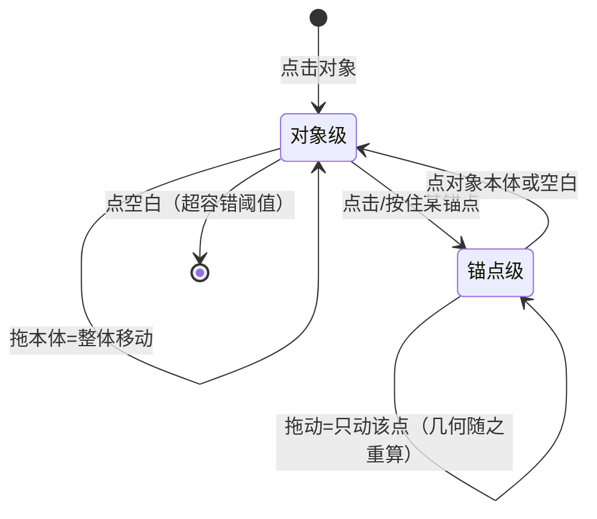

# 图片标注改版（对象化标注 + 标注列表）设计

> 标注交互全面改版：从「手指直接在图上涂画」升级为「**矢量对象操作**」。核心原则：**操作与呈现分离**——手指只承担粗定位与对象操控，精确度由结构化数据（锚点模型）与叠加层反馈（loupe/吸附/触觉）结构性提供，用户标注质量不再依赖手感。本稿拍板于 2026-10-01 交互评估系列对话；与既有 [image-annotation.md](image-annotation.md)（元数据层架构）的关系见 §8。

## 1. 设计原则（拍板汇总）

| 原则 | 内容 |
|---|---|
| 对象化 | 每个标注是**实体对象**（类型+几何+属性），可选中、可改、可删，永不烧进图片像素 |
| 画布恒定 | 图片画布**永不动**（不自动缩放/平移）；精度与确认全部走**叠加层**反馈 |
| 列表主入口 | 标注对象**单独列出**（标注列表），选中/管理在列表进行，**尽量减少对图片本体的触摸**——「数据本身代替手的精确」 |
| 画布微调台 | 画布只承担空间调整（拖锚点改位置/朝向），loupe+吸附+触觉兜底 |
| 文字不合成 | 文字标注是渲染层叠加，**永不合成进像素**；导出成图时才瞬时合成（产物为新文件，原条目数据不动） |
| 方向分工 | 图片标注**推荐横屏**（不强制）；视频操作（播放/打点/轻剪辑）竖屏优先 |

## 2. 双焦点问题的解法（操作与呈现分离的落地）

分离式操作的根本代价是视线在「操作区（手）」与「图片（结果）」之间跳跃。本节经历三轮拍板，**现行=第三轮（2026-10-04 二次拍板）**：

- **第一轮（职能分离）**：控件贴标注对象浮现 + 瞬隐纪律——理念正确但悬浮条落在画布边缘，与画布手势有摩擦；
- **第二轮（空间两区）**：预览区 + 底部操作区三件套——真机用下来画布被压小（操作区吃约 35% 高），列表常驻让低频管理占了高频画图的版面；
- **第三轮（全屏悬浮，现行）**：**画布全屏**（空间任务的图就是界面，预览面积拉满）+ **底部悬浮工具条**（工具+色板同卡，**瞬隐纪律**：手指落在画布期间悬浮件隐藏且不吃事件、抬手 120ms 渐显——由画布 `onInteractionChanged` 外报驱动）+ **列表 = 右上「标注列表 (N)」小签点按悬浮展开**（渐进披露：低频管理不常驻高频画图路径；展开态点面板外即收，translucent 屏障不挡画布手势）+ **导出收 AppBar 右上**（低频完成态动作不占画布）；
- 触觉反馈把「确认」从眼睛外包给手感（§5）。

历史评估仍成立的**否决项**（防复盘走回头路）：虚拟触控板（相对盲操适合大行程导航，标注是短行程离散操作，增益错配）；画布自动放大（画布跳动摧毁构图心智，且为防震荡/锁焦点需三条配套纪律，成本高——由 loupe 与用户双指捏合看大图替代）；环形菜单（radial menu 扇区误触风险，属性 ≤4 项用工具行更稳）。

> 工程注记：AnnotationToolbar 必须 `Wrap` 不许 `Row`——工具满排 + 遮挡/Toggle 在 331dp 逻辑宽真机上溢出出调试斜纹（2026-10-04，与详情底栏 10-01 溢出同教训）。

## 3. 工具集（首发定稿：四工具 + 一候选）

取舍依据：**复杂度线性于工具种类**（每新增一种形状 = 一套锚点模型 + 两级选择行为 + 列表行类型 + 几何 schema + 渲染分支），低频工具维护成本恒定、使用价值趋零。拾贝定位：**标注是条目的属性，不是作品**——不做通用标注平台（尺规/贴图/马赛克/放大镜强调等是专业标注产品主航道，全部不做）。

| 工具 | 几何模型（锚点最小集） | 覆盖场景 |
|---|---|---|
| 箭头 | 头点 + 尾点（两点定线：朝向/长度/指向全由两点导出） | 指向（全场景通用） |
| 圆角矩形框 | 对角两点（拖一角=对角锁定；圆角同时贴截图元素与实物圈围，替代椭圆） | 截图 UI 元素 / 文件条款 / 实物大致圈围 / **隐私遮挡（实心填充态，见下）** |
| 文字 | 框（定位锚 + 宽度把手，见 §7） | 说明 |
| 序号标记 | pin（单锚点）+ 自动递增序号 | 多点步骤指认（与标注列表天然联动，图上 ①②③ ↔ 列表行互跳） |
| 笔迹（矢量一笔） | **候选首发或 V1.5**（schema 位先留：`type: stroke, points[]`） | 实物随手圈——生活场景高频 |

**序号与身份解耦（防雪崩）**：schema **只存对象 ID**（如 `pin_8a2b`），**不存 index**——序号是渲染时按列表顺序动态计算的**视图属性**；列表文字副标题强绑定 ID，删除中间节点（如 ②）后后续 pin 自动回补重排（③→②），文字说明跟随 ID 而非索引号，图文永不错位。

**明确不做**：圆形/椭圆（圆角矩形覆盖；真椭圆锚点模型需旋转参数，复杂度不划算）；自由笔迹的**像素涂抹**形态（笔迹若做必为矢量对象存元数据）；字体/字号选择器（文字统一默认样式，跟随全局动态排版与 mymind 令牌——标注是功能性文字不是排版创作）；取色器（颜色固定色板）；贴图/马赛克/尺规/引出线家族/放大镜强调（专业标注平台功能）。

**属性（全局仅两项）**：颜色 = 固定色板 4-5 色（红/黄/绿/蓝，作用是区分标注归属，非审美表达）；线宽 = 默认单档（或细-粗三档）。撤销/删除与工具同级必备（对象化架构下撤销=删对象，成本极低）。

**隐私遮挡（Redaction）＝圆角矩形的实心填充态，不新增工具**：属性悬浮条加「空心线框 / 实心填充」Toggle（`Paint().style = PaintingStyle.fill`，成本一行）——默认空心圈重点，一键变纯色色块盖住头像/名字/金额。⚠️ **安全边界：矢量打码是「展示级遮挡」不是「数据级销毁」**——被遮像素仍在原图与 annotations 中，可删色块还原；分享**导出合成图**安全，但条目本体（原图+标注数据）经分享/MCP/未来多端同步流出时敏感信息并未抹除。涉及证件/密码级敏感内容时 UI 引导走**裁剪**（像素级真抹除），打码仅用于一般隐私遮挡。荧光笔（涂抹难精准，半透明矩形/红线可替代）与放大镜特效（做图软件的视觉魔术）不做。

**无模式化**：工具少使「先选工具再画」的模式切换可以省去——选中对象后在紧贴悬浮条切换类型（V2 可选，首发可保留轻量工具选择）。

## 4. 选择状态机（两级选择）



- **对象级选中**：显示选中框 + 全部锚点小圆点；拖对象本体/框内 = **整体移动**；
- **锚点级选中**：该锚点放大高亮、其余变暗；拖动 = **只动这个点**（箭头朝向/矩形对角/圆心半径随之重算）——「整个操作区属于这个点」；
- **层级回退单向**：锚点级 → 对象级 → 无，唯一出口是点空白/点对象本体（不做双击切换，防与拖拽误触打架）；
- **就近吸附容错**：按在对象附近但未命中时，距离阈值内吸附到最近锚点，超阈值才判定取消——两级模型的「好摸」保障；
- **视觉区分必须明显**：对象级=选中框+锚点显现；锚点级=单点放大高亮+其余变暗——用户任何时刻知道当前操作对象。

## 5. 精度栈（画布恒定前提下的叠加层反馈）

| 通道 | 形态 | 时机 |
|---|---|---|
| **放大镜（loupe）** | 手指按住锚点拖动时就近浮现被遮挡/被对准区域的放大视图（含十字准星）——**放大镜中世界，画布纹丝不动**；浮现挂在**锚点级选中**上（对象级不浮现） | 锚点级拖动全程 |
| **吸附线** | 拖锚点经过图片边缘/中心线/其他标注对齐线时显示细参考线+吸附——信息量最高的直觉反馈 | 拖动中 |
| **触觉 tick** | 正交角度（0/45/90°…）`HapticFeedback.selectionClick()`；对齐边缘/中心线用略重 `lightImpact` 区分语义——视觉显示对齐、手感确认对齐 | 拖动中 |
| 数值微显 | 锚点旁浮出小数值（45°、宽 320px） | 仅拖动中，松手即隐（可选） |

极限小目标精度兜底：用户**双指捏合看大图后再标注**（自己控制视野）+ loupe 高倍准星。

### 5.1 技术实现纪律（Flutter）

- **Loupe 用复渲染而非截屏**：`Transform.scale` + `ClipOval` 在气泡内**再渲染一遍**图层（实时截屏法在 60fps 拖拽中掉帧严重，弃用）；镜中**只渲染原图 + 当前操作标注的本体线**（不做选中态/其他标注/吸附线——200% 视野里多余图层全是噪音，且规避层级同步问题）；
- **手势排他锁（落地第一优先级）**：默认态单指=平移、双指=缩放（`InteractiveViewer`）；**选中对象/锚点后画布锁定平移**，单指拖拽仅作用于标注；点空白取消选中后解锁。命中优先级：锚点热区 > 对象本体 > 画布平移；平移采用**拖拽阈值判定**（位移 >8dp 前不锁定画布，给「按在对象上但想平移」的用户逃生口）——不处理此竞争整套 UI 不可用；
- **系统返回手势兜底（2026-10-01，ui-spec §3 无返回箭头口径的画布附属）**：画布生成/拖拽中 `PopScope canPop:false`——笔画起于屏幕边缘手势带时被系统掐断（ACTION_CANCEL），随后的返回事件解释为「取消生成模式」而非退页；边缘工具栏布局为第一层缓冲（落指点被挤离边缘），PopScope 为第二层兜底；（可选第三层：标注态对左缘 200dp 申请 gesture exclusion rects，真机验收再定）。
- **文字框几何边界**：`TextPainter` 计算动态宽高可行；几何模型写死 `minWidth`（≥2 个汉字宽），自动换行须考虑图片边缘 padding（框不得生长出图边界）；
- **导出合成（瞬时）**：`PictureRecorder` 离屏 Canvas——先画 Image，再遍历 annotations 调 `drawLine`/`drawRRect`/`TextPainter.paint`，`toImage()` 出 PNG；不受屏幕分辨率与 UI 遮挡影响，比截屏清晰；
- **渲染函数三消费方复用**：画布叠加层 / loupe 镜中 / 导出合成共用同一个纯函数（入参 canvas + annotations[] + 变换矩阵），保证所见即所得。
- **悬浮层边界碰撞检测**：loupe 默认在手指斜上方，靠近顶/左边缘自动翻转（下方/右侧）；悬浮条永远保证在 `SafeArea` 内，宁可偏离对象几像素也不超出屏幕——标注图片边缘（高频需求）时悬浮层被裁切=不可用；
- **对比度增强（渲染纪律）**：文字标注自带半透明底框或 1px 反色描边（纯色文字在斑斓底图上不可读）；箭头/框线渲染垫极淡黑色投影（Drop Shadow）——固定色板在游戏截图/风景照上会「融」进背景，靠衬底而非加色解决；
- **多对象重叠命中**：小区域密集标注时命中选 **Z 轴最上层**，再次点击同点**循环切换**到下层对象；标注列表是绕开画布歧义的**确定性通道**（点行选中精确无歧义），但列表与画布是两个独立通道，不存在「覆盖」关系。

## 6. 标注列表（主入口）

标注对象单独列出，承载「找与管」，画布只承担「调」：

```
标注列表（右上小签「标注列表 (N)」点按悬浮展开，2026-10-04 拍板）   图片画布（全屏，恒定）
├─ 点行 → 选中该标注（画布同步高亮；视口外则用户操作引发的轻滚对准）
├─ 行内：显隐 / 删除 / 改色 / 文字说明（副标题）
├─ 「调整」→ 进入锚点级编辑 → 画布拖锚点（§5 反馈栈兜底）
└─ 双向联动：图上点中对象 → 列表对应行高亮滚动到位
```

- 列表行 = 大热区，**零命中误差**（胖手指在列表侧结构性消解，与画布侧「就近吸附容错」互补）；
- **新建在画布，管理在列表（创建流二分）**：「新建标注」的动作由**长驻画布边缘的轻量工具栏**发起、在图上**拖拽生成**（箭头=起点为头/终点为尾一笔生成，两端点即头尾锚点），生成后**自动入列**（分配 ID、序号按顺序计算）——列表是标注的**目录**不是**产房**；工具栏遵守 §2 瞬隐纪律（拖拽生成过程中隐藏）。「尽量减少图上触摸」指的是减少摸索与误触，不是禁止落指；
- 列表行副标题 = 标注的文字说明，序号即行号——图上序号角标、列表行、文字说明**三位一体**；
- **防膨胀纪律**：列表做五件事（选中/删除/改样式/进入调整/**显隐**），不做搜索/折叠/分组/重排——不长成图层面板；对象数预期个位数；
- **显隐四纪律（2026-10-04 拍板，§2 视图态唯一豁免）**：①不落盘——隐藏态只活在本次编辑会话，重进页面全复显；②隐藏 = 不绘制不命中（宿主把隐藏项从传给画布的列表滤掉，渲染/命中/吸附零特判；画布回写按 id 并回全表，`mergeById` 保证隐藏项数据不被挤掉）；③防死锁出口——点隐藏行的选中/「调整」自动复显，不存在「藏了摸不着」；④导出所见即所得——合成按画布可见集走，隐藏的不进图。序号不因隐藏重排（序号是列表顺序的数据属性）。

## 7. 文字标注（元数据模型）

- **永不合成进像素**（架构唯一正解：可编辑、可备份、AI/MCP 可直接读——元数据就是最高保真的 OCR）；导出/分享成图时瞬时合成，产物为新文件；
- **输入时框随文字长**：无固定大小，宽度长到上限（图宽 ~80%）自动换行、框向下生长——用户只管打字；
- **完成后框收缩包字**：padding 内敛，框精确包住文字（「文字不超框」由系统保证）；此后拖宽度把手 = 改换行宽度（文字 reflow）；
- **字号固定不随框缩放**：拖大框是改排版宽度不是放大字，避免「框-字」比例纠缠；
- **横屏输入降级（软键盘死局）**：横屏下软键盘遮挡 70%+ 画布，「框随文字长」实时排版失效——横屏的一切文本编辑（图上文字与列表副标题）**降级为沉浸式全屏输入**（毛玻璃背景，成熟心智），确认后回图上回显排版；**竖屏保留实时排版**（键盘不遮画布）。两种形态按方向自动选择，不做「文字场景回竖屏」的规则碎片化。

## 8. 与既有 image-annotation.md 的关系

[image-annotation.md](image-annotation.md) 奠定的**元数据层架构**（annotations JSON、随条目走、进备份、Vault 口径、「有标注」角标）**全部沿用**——本稿改版的是其上的**交互层**（涂画 → 对象操作）。schema 需扩展对象化字段（`type` + 几何 + 属性，笔迹 `type: stroke, points[]` 留位），标注列表即 annotations 的具象呈现。冲突时以本文档交互口径为准、以 image-annotation.md 数据架构为准。

## 9. 方向策略与代码落点

- 图片标注态**推荐横屏**（一次性引导「横屏操作更精确」，不强制；竖屏可完整操作）；**编辑中旋转不中断不丢状态**（方向是视图属性非会话状态，布局自适应、选中状态保持）；
- 视频操作（播放/打点/[轻剪辑](video-trim.md)）竖屏优先（拇指热区覆盖控制条与 scrubber）。

| 文件 | 职责 |
|---|---|
| 标注编辑组件（新建，详情页图片区挂载） | 画布渲染层（标注叠加绘制）+ 两级选择状态机 + 横屏列表栏/竖屏抽屉 |
| annotations schema 扩展 | 对象化字段：type/head/tail（箭头）、对角点（圆角矩形）、center+r（pin 变体）、stroke points[]（笔迹留位）、color/文字内容 |
| 标注列表组件 | 四件事（选中/删除/改样式/调整入口）+ 双向联动高亮 |
| 反馈层 | loupe（快照+Positioned 悬浮）、吸附线计算、触觉 tick、数值微显 |
| 导出合成（瞬时） | 分享/导出成图时按 annotations 渲染合成新文件，原数据不动 |
| `lib/models/annotation.dart` | schema（归一化点/type/filled 实心填充态/'stroke' 读侧留位归一）+ AnnotationStore 纯文件 IO |
| `lib/models/annotation_geometry.dart`（第 1 批已建） | 锚点最小集/命中判定（hitAnchor/hitObject）/锚点重算（withAnchor）/整体平移（translated）/序号视图属性（assignPinNumbers——只存 ID 删中间自动回补）——全部纯函数 |
| `lib/render/annotation_painter.dart`（第 1 批已建） | **渲染纯函数三消费方共用**（§5.1）：画布叠加 / loupe（onlyIds 过滤只画当前操作标注）/ 导出合成同入口 `paintAnnotations` |
| `lib/ui/annotation_canvas.dart`（第 1 批已建） | 画布组件：两级选择状态机 + 手势排他锁（选中锁平移/8dp 逃生口/命中优先级 锚点>对象>画布）+ AnnotationToolbar 轻量工具栏（箭头/矩形/序号 pin 拖拽生成，tap 生成 pin） |
| `lib/ui/image_annotator.dart`（第 1 批已重写挂载） | 编辑宿主：装配画布+工具栏+调色板，持久化走 AnnotationStore——UI 只持交互态零 IO/json |

## 10. 第 1 批验收（2026-10-01 落地）

- ✅ 已落地：schema 对象化扩展（filled 实心态 + stroke 留位）+ 几何/序号纯函数 + 渲染纯函数（三消费方同一入口）+ 画布状态机与手势排他锁 + 工具栏三工具（箭头/矩形/序号）拖拽生成自动入列；`ImageAnnotator` 重写为新画布宿主（旧涂画实现 supersede）。
- 验证：analyze 0 / 全量 329 绿（新增 annotation_object_test 10 用例：schema 往返/序号防雪崩回补/命中吸附/对角锁定/离屏渲染三消费方）。
- 第 1 批**未含**（分批排期）：标注列表（第 2 批，含删除/改色/双向联动）、loupe/吸附线/触觉反馈栈（第 2 批）、文字标注与横竖屏输入降级（第 3 批）、导出合成（第 3 批）、隐私遮挡 Toggle（第 3 批，schema `filled` 位已就绪）。

## 11. 第 2 批验收（2026-10-01 落地）

- ✅ 已落地：**标注列表**（`lib/ui/annotation_list.dart`——四件事选中/删除/改色/进入调整，防膨胀纪律无搜索折叠分组；pin 行首序号角标动态算；竖屏底部抽屉形态，宿主 `ImageAnnotator` 装配 + 列表↔画布受控 `_selectedId` 双向联动）；**吸附线**（`annotation_geometry.dart` 增 `snapAnchorPoint` 边缘/中心/其他标注锚点对齐 + `snapOrthogonal` 正交八向射线修正，画布拖锚点接入，参照系排除自身）；**触觉两档**（正交=selectionClick / 对齐=lightImpact，边沿触发不随帧连发）；**loupe**（`lib/ui/annotation_loupe.dart` 复渲染法 Transform.scale+ClipOval，镜中只画原图+当前标注本体线 `onlyIds` 复用第 1 批纯函数，十字准星，贴顶/左边缘自动翻转，锚点级拖动时浮现松手即隐）。
- 验证：analyze 0 / 全量 336 绿（新增 annotation_snap_test 7 用例：边缘中心吸附/对齐参照/超容差/横竖双线/正交修正/SnapLine 语义/loupe 渲染链路回归）。
- 第 2 批**未含**（第 3 批）：文字标注与横竖屏输入降级、导出合成、隐私遮挡 Toggle（schema `filled` 位已就绪）、横屏右栏列表形态（当前仅竖屏抽屉）。

## 12. 第 3 批验收（2026-10-01 落地，改版三批全齐）

- ✅ 已落地：**隐私遮挡**（工具栏「遮挡」快捷入口=rect 实心态生成 + 选中 rect 的空心/实心 Toggle，安全边界文案见 §3——展示级遮挡非数据级销毁，涉及证件/密码级引导裁剪）；**文字标注**（工具栏「文字」工具 tap 落点生成 → 输入确认才入列（空文本不产出）；渲染走 `paintAnnotations` 既有 `_paintText`：TextPainter 动态宽高 maxWidth 0.8 图宽自动换行 + 半透明底框，单锚点可拖）；**导出合成**（`lib/render/annotation_export.dart`：PictureRecorder 离屏画原图+annotations → 走 `paintAnnotations` 同一纯函数（第三消费方兑现）→ PNG 落 `documents/annotations/export/` **新文件**，长边 2048 限边；源图与 annotations 数据不动；解码失败原样抛出不静默；宿主「导出分享」按钮经 share_plus 出系统分享，防重入转圈态）；**横屏右栏列表**（`OrientationBuilder` 方向感知：横屏 Row 画布+240dp 右栏常驻列表，竖屏保持抽屉形态不变，入口按钮随方向显隐——§9 推荐横屏不强制）。
- 验证：analyze 0 / 全量 344 绿（新增 annotation_export_test 8 用例：实心渲染出图/filled Toggle 往返/安全边界 schema 面/文字渲染/空文字防御/单锚点最小集/导出失败抛出/产物新文件且源图不动）。
- 改版收官：三批全部交付，§3-§9 拍板全量落地。遗留演进位（非第 3 批范围）：横屏沉浸式全屏文字输入（§7 横屏降级，当前通用对话框）、吸附线数值微显（§5 可选项）、笔迹工具（§3 候选，schema `stroke` 留位已备）。

## 13. 遗留演进位销项（2026-10-01，用户拍板笔迹+沉浸输入即做）

- ✅ **笔迹工具**（§3 候选 → 正式落地）：工具栏「笔迹」入口，free 类型画布拖拽**矢量一笔采点**（轨迹追加非两点替换，与上一点 <0.002 归一化重合不重复采）；命中走既有逐段线距离、锚点级=全轨迹点逐点调整、渲染走既有 drawPath 分支——schema `stroke` 留位兑现为 `free` 同模型（写侧维持 'free' 旧口径不变）。工具集至此 = 四工具 + 笔迹全齐（§3 表格全覆盖）。
- ✅ **横屏沉浸式文字输入**（§7 横屏降级完整形态）：`_askText` 方向感知两形态——竖屏键盘不遮画布走通用对话框（实时排版心智不变）；横屏软键盘遮 70%+ 画布走**全屏毛玻璃沉浸输入**（BackdropFilter blur + 大输入区，完成/取消显式双钮），确认后回图上回显排版。不做「文字场景回竖屏」的规则碎片化（§7 纪律）。
- 仍开放（低优，按需再排）：吸附数值微显（§5 标「可选」，纯增强）。
