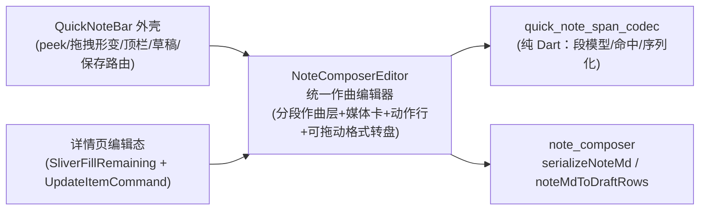

# 编辑器统一：详情编辑切换到速记作曲器形态

> 2026-10-03 用户拍板「详情的编辑页面和全部入口新增页面是一模一样，而不是现在区块样子」。
> 本文记录同源化改造的结构、裁决与边界；转盘交互 SSOT 见 [quick-note-format-dial.md](quick-note-format-dial.md)，
> 段模型/序列化口径见 [rich-text-media.md](rich-text-media.md) §2 与 [block-format-input.md](block-format-input.md)。

## 1. 结构

- **唯一编辑器** `lib/ui/note_composer_editor.dart`：段序列（NoteTextSeg/NoteMediaSeg）、
  光标处插媒体、格式状态机（先选后打+行级档位）、动作行（拍照/相册/录音弹框/视频门槛/标签）、
  可拖动转盘行 + 转盘面板 + 点空白收合——「作曲层+工具层顶层 Stack」挂载约束封装在组件内，宿主只给有界高度。
- **宿主解耦面**：`onDirty(rows)`（草稿行快照，宿主防抖落盘）/ `onChanged`（内容感知刷新）/
  `pendingTags`+`onPendingTagsChanged`（速记标签，详情不传即隐藏）/ `onMediaReplace`（媒体替换钩子）/
  `audioController`（页面单实例红线：详情复用页面控制器，速记自建）。
- **草稿行扩展**：`['t',md] / ['i'|'a'|'v', url, label?]` 第 3 位携带媒体 alt/label
  （QuickNoteDraft 解码兼容旧两列格式）。

## 2. 三项裁决（2026-10-03 用户确认）

1. **字面文本保留**：段模型不认识的旧结构（列表/引用/代码块/分隔线/外链图片行）在编辑态
   以字面 md 文本呈现，保存原样回写；查看态渲染不变。`# ` 标题与行内样式经 seedQuickNote
   恢复所见即所得，序列化逆变换回写（往返单测钉住）。
2. **长按替换保留**：详情编辑长按图/视频卡=换文件、点音频卡=重录（`onMediaReplace` 钩子，
   就地改 `seg.url`，保存时一并落库；取消=不出编辑态整体丢弃）。媒体 alt/label 随段进出
   但编辑态不可改（与作曲页形态一致）。
3. **死代码暂留标废弃**：`lib/doc/edit_session.dart`（EditSession 块模型/EditOp 家族）与
   `lib/ui/format_toolbar.dart`（线性格式条）不再被 UI 消费，标 DEPRECATED 暂留（历史契约
   与单测保留），清偿删除见 context/todos.md。

## 3. 详情编辑链路（改造后）

进入编辑：`human_md → noteMdToDraftRows → NoteComposerEditor(initialRows)`；
提交：`editor.toNoteSegments() → serializeNoteMd → UpdateItemCommand(humanMd)`（FIFO 锁/
乐观锁链路不变；无改动明说「无改动」）。页面壳（双态切换/解锁门禁/PopScope 丢弃确认/
底栏常驻）零改动。编辑态划词 AI 入口现状仅读态生效、图片标注走读态长按——维持现状。

## 4. 已知边界

- 编辑态媒体说明（alt/label）不可改（作曲页无此能力）；替换媒体时原说明保留。
- 列表等字面结构在编辑态显示 `- ` / `> ` 原文（所见即所存），新建内容不受影响
  （作曲器本就不建这些结构）。
- 待办 `- [ ]` 行按字面文本段编辑；勾选态写路径（MCP/机器态 CommitTextOp.todoDone）不受影响。
