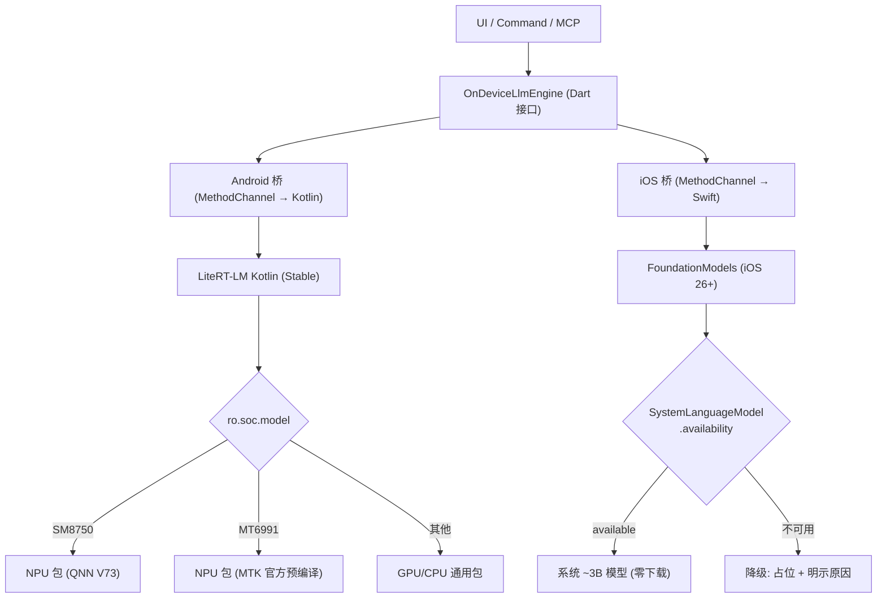

# 端侧 LLM 设计（LiteRT-LM / FoundationModels）

> 通过 Google AI Edge 主线框架 LiteRT-LM 与 Apple FoundationModels 为 goodshare 接入端侧 LLM 能力（摘要 / 关键词等文本态产出）。双端各走官方方案：Android 用 LiteRT-LM + SoC 感知模型包；iOS 用系统内置模型（零下载）。评估拍板于 2026-09-28。

## 1. 选型结论

| 决策点 | 结论 | 依据 |
|---|---|---|
| LLM 推理框架 | **LiteRT-LM**（Google AI Edge 主线） | MediaPipe LLM Inference API 已 maintenance-only 并标 @Deprecated，新特性只在 LiteRT-LM |
| Flutter 接入方式 | **Dart 接口 + 双端薄原生桥**（无官方 Flutter API） | flutter_gemma 为社区包且底层是弃新中的 MediaPipe，不符合「官方方案」诉求 |
| Android 运行时 | LiteRT-LM **Kotlin API（Stable）** | 官方语言支持矩阵最高档 |
| Android NPU | SoC 感知模型包，三级降级 NPU→GPU→CPU | 一加 Ace6（SM8750/V73）+ 天玑 9400（MT6991）官方均在支持列表 |
| iOS 运行时 | **FoundationModels framework（iOS 26+）**，非 LiteRT-LM Swift | 系统 ~3B 模型零下载零管理；LiteRT-LM Swift 为 Early Preview，且 iOS 无 NPU 路线 |
| 模型 | 文本档定 **Qwen2.5-1.5B**（用户拍板；中文原生，Apache-2.0）。⚠️ 官方 `.litertlm` 目录中该模型为 **8-bit 通道量化版（~1.5GB，4096 ctx）**，无官方 int4——选包时按此现实取 8bit 档或评估社区 int4 转换包（如 litert-community 的 Qwen2.5-Coder 系先例，int4 blockwise ~1.12GB）；多模态档（图片描述）Gemma 系待选 | Qwen 中文质量优于同体积 Gemma；GPU decode ~31 tk/s 短输出 5–10s；NPU 预编译包以 Gemma 为主，Qwen NPU 档可能需自编（二阶段处理） |
| 用例 | **三个全做**：条目摘要 / 关键词提取 / 图片描述（图片描述依赖多模态，Android 侧需 Gemma 多模态包验证，排最末） | 2026-09-28 用户拍板「摘要/关键词/图片描述 这些都要」 |

## 2. 架构

跨端能力接口化（同翻译层 `TranslationEngine` 模式），UI 与动作层只依赖 Dart 接口：

- 接口方法：`isAvailable` / `generate` / `generateStream`（流式可选实现）。
- **isAvailable 语义分端**：Android = 模型包已下载且引擎初始化成功；iOS = Apple Intelligence 可用性探测。**均动态探测、不做一次性持久化**（沿用翻译层「语言包状态动态，避免 OCR 误判锁死」口径）。
- 降级链统一：不可用 → 占位完成 + 可观测反馈（沿用队列「降级不卡死」+「结果可观测」双原则——新增异步 AI 动作必须配状态反馈）。

## 3. Android 侧：SoC 感知模型包

### 3.1 包矩阵

文本档模型已定 **Qwen2.5-1.5B**（中文原生；官方 `.litertlm` 下载为 8-bit/4096ctx/~1.5GB 档，Apache-2.0 再分发宽松）。**LiteRT-LM 官方模型目录当前仅 ~10 个模型**（Gemma 系为主 + phi-4-mini + Qwen2.5-0.5B/1.5B + Qwen3-0.6B + FunctionGemma），这是平台现状硬约束：新模型需走 litert-torch 自行转换（社区有 Qwen2.5-Coder int4 先例，~1.12GB）；模型多档目录（`LlmModel`）按此现实设计——目录条目=「官方直下包优先，缺档再评社区包/自编」。

| 设备 SoC | `ro.soc.model` | 模型包 | 来源 |
|---|---|---|---|
| 骁龙 8 Elite | SM8750 | **官方 NPU 包在列**：Gemma3-1B 4bit 1280ctx **~658MB**（SM8750 专包直下）；Qwen NPU 档二阶段 | **官方预编译直下** |
| 天玑 9400 | MT6991 | **官方 NPU 包在列**：Gemma3-1B 4bit 1280ctx ~986MB；Qwen 档二阶段 | **官方预编译直下** |
| 其他 | — | **Qwen2.5-1.5B 8bit 通用 `.litertlm`**（GPU/CPU，4096 ctx） | HuggingFace LiteRT 社区（国内走 R2 自托管镜像） |

### 3.2 分发与下载

- 复用 `lib/ai/model_manager.dart`「下载 → 校验 → 解压/落盘」链路与 `AsrModel` 目录结构模式；新增 `LlmModel` 目录条目。
- 下载源：Cloudflare R2 自托管（同 ASR R2 迁移待办，域名 `r2.oklhj.eu.org`）；Wi-Fi 限制 + 断点续传。
- 选包逻辑：启动下载前读 `Build.SOC_MODEL`（原生层回传），查映射表命中 NPU 包；未命中落通用包。
- 内存水位：Gemma3-1B 峰值 ~700MB–1.7GB，下载/初始化前检查 goodshare-mobile 富媒体内存水位机制。

### 3.3 注意事项

- QAIRT 运行库（`libQnnHtp*.so`）为 NPU 档依赖：二阶段评估「打进 APK vs 首启动下载」；MVP 通用包无此依赖。
- MTK 包 context 仅 1280 token：摘要任务需先按句切分（复用 `splitSentences`）做分段截断策略。
- NPU 包与 SoC 严格绑定，运行时校验失败自动落 GPU（LiteRT 内建 fallback），不置死信。

## 4. iOS 侧：FoundationModels

- iOS 26+ 的 `FoundationModels` framework 调系统内置 ~3B 模型，官方定位即「摘要 / 抽取 / 分类」，与本项目用例对口。
- 桥层只做三件事：① 可用性探测（`SystemLanguageModel.availability`：设备资格 + 地区门控）；② `LanguageModelSession` 调用与流式回传；③ 错误映射（guardrail 违规 / 语言不支持 / 上下文超限 → 友好降级文案）。
- **不下载任何模型**：模型管理、SoC 感知逻辑均只存在于 Android 桥。
- 内置 content-tagging adapter（打标签/实体抽取/主题检测）可用于关键词提取用例的 iOS 加成。
- 风险：**国内行货 iPhone 的 Apple Intelligence 可用性未确认**——若国行为主则 iOS 桥可能长期降级，届时再评估「补 LiteRT-LM Swift 通用包」双层方案。

## 5. 与队列 / 命令链路整合

- LLM 生成耗时长（首 token 0.3s + decode 数秒~数十秒）：**Job 化 + 手动触发**（沿用 OCR/转写手动化拍板口径，绝不自动入队）。
- 三个用例各对应一个命令（op 独立），全部走 ItemActionHandler 命令入口，动作层校验下沉（正文非空 + 引擎可用性预检——沿用翻译「入队前预检、不为必然无结果的任务让用户干等」）：

| 用例 | 命令 | 动作校验 | 产物落点 | 详情页入口 | MCP 工具 |
|---|---|---|---|---|---|
| 条目摘要 | `SummarizeCommand`（op=summarize） | 文本类条目且正文非空 | `summary_md`（与 human_md 并列，不覆盖） | 「摘要」按钮 | `summarize_item`（第 14 工具） |
| 关键词提取 | `ExtractTagsCommand`（op=extract_tags） | 文本类条目且正文非空 | `tags_json`（融入既有标签体系，可被筛选） | 「提取关键词」按钮 | `extract_tags`（第 15 工具） |
| 图片描述 | `DescribeImageCommand`（op=describe_image） | 仅 image 条目；需多模态模型包 | `machine_json` 描述字段 / `summary_md` | 「图片描述」按钮 | `describe_item`（第 16 工具） |

- iOS 侧关键词提取可用 FoundationModels 内置 content-tagging adapter（打标签/实体抽取）加成；摘要/描述走通用 `LanguageModelSession`。
- 图片描述的输入通道：Android 需 Gemma 多模态包（Gemma4-E2B / Gemma-3n 支持视觉输入，通用文本包不含视觉能力——选包时用多模态档，或文本/多模态双包并存）；iOS 系统 ~3B 模型原生支持图像输入（iOS 26 视觉能力随 FoundationModels 提供）。**实施顺序上排最末**：MVP 先做摘要 + 关键词（纯文本链路两端无歧义），图片描述待 Android 多模态包选型验证后再接。

- 队列超时：LLM 档超时上限单独放宽（建议 120s，或按输入 token 数动态），不与 OCR 20s / 管线 60s 共用。
- 产物一律与 human_md 并列、不覆盖原文（同翻译「译文并列、不覆盖」模式）；「静默成功=无产出」必须配状态反馈（既有两次踩坑的硬规则）。

## 6. 风险与遗留

| 风险 / 遗留 | 等级 | 缓解 |
|---|---|---|
| 首个用例未拍板（候选：条目摘要 / 关键词提取 / 图片描述） | ~~阻塞~~ **已定**：三个全做，实施顺序=摘要→关键词→图片描述（图片描述待多模态包验证） | 见 §5 用例表 |
| Gemma 再分发许可（自托管需核条款） | ~~中~~ **已缓解**：文本档定 Qwen2.5-1.5B（Apache-2.0，再分发宽松）；仅多模态档仍涉 Gemma 许可，待核 | 选 Qwen 系做文本档 |
| 国行 iPhone Apple Intelligence 可用性 | 中 | 待真机确认；不可用则评估 LiteRT-LM Swift 通用包补层 |
| 高通 NPU 包自编预期（Qwen 档） | 中 | **核实后降级**：SM8750 有 Gemma3-1B NPU 官方直下包（~658MB）；Qwen NPU 档仍需自编，二阶段处理 |
| MTK NPU 包真机稳定性（社区有 9300+ 闪退反馈） | 中 | 真机矩阵验证后再启用 NPU 档 |
| iOS 桥依赖 iOS 26+ | 低 | 老系统降级路径明示，同 Apple Intelligence 门控 |

## 7. 实施分期

1. **MVP**：Dart 接口 + Android 桥（Kotlin）+ 通用包分发（R2）+ **摘要 + 关键词提取**（命令/UI/MCP）+ iOS 桥（FoundationModels 探测与调用）。
2. **二阶段**：图片描述（Android 多模态包选型验证后）+ NPU 档（SM8750 自编/社区包 + MTK 包真机验证）+ QAIRT 库分发策略 + 用例扩展。
