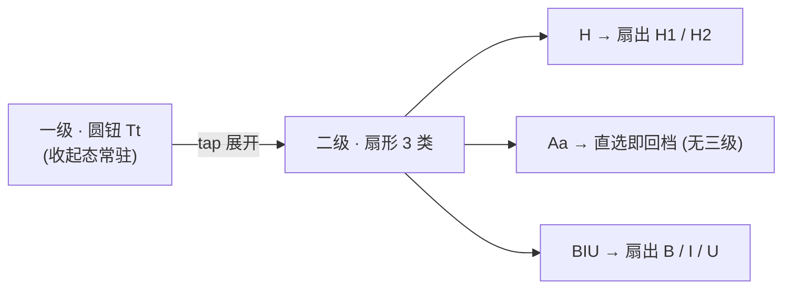

# 速记格式转盘（可收起三级径向盘）设计稿

> 状态：**active**——2026-10-03 起分批落地（真机反馈两轮定标回写本文）。
>
> 2026-10-03 拆分：原 §3（AI 写入处理）/ §4（格式全量镜像对照与渲染标准）已拆出至
> [rich-text-gfm.md](rich-text-gfm.md)（渲染/存储层 GFM 全量收编 + AI 写入三层处理链）——
> 转盘**输入 UI** 与渲染/存储层全集解耦，各自独立演化。本文只管转盘输入交互。

## 1. 背景与目标

速记条格式能力已同源化（见 [block-format-input.md](block-format-input.md)）：编辑区无 md 标记，
格式状态存段模型（`QuickNoteSpans`），保存时序列化。当前交互为「`Tt 格式`胶囊 + 6 项小横条」，
本设计稿评估并定义其替代形态：**可收起的三级径向转盘**。

用户拍板（2026-10-03）：

- 一级 = 圆形按钮（收起态常驻，替代现胶囊）
- 滑动展开二级
- 二级联动三级
- ~~显式收起（再点圆钮），不自动收起~~ → **2026-10-03 再拍板：点空白处自动闭合**（§2.1 收合口径，圆钮同时被命中层覆盖、点它同效）
- **行内单选制（2026-10-04 拍板）**：不做复合选择，B/I/U 互斥——新选替换旧选，角标恒单项（§2.7）
- **节奏放慢（2026-10-04 拍板）**：反悔窗口 1s→1.5s、selected/timeout 退场 200ms→400ms——真机反馈「按钮消失太快、节奏赶」（打字即收 80ms 不变，属功能件）

排除项：全屏旋转手势盘（评估否决——旋转精度/IME 遮挡/手势冲突，评估记录见 devlog）。

**收合出口全景（2026-10-05 拍板扩至 4+5 条）**——全部经统一 `closing` 分级
退场管道进来（打断反悔窗口=强确认，详见 §2.1）：

| # | 出口 | 触发 | 落点 |
|---|---|---|---|
| 1 | hub 点按 | 根态按 hub（含缝隙盘） | 组件内 |
| 2 | 空选松手 | 扇外/死区松手 | 组件内 |
| 3 | 选中生效 | 反悔窗口走完/双击加速 | 组件内 |
| 4 | 打字即收 | onChanged | 宿主 onChanged |
| 5 | 失焦超时收 | 全场失焦 1.5s | 宿主 focusManager |
| 6 | 返回键/侧滑 | PopScope 拦截：canPop=false 先收盘 | 宿主 `_closeFormatDial` |
| 7 | 拖动滚动收 | 写作区用户拖动滚动=离开格式态 | 宿主 ScrollUpdateNotification |
| 8 | 动作行操作收 | 拍照/相册/录音/视频/标签入口 | 宿主五个 handler |
| 9 | 切后台回来收 | resumed 时键盘已失、回显过期 | 宿主 WidgetsBindingObserver |

配套加速：**双击同项立即提交**（反悔窗口内再按同一叶子/直选项，跳过等待
落地；微动不解除、拖离即回常规反悔流）。

## 2. 交互模型

### 2.1 三级结构

| 层级 | 形态 | 内容 | 手势 |
|---|---|---|---|
| 一级 | 48dp 圆钮，全域拖动四缘吸附（§2.6） | `Tt` 图标 + 激活角标（见 §2.4） | tap 展开 / 点空白收合（§2.1 收合口径） |
| 二级 | 扇形 3 扇区（120° 均分），从圆钮上方扇出 | H / Aa / BIU（业界标识，2026-10-04 拍板：中文二字在 36dp 环宽里局促） | 按住滑入扇区高亮，松手切类/直选；三级态活动扇区 secondaryContainer 持久区分同级，**盘面字恒定不升级路径**（2026-10-04 去路径字拍板，见下） |
| 三级 | 联动扇形（2 或 3 扇区） | H→H1/H2；BIU→B/I/U | 松手挂起反悔（见下）；Aa 类无三级，松手直接生效 |

**去路径字（2026-10-04 拍板）**：活动二级扇区不再升级显示完整路径
（`H›H1` / `BIU›B` 与中止态 `H›` 全部废除），盘面字恒为 H / Aa / BIU 地标。
依据：反悔窗口期是**松手挂起**——手指已抬离，外环叶子完整可见，叶子高亮 +
hub 倒计时弧 + selectionClick 触觉已三重冗余；路径字反而打破二级恒定地标
（1s 窗口内扫视找「H」时它变成了「H›H1」）。事后文字确认由 hub 角标承担。

**松手挂起反悔（2026-10-04 拍板，替代早期「松手即选」；10-05 扩至二级直选）**：
松手不立即生效——挂起 1.5s 反悔窗口（2026-10-04 二次拍板由 1s 放慢）（`kDialLeafDwell`），hub 外缘倒计时弧顺时针
填充、选项持续高亮，用户直读所在层级链。窗口内**反悔两式**：① 再按压（改选别的选项即重新挂起）；
② 滑回深处回根 / hub 死区收合（放弃）。倒计时走完自动提交并按 selected 闭合。
**打断=强确认（10-05 真机实证修正）**：打字 keyPressed / 失焦 timeout 打断
窗口时**先落地挂起选择再退场**，绝不作废——否则「选完立刻打字」的高频流静默
丢提交（表现为「选了没效果」）。停留只加在易误触项上，效率与防误触兼得。

### 2.2 展开几何与 IME 动态避让

- 展开锚点 = 一级圆钮中心；扇形**朝手心**展开（§2.2 斜向扇出拍板），向手心
  象限 90°。
- **比例定标（2026-10-05，真机反馈「环没盘大、不协调」修正）**：hub r=20
  （d=40，展开态处于连续手势盘内可略低于 48dp 触控线；收起态圆钮仍 48dp）、
  L2 环带 26→76（带宽 50dp ≥ hub 直径，环为盘面主体）、L3 环带 76→128
  （带宽 52dp 与 L2 等宽协调）、hub-环缝 6dp、回根死区 14。此前 10-04 定标
  （hub 24 / L2 32-68 / L3 118）环带 36dp 窄于 hub 直径 48dp，比例失衡弃用。
  数值 SSOT 在 `format_dial.dart` kDial* 常量（DialGeometry 默认值）。
- **动态避让（量化定标）**：展开前读光标行屏幕 Y 坐标——光标行距键盘顶端
  **< 160dp** 时触发避让计算：切**左上/右上斜向扇出**或下移锚点，保证组合下划线与
  候选词区可见；空间充足默认向上扇出。
  避让是自动兜底，用户仍可拖动圆钮手动定锚点（§2.6），两者叠加不互斥。

### 2.3 手势细节（死区 / 磁吸 / 触觉 / 联动时机）

| 机制 | 参数 | 目的 |
|---|---|---|
| 中心死区 | 内半径 < 44dp 无响应（与 §2.2 内半径同一值，实现期只调一处） | 防稍偏离中心即误选 |
| 角度磁吸迟滞 | 扇区交界 ±5–8° 保持已高亮扇区 | 防边缘来回滑动高频闪烁 |
| 触觉反馈 | 划入新扇区（高亮切换）时 `HapticFeedback.selectionClick()` | 径向盘手感关键件，盲选依据 |
| 联动展开时机 | 二级扇区 hover > 100ms **或** 向外环续滑 > 10dp，即扇出三级 | 手指射线状滑出，不抬手直接从二级滑入三级，轨迹连贯 |

命中判定为纯几何函数（极坐标 → 扇区 index，内外死区先行校验），落 `format_dial.dart`
独立可单测。

### 2.4 与现小横条的关系

- 转盘为**替代**方案：过稿后删除小横条（`_formatSheet`），胶囊位换圆钮。
- 旧档位/mark 调用不变：扇区 onTap 最终仍走 `_pickLevel(lv)` / `_toggleMark(m)`，
  段模型层零改动。

### 2.5 激活态外显（回归风险对策）

转盘收起后，激活格式必须可见，防止「开着粗体打完全文」：

| 激活状态 | 圆钮外显 |
|---|---|
| 无任何激活 | `Tt` 图标，表面色（同现胶囊熄灭态） |
| 档位 H1/H2 | `Tt` + 右上角标 `H1` / `H2`（primaryContainer 点亮） |
| 行内 mark | `Tt` + 右上角标 `B` / `I` / `U`（2026-10-04 单选拍板后恒单项，不再叠加） |
| 档位 + mark 同时 | 角标显示 mark 优先，档位色环区分（实现期可微调） |

### 2.6 全域拖动 + 四缘吸附（2026-10-04 二次拍板，取代「横拖换缘版」）

一级圆钮从「工具行内横移换缘」升格为**编辑区全域拖动 + 四缘吸附**
（AssistiveTouch 模式）：

| 机制 | 设计 | 依据 |
|---|---|---|
| 拖动范围 | 悬浮球迁顶层 Stack，边界=作曲层视口（工具层上沿以上）——底缘吸附落在动作行上沿，**永不遮动作行图标** | 缘上停留不遮内容流的底线保留，自由度给满（全域自由浮动会遮正文+与光标定位手势歧义，否决） |
| 四缘吸附 | 松手时球心距左/右/上/下最近一边吸附该轴，另一轴保持松手位（`SmartFloatingHub` 通用化） | 横拖换缘的泛化；拖拽结束回调 `onDragEnd` 供宿主持久化 |
| 扇出象限泛化 | `DialSide` 从 {left,right} 扩为四象限 {upLeft,upRight,downLeft,downRight}（值名=扇形展开方向）：水平/竖直各取**朝屏内半区**组合而定；几何全经镜像归一到 canonical upLeft 复用同一套角度数学（命中/painter/文字三处共用） | 顶/底缘停靠时扇形须朝屏内展开；镜像保序（index 0 恒贴水平），纯函数单测锁定 |
| 面板定位 | hub 圆心=球心；面板尺寸/锚点由 `FormatDial.panelSize` / `anchorInPanel` 静态助手给出（宿主与 painter 同一数学，不重推） | 防宿主/组件几何漂移 |
| 位置持久化 | 停靠位=**缘 + 缘上分数**双键（`quick_note_dial_dock_edge`/`_frac`）+ 静态字段 Activity 重建幸存；旧布尔键 `quick_note_dial_dock_left` 首次恢复时迁移；键盘起落/旋转致边界尺寸变化时按缘×分数重播种（相对位置随分数保持） | 1 bit 换缘不够表达四缘；分数制跨屏尺寸稳健 |
| 格式行退役 | 工具层收单行（`kComposerToolLayerHeight` 96→48），写作区让出一行高度 | 悬浮球迁出后常驻格式行成死空间 |
| 一次性引导 | 未实施（发现性暂靠激活角标与既有位置心智，后续真机评估补） | 可拖动无可供性 |

**作用域口径**：格式操作恒作用于**光标所在段**（先选后打模型，§2.7），与
球停靠位置无关——球的空间位置不暗示作用域（评估结论：作用域感知将来以
「展开时高亮光标段」外显，本轮未做）。判手（触点统计推断操作手）仅可作
首启默认侧播种，不做运行中自动换侧（自移动 UI 反模式，2026-10-04 评估否决）。

### 2.7 格式范围定稿（拍板：维持现状，不扩充）

用户拍板（2026-10-03）：**不做删除线/高亮等扩充，保留现有格式集**——

- 档位：一级标题 / 二级标题 / 正文（二级直选）
- 行内：加粗 / 斜体 / 下划线（三级「行内」子盘 3 扇区）

此前「全部 md 语法」扩充计划（行内码/链接/删除线/高亮）**全部搁置**；渲染/存储层不受此限——
GFM 全量收编已拆至 [rich-text-gfm.md](rich-text-gfm.md)（AI 写入的表格/高亮/删除线等照常
渲染精美，输入 UI 与渲染全集解耦）。

**档位 × 行内互斥（拍板：严格 md 语义）**：md 中标题是行属性（`#` 前缀），
行内变形（`*`/`<u>` 等）属行内内容——标题行的显示由标题样式全权决定，不应再叠行内态。
交互规则：

| 场景 | 行为 |
|---|---|
| 当前行档位 > 0（标题） | 三级「行内」子盘**禁用置灰**（不可选） |
| 行内 mark 激活中，滑到「标题」档位 | 选档即**清除全部激活 mark** 再设档（md 语义：标题不接受行内变形） |
| 行内 mark 激活中，再选别的行内项（B/I/U） | **替换**（2026-10-04 单选拍板：不做复合选择，B/I/U 互斥——新选关旧选；再点同项关闭） |
| 回「正文」档 | 行内子盘恢复可选，此前 mark 不自动恢复（避免隐式复活） |
| 换行（Enter） | 行内 mark **自动熄灭**，新行档位回正文——防下一段无意继承粗体（先选后打状态机：mark 生命周期止于本行） |

这样「标题变斜体」在输入侧被结构性排除，落库 markdown 恒为 `# 标题` 而非 `# *标题*`。

### 2.8 已知代价（接受项）

- 到「下划线」需 2 步（展开→行内→U），比横条 1 步多——换收起态空间收益，接受
  （格式在速记场景是低频操作）。
- 二级三类深度不均（正文 0 步 / 标题 2 项 / 行内 3 项）——用户已拍板三级结构，
  若实现期体感失衡，备选降级：二级直出 H1/H2/B/I/U 五扇区（正文=中心钮 tap）。

## 3. 实现落点（预排，仅转盘件）

| 件 | 落点 | 说明 |
|---|---|---|
| 扇形绘制 | `lib/ui/format_dial.dart`（新建） | `CustomPainter` 扇环 + 图标/文字定位（极坐标） |
| 手势命中 | 同上 | 纯几何函数 `hitSector(offset, center) → int?`，可纯 Dart 单测 |
| 展开动画 | 同上 | 半径/透明度 tween，150–200ms |
| 挂载 | `lib/ui/quick_note_bar.dart` | 顶层 Stack，替换 `_formatSheet`；圆钮替换现胶囊 |
| 激活角标 | 同上 | 依据 `quickNoteLevelAt` + `_activeMarks` |
| 换行 mark 熄灭 | `quick_note_bar.dart`（先选后打状态机） | Enter 后 `_activeMarks` 清空 + 档位回正文（§2.7） |

量级：**2–3 天（含单测）**——仅转盘件；解析器 GFM 收编/归一层另计，见
[rich-text-gfm.md](rich-text-gfm.md) §4。无第三方依赖（自研轻量，符合「不引第三方富文本
编辑器」拍板的同源约束）。

### 3.1 组件配置化（2026-10-04 拍板：DialSpec 三节，缺省回落默认）

组件零业务语义，选中语义（档位/mark 落地）归宿主经 `onCategorySelect` /
`onLeafSelect(cat, leaf)` 映射；菜单项（分类/叶子/静态置灰/**每项角度权重**）、
环尺寸（hub/内外环半径/回根阈值/联动越界量/**总扇角**，>90° 面板包围盒自动
放宽）、手感（反悔停留时长+开关、磁吸迟滞角、触觉开关、动效时长/曲线）分别
收进 `DialSpec{geometry, menu, feel}` 三节，全部字段有默认值——不传即默认
转盘。另支持 `sectorBuilder` 自定义扇区内容（定位仍归组件）、动态置灰
`disabledCategories`、生效回显 `appliedInner/appliedLeaf` 直给。命中/绘制/
文字三处共用 `dialSectorStarts` 权重映射，防几何漂移。

### 3.2 动画拍板（2026-10-04，V11 质感层增补）

| 维度 | 拍板 | 落点 |
|---|---|---|
| 级联绽放 | L2/L3 不存在同时入场（展开仅 L2）；真战场=三级换类瞬间叶子换装——叶子环相对内环延迟 `feel.stagger`（80ms）后 0.85→1.0 生长淡入（水波纹由内向外） | `_leavesIn` 控制器 + painter `leafRadiusScale/leafOpacity` |
| 非对称退场 | 已有（keyPressed 80ms 极速淡出 / timeout 400ms 柔和收缩（2026-10-04 由 200ms 放慢））；曲线升格 easeInCubic（由快变慢体面收拢） | `feel.exitCurve` 默认值 |
| 提交脉冲 | selected 退场期保留三级态：选中叶加亮主色实底+微放大（1.0→1.15 随退场进度），其余随整体淡出——**零额外退场时长**（不违背「退比进快」）；反悔停留已前置大部分确认感，此为收尾锦上添花 | `_commitLeaf` + painter `pulseLeaf/pulseT` |
| hover 切换 | 维持 0ms 即时切换 + 6° 磁吸迟滞（优于 80ms 渐变门槛，加渐变=倒退） | 不变 |
| 否决项 | hub 缩放脉冲（真机拍板 hub 恒定——整面板缩放挤占 L2）、easeOutBack（overshoot 冲过定标半径挤压缝隙，10-04 已否） | — |

## 4. 验收口径（转盘件）

1. 收起态：圆钮 48dp 常驻，激活格式角标正确（H1/H2/B/I/U 组合）。
2. 展开态：tap 展开 3 扇区；按住滑动扇区高亮；松手即生效并收合。
3. 联动态：标题扇区滑到后立即扇出 H1/H2 子扇区（不松手继续滑即可选）。
4. 编辑区全程无 md 标记；保存序列化行为与现状完全一致（codec 零改动）。
5. IME 组合期：展开转盘后组合下划线不被遮挡或可滚动避开；光标行距键盘 <160dp 触发避让。
6. 换行（Enter）后行内 mark 自动熄灭、档位回正文（§2.7 状态机，单测锁定）。
7. `flutter analyze` 0 issue；全量测试零回归；转盘几何命中单测覆盖全扇区与边界。
8. 档位 × 行内互斥（§2.7）：标题行上行内子盘置灰；激活 mark 中选标题档 → mark 清除；
   落库 markdown 恒为 `# 标题` 而非 `# *标题*`（单测锁定）。
9. 四缘吸附（§2.6）：全域拖动松手吸最近缘（底缘不遮动作行）；四象限扇出
   朝屏内（顶/底缘锚向下/上展开）；停靠位（缘+分数）持久化与重播种（单测锁定）。
10. 盘面字恒定（§2.1 去路径字拍板）：反悔窗口期二级扇区不出现 `H›`/`H›H1`
   类路径字（单测锁定）。

## 5. 开放问题（全部闭合）

1. ~~三级 vs 二级直出五扇区~~ → **已拍板：三级**（扇区面积大、触摸容错高；5 扇区单手误触率显著上升）。
2. ~~圆钮位置~~ → **已拍板：默认右缘 + 可拖动吸附 + 位置持久化**（§2.6）。
3. ~~连续多次设格~~ → **2026-10-03 再拍板（替代「选中后收合」）**：选中后保持展开（内环留驻可连续操作），点空白处统一收合——连续 B→I→U 无需重新展开，误触面由空白收合兜底。
4. ~~高亮 `==` 非标语法~~ → **输入不扩充**，维持现有格式集（§2.7）；渲染层收编独立推进（rich-text-gfm.md）。
5. 手势细节四件套（§2.3）与 IME 动态避让（§2.2）按用户补充意见采纳，参数为初始值，实现期真机调校后回写本表。
