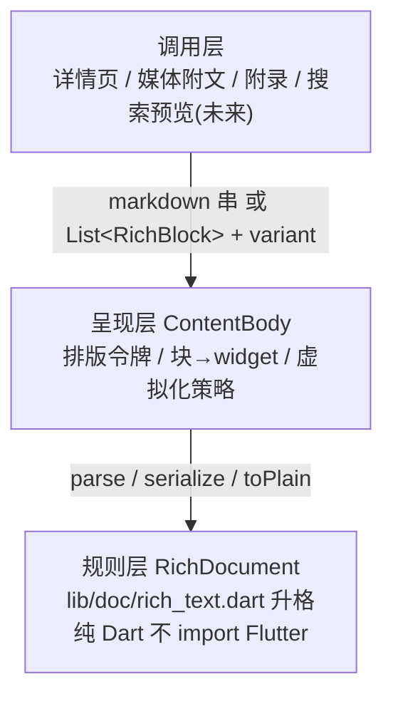

# 富文本组件分层与结构化编辑设计

> 决策拍板于 2026-09-30（HCI 评估多轮收敛）。两件事一体：① 把「文本展示」从详情页专属抽成 app 级公共组件（`ContentBody`），消除媒体类型正文裸 `SelectableText` 的渲染降级；② 抹去 App 内 Markdown 的用户暴露——人不再编辑 md 源码，改走结构化块编辑。
> 上位文档：[content-pipeline.md](content-pipeline.md)（内容管线与文档形态 SSOT）；本文档是其消费侧（呈现 + 编辑）的延伸设计，与上位冲突时以上位为准。

## 1. 关键决策

| 决策点 | 结论 | 依据 |
|---|---|---|
| Markdown 的用户暴露 | **App 内彻底抹去**：用户不读 md 源码（已由渲染器保证）、不写 md 源码（本决策） | 手机软键盘输入符号层成本高；用户是「修正者」非「作者」；残缺语法让用户承担系统表示负担（Norman） |
| 源码编辑逃生舱 | **不保留**（含 `⋯` 菜单次级入口） | 两条写路径 × 校验 × 错误态 × 测试矩阵的终身维护成本 > 极少数重度用户收益；数据兼容（raw_content 可能是用户写的 md）≠ 交互暴露 |
| 人机中转协议 | **md 保留为机机协议**（AI 产出 → 存储 → MCP 桌面端），人走块树视图 | LLM 产 md 零成本、MCP 契约零改动；人直接操纵块内容（Hutchins/Hollan/Norman 直接操纵原则） |
| 文本组件抽取 | **抽 `ContentBody` 公共组件**（sliver / inline 双面） | 已发生的不一致：audio/video/image 附文是裸 `SelectableText`，与文本类详情页排版割裂；未来调用点（搜索预览/工作区备注）预期增长 |
| TLDR / 标签归属 | **不进 ContentBody**：TLDR 走 `humanTldr` 字段、标签走 `machine_json.tags`，与 md 渲染解耦 | 它们是结构化字段的专属渲染，塞进组件即退化为「详情页组件」，复用性归零 |

## 2. 三层架构



职责边界（口诀：**换语法动规则层，换长相动呈现层，换页面动调用层**）：

| 层 | 拥有 | 禁止 |
|---|---|---|
| 规则层 `RichDocument` | md 子集语法、块树模型、parse/serialize/toPlain 纯函数 | 不知道 widget 存在（不 import Flutter） |
| 呈现层 `ContentBody` | 排版令牌、块→widget 映射、sliver/inline 双面 | 自己做语法解析（只调规则层）；认识 `InboxItem` |
| 调用层 | 选文本源、选 variant、传回调（待办勾选→命令） | 自己拼 span、自己写排版样式 |

**性能硬约束**：`.sliver` 面必须保持 Phase 1 虚拟化成果——block builder 交给外层 `SliverList`，组件只提供块级 widget（`richBlocksOf` + `buildRichBlock` 现路径不变）。严禁为省事把详情页正文改成组件内部 shrinkWrap 的 ListView，长文性能回退是本重构最大的坑。

## 3. ContentBody 组件形态

```dart
// 呈现层唯一入口（lib/ui/content_body.dart）
ContentBody(
  blocks,              // List<RichBlock>；或 markdown 串（内部调 parse）
  variant: .sliver,    // 详情页 CustomScrollView：块 builder 供外层 SliverList
  // variant: .inline, // 嵌入场景（附录/媒体附文）：shrinkWrap + 禁滚动
  selectable: true,
)
```

- `.sliver` 面：直接返回 `SliverList`（与 `item_view_template.dart` 现状同构），调用方组进自己的 `CustomScrollView`。**硬约束：吐出的必须是 Sliver 对象**——`CustomScrollView` 的 direct child 不接受 RenderBox，严禁误包 `Container`/`Padding` 等盒组件
- `.inline` 面：自含 widget（内部 shrinkWrap ListView），用于附录、媒体类型附文
- **阅读态选择能力（批 A 强制）**：块级 `SelectableText` 只能块内选择，跨块复制是文档阅读的硬需求——正文区外层统一包 `SelectionArea`，块内改用普通 `Text`/`RichText` 承接，禁止每块各自 `SelectableText`（选择边界割裂 + 每块一个 selection 手势层）
- 待办勾选回调（`onTodoToggle`/`todoDone`）原样透传，接线归调用层

### 实施批 A：抽取 + 消除不一致（一天级，先行）

1. 抽 `ContentBody` 双面组件（搬移 + 参数化，现有调用点即测试用例）
2. 替换 `item_view_template.dart` 中 audio/video/image 三处裸 `SelectableText(item.bodyText)` → `ContentBody(variant: .inline)`（顺带修复渲染降级）
3. 补 `serialize(blocks) → markdown` + 往返单测（parse→serialize→parse 幂等），为批 B 铺路
4. L0 术语抹除：编辑 sheet label「内容（Markdown）」→「内容」

## 4. 结构化块编辑（批 B，替换源码编辑）

编辑 sheet 的正文 `TextField`（现直接编辑 md 源码）改为**块列表编辑**：

- 每个已有块渲染为**按块类型映射的编辑 widget**（预填 `blockToPlain` 纯文本），保持语义视觉而非退化成裸文本——待办块 = Checkbox + TextField（改的是状态不是 `[ ]` 字符）、引用块 = 左侧竖线 + TextField、代码块 = 等宽 TextField；用户永远在编辑「某一段话」而非带标记的源码
- **实施注记（2026-09-30 批 B 落地时修正）**：编辑文本预填改走 `serializeInline`/`serializeBlock`（含字面转义）而非 `blockToPlain`——含行内样式的块若预填纯文本，保存经 serialize 会把 `**粗体**` 等样式静默压平，违反 §5 数据无损防线；serialize→parse 往返逐节点相等（往返单测保证），无样式文本两者本就一致。多项列表预填含 `-`/`1.`/`[x]` 标记（列表符号属自然语言）
- **Tap-to-Edit（性能强制）**：块列表默认渲染阅读态 widget，点击某块才原位激活为编辑 widget——若 N 个块全部常驻 TextField/Controller，长文直接性能爆炸；激活态全局同时至多一个，失焦即回阅读态
- **排序 MVP 降级**：不做拖拽（长列表拖拽 + 手势竞争成本高），提供「上移/下移」按钮
- 支持「在其后追加块」「删除块」；块粒度天然规避语法错误
- **MVP 操作边界（防工作量失控，键盘隐式操作一律降为按钮显式操作）**：
  - Enter = 块内换行（`\n`），**不拆块**——拆块需光标位置计算/文本流合并/焦点重建，省去这 2-3 天；新块只走「+ 追加块」按钮
  - Backspace 在块首**无事发生**；删块只走「删除该块」按钮
  - 新增块后焦点立即赋给新 TextField 并弹软键盘（体验打磨项，可后补）
- 保存：块列表经 `serialize` 回写 md 落库 → AI 下游（翻译/再摘要）与 MCP 消费端零感知
- 现有 BottomSheet 装不下块列表，改 fullscreen dialog
- 草稿沿用 `DraftController` 体系；`UpdateItemCommand` 契约不变（`humanMd` 字段照传）
- 待办勾选（`onTodoToggle`）接动作层命令按 `todo_state_json` 口径持久化（接口已留，V2 接线）

## 5. 规则层语法扩展护栏（私有块类型）

加私有语法（如 `CalloutBlock` 呈现 TLDR 卡）= 加一种块类型，但必须三出口齐全：

| 出口 | 作用 | 缺失后果 |
|---|---|---|
| `parse`（md→块） | 进得来 | 语法显示不出来 |
| `serialize`（块→md） | 出得去（编辑回写、AI 回写） | 编辑一次语法即丢失 |
| `blockToPlain`（块→纯文本） | 降级（分享/检索/预览/MCP） | 分享带私有标记或检索漏内容 |

另两条：样式留在呈现层（规则层只说「这是 CalloutBlock」）；私有语法对 MCP 桌面端是「带标记文本」（可读不认识，可接受；需桌面端渲染时在 MCP 文档登记约定）。私有扩展控制数量，只给高频块（callout）开，长尾用 Paragraph 兜底。

### 数据无损防线：UnknownBlock（强制）

生态里有 MCP 桌面端这个「外部写方」：下游 AI 可能写入 App 规则层不支持的语法（如表格）。若 parse 直接丢弃或报错，用户在 App 内一次编辑保存（触发 serialize 回写）就永久丢数据。故规则层必须含 `UnknownBlock`：

- `parse`：遇不认识的语法，整段吞为 `UnknownBlock(rawMarkdown)`，**不丢、不报错**
- `serialize`：`UnknownBlock` 原样吐出 `rawMarkdown`（数据安全出口）
- `blockToPlain`：降级输出 raw 纯文本（分享/检索可用）
- 呈现层：渲染为不可编辑的灰色提示块（「外部内容，暂不支持编辑」）或直接渲染 raw 文本

与既有「宁可样式平，不可吞内容」铁律（content-pipeline.md §3）同源，此处是其在块树层的机制化落地。

## 6. 呈现层增强（对齐 mymind 视觉，独立批次）

TLDR 描边 callout 卡 / 标签胶囊流（`Wrap`+`Chip`，支持渐隐）/ 头图卡片区 / 排版调优——全部是呈现层工作，与批 A/B 正交；实现时复用批 A 打通的结构化渲染通道，标签区数据源为 `machine_json.tags`（不走 md）。

### 6.1 视觉元数据前置（mymind 方案吸收，2026-09-30 评估拍板）

对 mymind 五条技术方案的采纳裁定：多态 Payload **不做**（三层存储 + `itemType` 分型 + `ItemViewRegistry` 已是等价物，重构 tagged union 是大迁移而收益仅编译期穷尽；规则层 `switch (block)` 已用 Dart 3 密封模式）；Hero 转场**缓做**（前置缺失：列表卡片 `ContentCard` 是纯文本摘要，与详情页无同源锚点，随列表页视觉改造再议）；其余三条合并为「视觉元数据前置」批次，按性价比排序：

> **实施注记（2026-09-30 V1 落地）**：宽高比改存 `inbox_items.aspect_ratio` 专用列（schema v15）而非 `machineJson`——AI 回写对 machine_json/facets_json 均**整替**，摄入元数据会被冲掉；且 machine_json 落库须过领域 Schema 强校验，专列零迁移负担。

| 批次 | 内容 | 落点 | 成本 |
|---|---|---|---|
| V1 尺寸前置 | 摄入链路解码图片头取宽高比（`ImageDescriptor.encoded` 只取头，不整图解码），宽高比入 `inbox_items.aspect_ratio`（schema v15 专用列）；渲染处 `AspectRatio` + 占位底色包图片，消灭加载抖动 | 摄入：`lib/share/image_aspect.dart`；渲染：图片视图 | ≤1 小时 |
| V2 OG 元数据富化 | URL 类条目复用 `fetchHtml` 产物顺带解析 `<meta property="og:*">`（标题/封面图/描述/站点名），url 条目从「一坨正文」变卡片；骨架态→后台富化→精准刷新的管线三段已有（AiReconstructor + ai_task_queue + attach_state），只补解析一环。落点 `lib/ai/url_extract.dart`（解析纯函数 + og.v1 schema，machine_json 由 url reconstructor 自写自读无冲替问题）；列表卡 OG 化随列表视觉批再议 | `lib/ai/url_extract.dart` / `ocr_reconstructor.dart` url 分支 / `_urlView` | 半天 |
| V3 主色调 | 摄入队列 Job 化算图片主色（`palette_generator` 64px 降采样，`taskActionFor(image)=extract_palette` 自动入队），hex 入 `machine_json`（color.v1，image 条目 machine_json 仅此写入方无冲替）；图片加载前作占位底色（`GoodshareImage.placeholderColor` + 详情图 Container）。**不在 build 路径同步算**（耗时路径 Job 化约束） | `lib/ai/palette_reconstructor.dart` + 摄入队列 + 图片视图 | 半天 |

## 7. 验收

- parse→serialize→parse 往返单测覆盖全部块类型（含待办、引用嵌列表）
- 往返单测含 UnknownBlock 用例：含表格等未支持语法的 md 经 parse→serialize 后原文逐字节保留
- 批 B 编辑器：待办块在编辑态保留 Checkbox（不退化为 `[ ]` 字符编辑）
- 三处媒体类型附文渲染与文本类详情页排版一致（同一 `ContentBody`）
- 全仓用户可见 UI 无「Markdown」字样（`grep -rn 'Markdown' lib/pages lib/ui` 仅剩代码注释）
- 长文（数万字）详情页滚动无卡顿（虚拟化路径未被破坏）
- V1 生效后图片列表滚动无高度跳动；V2 后 URL 条目详情页含 OG 标题/封面卡
- `UpdateItemCommand` / MCP `get_item` 契约零改动（`test/mcp_server_test.dart` 通过）
