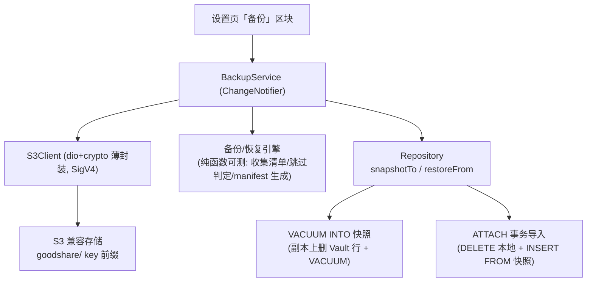
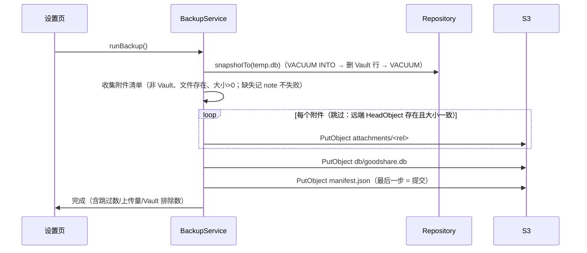
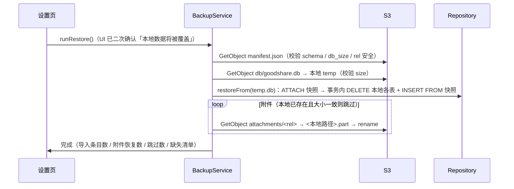

# S3 备份与恢复设计

> 把「数据库 + 附件」整库备份到用户私有 S3 兼容存储（MinIO / NAS / R2 / B2 / OSS），支持换机重装后恢复。
> **不做**：App 内置对象存储 Server（与「写必走 Handler」冲突，桌面精修走 MCP）；多端双向同步（V3 独立 epic，本设计仅是其未来传输层之一）。
> 决策拍板于 2026-09-29（用户拍板「换 S3 备份」；当日上午曾短暂评估 WebDAV 方案，随用户拍板整体作废，不再支持）。
> 变更史：传输层原始方案为 WebDAV（PROPFIND/MKCOL/MOVE + Basic），2026-09-29 拍板换 S3
> （SigV4 对象 API + endpoint/bucket/region/AK/SK），编排/快照/恢复语义/manifest 提交标记/增量跳过/Vault 排除均未变。

## 1. 关键决策

| 决策点 | 结论 | 依据 |
|---|---|---|
| S3 client | **dio + crypto 手写 SigV4 薄封装**（PutObject / GetObject / HeadObject / ListObjectsV2 / DeleteObject，path-style） | 零新依赖惯例（synchronized 零依赖、uuid 自实现先例）；dio + crypto 已是依赖；SigV4 签名链 ~40 行可控 |
| 原子提交 | S3 单对象 PUT 本身原子（无半截正式对象）；manifest 最后写 = 提交标记 | 取消/失败时旧 manifest 仍在 → 远端保持上一次完整备份 |
| DB 快照 | **`VACUUM INTO`** 产出整库二进制快照 | SQLite 3.22+ 官方机制，原子一致；免自研表级序列化；恢复走 ATTACH 事务导入 |
| 备份包结构 | 固定根 `goodshare/`：`manifest.json` + `db/goodshare.db` + `attachments/<relpath>` | 固定结构才能跨次增量复用附件 |
| 提交标记 | **manifest.json 最后上传** = 提交标记 | S3 单对象 PUT 本身原子（无半截正式对象）；manifest 未更新则远端仍为上一次完整备份 |
| 增量 | 附件按「远端存在且大小一致」跳过（HeadObject 比对） | 增量比断点续传更值，失败损失限单文件 |
| 大文件 Multipart | >100MB 自动切换 Multipart Upload（16MB/片，自动放大保证 ≤10000 片）；失败 abort 清理已传分片 | 大视频备份中断不再整体重传（简单 PUT 一抖即从头）；putFile 对编排层透明，BackupService 零改动 |
| Vault 排除 | 快照副本上删除 `is_vault=1` 条目（队列/drafts 连带）再 VACUUM；**Vault 条目不进备份** | DB 快照含未加密正文；上传未加密远端会击穿 Vault 物理防线（加密落盘是 V3，届时再开放） |
| 恢复语义 | **全量替换**（云端为源，UI 二次确认明示「本地数据将被覆盖」） | 备份/恢复 ≠ 同步；merge 语义留给 V3 多端同步 |
| 视频源文件 | **不进备份**（2026-09-29 D3 拍板：体积大头，「只备份关键的东西」）；字幕/译文/切片产物照进；恢复后视频走既有「文件缺失」降级态 | 视频动辄几百 MB，全量备份首传过重 |
| 整片标记 opt-in | 用户在详情页「整片」标记的单个视频源文件**进备份**（2026-09-29 E3 拍板）；标记本身不触发上传，仍由手动备份携带 | 两极标记：默认排除 + 逐条目自愿携带 |
| 凭证存储 | SharedPreferences（`s3_endpoint` / `s3_bucket` / `s3_region` / `s3_access_key` / `s3_secret_key`），UI 掩码显示 | 与 MCP token 同口径（同存 prefs）；安全存储（flutter_secure_storage）为后续项 |
| 执行载体 | 独立 `BackupService`（ChangeNotifier），**不进 ai_task_queue** | 队列是条目维度（item_id 外键 NOT NULL）；备份是全局维护操作，自带进度/取消状态机 |

## 2. 架构



分层约束：引擎的纯决策（跳过判定、manifest 序列化、路径消毒）为纯函数，单测守护；网络与文件 IO 在 service 层；DB 读写只经 `Repository`（与写路径同入口原则，备份读路径不走 `synchronized`——读不入队）。

## 3. 备份包格式

远端布局（`goodshare/` 固定根，跨次复用）：

```text
goodshare/
├── manifest.json          # 提交标记：最后上传，未更新则整包视为上一次备份
├── db/
│   └── goodshare.db       # VACUUM INTO 快照（已删 Vault 行，VACUUM 压实）
└── attachments/
    └── <relpath>          # 附件原始相对路径（相对 app documents 目录），如 shares/1729...jpg
```

`manifest.json`（schema v1）：

```json
{
  "schema": 1,
  "ts": 1729000000000,
  "schema_version": 8,
  "device": "OnePlus Ace6",
  "item_count": 128,
  "vault_excluded": 3,
  "db_size": 245760,
  "attachments": [
    {"rel": "shares/1729000000000.jpg", "size": 456789, "item_id": "uuid..."}
  ]
}
```

- `attachments[].rel` 相对 app documents 目录；恢复时按 `rel` 写回同路径（Android app 私有目录重装后路径稳定）。
- `vault_excluded` 仅计数不含内容（清单本身不得泄露 Vault 文件名）。
- 恢复侧校验：`schema` 支持性 + `db_size` 与远端实际大小一致 + 每个附件条目 `rel` 无 `..` 穿越（纵深防御，路径来自自家 DB 正常不该发生）。

## 4. 备份流程



- 任一步失败：停止并回 `failed + 原因`；远端 manifest 未更新 → 旧备份仍完整可用。
- 进度模型：`{phase: attachments|db|manifest, done, total, transferredBytes, currentRel}`，UI 进度条 + 取消按钮（取消 = 中断后续上传，远端同上述不毁旧备份）。

## 5. 恢复流程



- 顺序：先 DB 后附件——附件下载中断时条目已恢复，附件缺失走既有「文件缺失」UI 降级态，不阻断。
- 恢复导入的表：`inbox_items` / `ai_task_queue` / `daily_metrics` / `drafts` 全量替换（含软删条目，保留期语义随数据走）。
- DB 导入后 `notifyListeners` 一次；附件落盘不走写路径（不 bump `version`——恢复是整体替换，不做 CAS）。

## 6. 安全边界

| 项 | 约束 |
|---|---|
| Vault | 条目文本与附件一律不进备份；设置区块明示「保险箱条目不备份（未加密）」 |
| 传输 | 允许 `http://`（局域网 MinIO/NAS 场景），UI 对非 https 明示「明文传输」；endpoint 校验仅接受 http/https |
| 凭证 | 存 SharedPreferences（与 MCP token 同口径）；**已知限制**：非加密存储，引入 flutter_secure_storage 为后续项 |
| 路径穿越 | 附件 `rel` 消毒（拒绝含 `..` 的段）；恢复下载目标路径必须落在 documents 目录内 |
| 鉴权 | SigV4（AccessKey + SecretKey）；401/403 明确回「AK/SK 错误或无 bucket 权限」 |

## 7. 代码落点

| 文件 | 职责 |
|---|---|
| `lib/sync/s3_client.dart` | S3 薄封装：`testConnection`（HeadBucket）/ `head`（HeadObject）/ `put` / `putFile`（流式 UNSIGNED-PAYLOAD）/ `get`（流式落盘+大小校验）/ `list`（ListObjectsV2 翻页）/ `delete`；SigV4 手写签名（host+x-amz-date+x-amz-content-sha256 三头，固定时间测试缝供对拍）；错误分类（auth/notFound/protocol/network/server/cancelled） |
| `lib/sync/backup_manifest.dart` | manifest 模型 + `fromJson` 防御解析 + `toJson`（纯 Dart，单测守护往返） |
| `lib/sync/backup_service.dart` | `BackupService`（ChangeNotifier）：配置持久化（prefs 五键）、`testConnection`、`runBackup` / `runRestore`（进度/取消/note）、状态机 `idle|working|done|failed|cancelled` |
| `lib/data/repository.dart` | `snapshotTo(File)`（VACUUM INTO 临时路径 → 开临时库删 Vault 行 + 关联 drafts → VACUUM → 返回条目计数与 Vault 排除数）；`restoreFrom(File)`（ATTACH → 事务全量替换四表） |
| `lib/pages/settings_page.dart` | 「S3 备份」区块：endpoint/bucket/region/AK/SK 配置（SK 掩码）+ 测试连接 + 立即备份（进度条/取消）+ 恢复（二次确认）+ 最近备份状态行 |

## 8. 测试策略

- `backup_manifest`：序列化/防御解析（坏字段跳过、`rel` 含 `..` 拒绝）往返。
- `s3_client`：SigV4 固定时间向量对拍（测试侧独立派生签名链）+ ListObjects XML 解析单测；HTTP 行为需真机/集成环境（MinIO 起本地实例可后续补集成测）。
- `Repository.snapshotTo/restoreFrom`：既有内存库模式（`Db.overridePath`）——快照往返字段保真、Vault 行不进快照、恢复全量替换（含软删条目）。
- 跳过判定纯函数：远端 size 一致 → skip；不一致 → reupload。

## 9. 已知限制与后续项

| 项 | 说明 |
|---|---|
| 无自动备份 | 仅手动触发；定时/触发式（如退后台且充电）后续项，需与前台服务调度协同设计 |
| 凭证加密 | SharedPreferences 明文，后续引入 flutter_secure_storage（需依赖确认） |
| 派生数据 | `item_embeddings` 向量表（schema v9）整表**不进备份**、恢复后清空待重算——派生物可全量重算，备份只保护事实源；详见 [vector-embeddings.md](vector-embeddings.md) |
| 视频切片 | 切片结果存 `clips_json`（事实源内），随 DB 快照走；源视频不进备份见上表与 [video-clips.md](video-clips.md) |
| Vault 备份 | 待 V3 加密落盘后开放「保险箱条目加密进备份」 |
| iOS 路径 | Android app 私有目录重装后路径稳定，`raw_file_path` 直接复用；iOS Documents 路径含随机 UUID，iOS 适配时需路径重写（Android 首发不阻塞） |
| 多端同步 | 本设计单向（备份/恢复），双向 sync 引擎是 V3 独立 epic，S3 届时仅为可选传输后端 |
| 对象存储 Server | **明确不做**（桌面精修走 MCP 工具族，见 docs/design/ui-spec.md §4.3 既有决策） |
