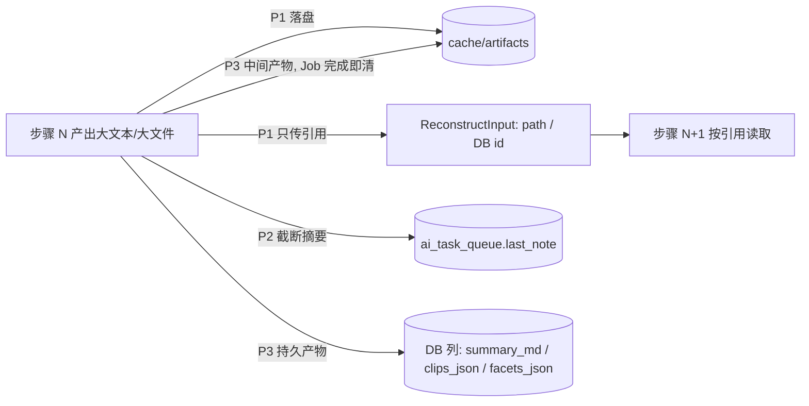
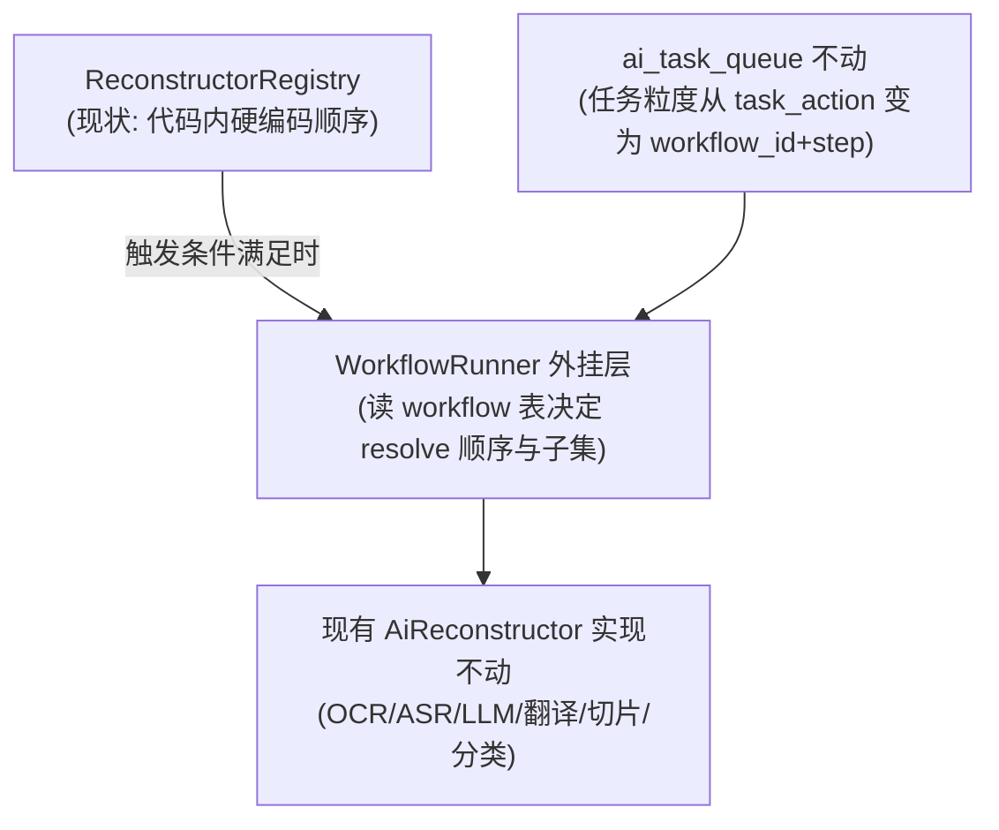

# 任务编排与调度（scheduling-tasks）设计

> 结论先行：**暂缓引入独立「用户自组装工作流编排器」**。现有 `ai_task_queue` + `AiReconstructor`/`ReconstructorRegistry` 已覆盖编排需求的 80%（持久化队列、断点重试、可插拔处理单元、按类型路由）；唯一缺口是「用户级流程组装」，而当前仅有一条多步链（视频切片），抽象成 JSON workflow + 组装 UI 是纯负收益。
> 本文档同时固化**大参数处理铁律**（与编排器解耦、现在就生效）与**未来引入编排器的触发条件**（三条全满足再重开议题）。

## 1. 背景与评估范围

评估输入：收藏类 App「系统预置流程 + 用户自组装」的通用编排方案（Step Registry / 自表达契约 / 三轨暂存 / Dry-Run 校验 / 上下文总线）。评估问题：

1. goodshare 是否需要应用内工作编排器？
2. 某一步的参数（长文本、大文件产物）如何在步骤间传递与暂存？

## 2. 现状盘点：编排能力已覆盖项

| 通用编排方案组件 | goodshare 现状 | 结论 |
|---|---|---|
| 持久化任务队列 | `ai_task_queue` 表 + `AiQueueService`（status/priority/last_note/updated_at）+ `QueueConsumer` 串行消费 | ✅ 已有 |
| 断点续传 / 失败重试 / 超时兜底 | 队列层已实现（clip 链 180s 超时、失败占位完成不置死信、last_note 可观测） | ✅ 已有 |
| 可插拔处理单元（Step Registry） | `AiReconstructor` 接口（isAvailable/handles/reconstruct）+ `ReconstructorRegistry` 运行期路由 | ✅ 等价已有 |
| 上下文总线与输入输出契约 | `ReconstructInput` / `ReconstructResult` **强类型**契约——缺字段编译期即报错 | ✅ 已有（优于运行时校验） |
| 按类型路由多条管道 | `handles(itemType)` 按条目类型路由 | ✅ 已有 |
| 用户级流程组装（JSON workflow + 组装 UI） | 无——各 Reconstructor 内部步骤硬编码 | ❌ 唯一缺口 |
| Dry-Run 静态校验器 | 无（也无组装 UI，无非法链条来源） | ⚠️ 暂无需求 |
| 三轨暂存（Spec/Context/Artifacts） | Spec=代码内硬编码；Context=ReconstructInput 内存对象；Artifacts=DB 列 + cache 目录 | ⚠️ 部分有，铁律见 §3 |

## 3. 大参数处理铁律（现在生效，与编排器解耦）

步骤间传「大参数」（长文本、媒体产物）的三条硬约束，全链路适用（现有 clip 链、翻译链、摘要链，及未来任何新链）：

| # | 铁律 | 说明 | 现有对应 |
|---|---|---|---|
| P1 | **上下文只传引用，不传实体** | 大文本落盘 cache（如 `cache/artifacts/{itemId}/{step}.txt`），`ReconstructInput` 只传路径或 DB id；严禁把完整长文/二进制塞进内存 Context 随链传递 | `rawFilePath` 已是此模式；推广为全链铁律 |
| P2 | **快照记录摘要截断** | 任务日志（`last_note` 等）只记原因与摘要（如 `[String len=52000] 前100字…`），不落数据本体 | `last_note` 一行原因说明，已是此口径 |
| P3 | **产物分级 + 中间产物即弃** | 持久产物（summaryMd/transcript/facets/clips_json）走 DB 列；中间产物（ffmpeg 临时 wav、提取片段）走 cache 目录，Job 完成即清 | clip 链临时 wav「用完即删」已是此模式 |

依据：移动端 OOM 防线 + Android IPC 1MB 限制（跨进程传大实体必然失败）。

## 4. 「用户自组装编排器」评估结论：暂缓

### 4.1 为什么暂缓

- **收益/成本倒挂**：当前仅一条多步链（clip：提取→转写→摘要），且顺序由产品逻辑固定、用户只需勾选子集（`normalizeClipSteps` 已做）。抽象成 JSON workflow + 自表达组件 + 组装 UI 估计 600~900 行新增代码 + 一张 workflow 表 + 一个组装页面，换来的只是唯一一条链的间接化。
- **强类型契约已优于运行时校验**：通用方案里大量篇幅防「用户拼出非法链条」（Dry-Run Validator / 三层校验金字塔），前提是暴露了组装 UI。goodshare 没有组装 UI，非法链条不存在来源。
- **与既有铁律对齐**：「重资源动作一律手动」已拍板（切片改版 E1）；编排器本质是把控制权进一步下放给用户配置，与当前「预置好、用户勾选」的交互模型不冲突也不必要。

### 4.2 与现有架构的关系（未来引入时的升级路径）

引入编排器**不需要推翻现有架构**——`AiReconstructor` 接口即「自表达组件」雏形，升级路径是外挂而非重写：

- 组件层零改动：每个 Reconstructor 补充声明 `requiredInputs`/`providedOutputs` 元数据即可（接口不动）。
- 队列层零改动起步：`task_action` 动作串可先表达为 `wf:<workflow_id>`，逐步迁移。

### 4.3 触发条件（三条全满足再重开议题）

1. **多链**：出现两条以上可组合的长链（如 视频→转写→摘要→向量 与 音频→转写→翻译 并存）。
2. **用户排序诉求**：处理顺序需要用户按条目（或全局设置）调整，且勾选子集模型（现状）无法满足。
3. **Rule of Three**：同一步骤逻辑（如「转写」）被第三条链复用，硬编码开始重复。

### 4.4 预置链：「提取并翻译」（2026-09-30 拍板，工具箱收敛配套）

> 定性：**产品逻辑固定的预置链**（复用 clip 链模式），不是用户自组装——不违背 §4 暂缓结论。动机：详情页工具箱收敛后，image（OCR→翻译）与 audio/video（转写→翻译）的「提取完顺手翻译」是高频意图，链式一键把两步变一步（UI 落点见 ui-spec §4.3 工具箱）。

| 链 | 步骤 | 产物去向 |
|---|---|---|
| image | `ocr_and_extract` → `translate`（以 OCR 产物为输入） | 译文写回 OCR 产物的 `translated_md`（appendix_json） |
| audio/video | `transcribe_audio` → `translate`（以转录稿为输入） | 译文写回转录产物的 `translated_md` |

**实现要点（唯一工程大头是翻译产物化）**：

1. **TranslateCommand 产物化改造**：现版翻译条目正文、写 `translation` 顶层字段；链式版须支持以**产物文本**（OCR 结果 / 转写稿）为输入、译文写回该产物的 `translated_md` 字段（appendix_json 内既有结构），命令加可选输入源参数（缺省 = 条目正文，向后兼容 MCP `translate_item` 契约零改动）。
2. **链式触发**：上游任务完成后由队列层自动入队下游 translate（复用 clip 链「完成一段接一段」模式），任务行记链 id 便于整体重试/取消。
3. **铁律遵循**：产物文本经 P1 引用传递（DB 字段/落盘路径，不塞内存长文）；失败断点在链内重试，不重复跑上游。
4. **状态反馈**：工具箱内该项用 `_AiTaskStatusLine` 显示链整体状态（提取中→翻译中→完成），产物章节就地刷新。
5. **单步兜底保留**：各产物旁独立「翻译」按钮不撤——链是快捷方式不是唯一入口，符合「重资源动作手动显式触发」铁律。

### 4.5 明确不做（引入时也遵守）

- 不做二维节点拖拽画布（一维卡片流 + `ReorderableListView` 足够）。
- 不做 DAG/并行拓扑——保持线性管道，分支下沉到单个 Reconstructor 内部判断。
- 不做重型工作流引擎包（Temporal/Airflow 类）——SQLite 队列 + 责任链自写，零新依赖。
- `ProcessingContext`（若引入）严禁携带大实体——遵循 §3 P1/P2/P3。

## 5. 现在要做的事（落地清单）

| 事项 | 落点 | 状态 |
|---|---|---|
| 三条大参数铁律入 `goodshare-arch` skill 约束清单（改写路径前必读） | `.agents/skills/goodshare-arch/SKILL.md` | 待落 |
| 新增长文本/媒体产物落点遵循 `cache/artifacts/{itemId}/` 约定 | `lib/ai/` 各 Reconstructor | 增量遵循，存量 `rawFilePath` 已合规 |
| 编排器议题重开检查点 | 本文档 §4.3 | 每次新增多步链时对照 |

## 6. 关联文档

- 队列与消费：`lib/ai/ai_queue_service.dart`、`lib/ai/queue_consumer.dart`、docs/product/v2-requirements.md §3.7/§3.8
- 多步链现状（唯一参照）：[video-clips.md](video-clips.md)
- 备份对产物/中间文件的取舍：[s3-backup.md](s3-backup.md)
- 分层与写路径约束：项目 skill `goodshare-arch`（Human-AI 对称性 SSOT：docs/architecture/human-ai-parity.md）
