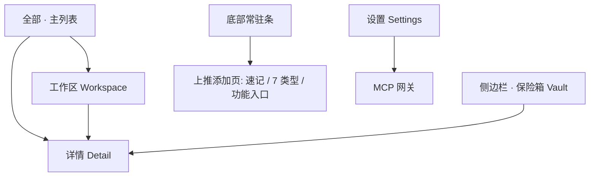

# goodshare UI 设计规范

> 视觉 / 交互 / 组件单一事实源。新增页面、改版、新增组件前先读本规范；与 PRD / V2 需求冲突时以需求文档为准，冲突点回写需求。
> 配套可复用约束见项目 skill `goodshare-ui`。

## 1. 设计原则

- **Material You / Material 3 为视觉基底**：不照搬「文件极客」的**文件管理隐喻**（文件夹 / 清理 / 存储空间）；本 App 是内容 / 时间线 / 笔记中枢 + AI 双态重构 + MCP 网关。
- **内容优先**：详情页同时承载人类态（`human_md`）与机器态（`machine_json`），可显式切换。
- **零阻力吞噬**：**底部常驻条**为一级添加入口（2026-09-29 取代悬浮球）——点即聚焦输入、打字即存，高频类型（拍照 / 选图 / 录音）一步到位，不进面板选类型。
- **隐私前置**：Vault 与打码在交互中显式呈现；MCP 层物理隔离 Vault（`is_vault=0` 过滤）。
- **分期**：MVP 仅时光机 + 全部 + 详情 + MCP 设置；V2 加 AI 态标记与通用截图解析；保险箱加密、健康/日历聚合推迟 V3（2026-09-27 决策）。
- **文档形态**（2026-09-29 拍板，SSOT 见 [content-pipeline.md](content-pipeline.md)）：详情页是**一篇文章**而非仪表盘——标题置顶、正文全宽、chrome 极低、主操作唯一；列表提密度，**弃低密度大卡片**（小红书式色块海报已否决）。富文本由**自建渲染器**呈现（弃 `flutter_markdown_plus`），载体为 Markdown 子集；**存储仍三层，呈现只走富文本**。

## 2. 视觉系统

> **2026-09-30 视觉基准改版（用户拍板）**：全 App 视觉以 **mymind 风格为基准，旧审美作废**。视觉性格 = 「恒定暗室 + 单一强调色 + 书籍感阅读排版」。参考截图存 `/home/zzh/Pictures/screen/`（mymind 实拍）。
>
> **与 Material 的关系（拍板口径：留骨头、换皮）**：
> - **代码层**：Material 组件库照用（Scaffold / Sheet / TextField / 无障碍语义…）——Flutter 的地基，拆不起也不必拆；
> - **主题层**：`ThemeData` 全量 override 为本文 mymind 令牌，**M3 默认视觉（紫 seed / elevation 阴影 / 描边 chip / 默认组件长相）一个像素不许露出**；
> - **视觉层**：规范、验收、评审**只认 mymind 基准，「像不像 M3」从此不是评价维度**——不存在两种风格混搭。

### 2.1 取色（改版：恒定暗色，弃动态取色）

- **恒定暗色**：全 App 固定暗色系，不跟随系统明暗切换（mymind 即如此；亮色模式不做，后续有需求再立项）。
- **色阶分层代替海拔**：三层灰阶构成空间感——底色 `#15171E` 级深墨蓝黑 / 卡片 `#1C1F27` 级 / 浮层（sheet/dialog）再亮一档；**阴影几乎不用**，暗色下 M3 elevation 阴影不可见，层级全靠色阶。
- **单一强调色**：品牌橘红（现 brand primary）仅用于**动作与选中**——＋块、Add tag、选中 chip、主按钮；不参与大面积装饰，克制即质感。
- 文字色阶：正文暖白（非纯白），次级信息用灰阶递减；分区标题用低饱和灰 + 大写宽字距（§2.2）。
- M3 `dynamic_color` 动态取色**废弃**（换壁纸全 App 变调与恒定视觉性格冲突）；`ColorScheme.dark` 仍作为工程载体，override 上述色值。

### 2.2 字体与排版（改版：书籍感阅读排版）

- **阅读态衬线（P0）**：note / url / chatlog 等**文章类详情正文**用系统衬线（`fontFamily: 'serif'`）+ 暖白字色 + 行高 ≥1.7——整页如纸质书（mymind 文章页整篇衬线）。标题同衬线、字号升一档。图片/视频等媒体型条目正文（转录稿/OCR）沿用无衬线，不强行衬线。
- **富文本排版令牌**（2026-09-29，自建渲染器，见 §8 与 [content-pipeline.md](content-pipeline.md) §5）：正文 15.5–16px / 行高 1.65（衬线阅读态 ≥1.7）/ 段间距 12（`Insets.md`，守 tokens 刻度不引入 14）；**标题一律映射 M3 `textTheme`（架构 R7 禁裸 fontSize 字面量）**：h1 `headlineSmall`(24) / h2 `titleLarge`(22) / h3 `titleMedium`(16) / h4-h6 `titleSmall`(14)，w600（衬线态可降 w500）、行高 1.35；引用左侧 3px 竖线 + 次级色；代码块 `surfaceContainerHighest` + 等宽 + 12 内边距；列表缩进 20；待办为可勾选行（完成态加删除线）。
- **分区标题签名式（mymind MIND TAGS 式）**：详情页分区标签（TLDR / 标签区 / 附录等）= **大写（中文场景为小字号）+ 宽字距（letter-spacing ≥1.5）+ 低饱和强调色或灰**，字号小（11-12 级），与正文拉开身份差。
- 富文本载体为 **Markdown 子集**（块级：标题/段落/引用/列表/代码块/分隔/待办；行内：粗体/斜体/行内码/链接）。不认识的块降级为纯文本段落——**宁可样式平，不可吞内容**。
- **文青风口号（首页空态欢迎 / 类型空态引导 / 关于 / 详情底栏）**：沿用暗色表面，不硬编码底色；衬线 + Light 字重 + 1.5 字间距 + `onSurfaceVariant` 文字色（与 §2.2 阅读态衬线同语言）。文案走远端配置 `config.slogans`（见自更新文档），本地默认值兜底，零字体体积。无独立闪屏遮罩，口号自然融入主界面空态。

### 2.3 形状 / 间距 / 组件形态（改版：大圆角 + 胶囊；2026-10-01 按钮去胶囊修订）

- **圆角上调**：卡片 20dp 级（原 16dp 偏工具感）；媒体封面卡同档大圆角；间距仍循 8 倍数栅格（8 / 16 / 24）。
- **按钮形态（2026-10-01 修订；同日二次拍板「全系统去胶囊」）**：**按钮类一律大圆角矩形**——Filled/Outlined/FAB 经主题 `shape` 全局收口（`Radii.lg` 16dp，与卡片同语言），M3 默认 Stadium 胶囊退役。**胶囊形态全系统退役**：筛选 chips（chipTheme）与标签（`_tagBadge`）同为矩形（`Radii.md` 12dp）、搜索输入框 `xl20`、标注工具栏 `lg16`、**NavigationBar 选中指示器透明化**（M3 原生=64×32 胶囊；选中=图标+文字橘红、无底板）、SegmentedButton 收口 `lg16`——lib 内 Stadium 归零，胶囊不再是任何组件的形态选项；圆角按组件尺寸取档：小件（chips/标签）md、按钮/工具栏 lg、卡片/输入框 xl。
- ~~**胶囊化**：标签、按钮、操作项一律全 pill（StadiumBorder）~~（2026-10-01 两步废止：先按钮去胶囊，同日**全系统去胶囊**——chips/标签/输入框/工具栏全部矩形化，见上条；全库 Stadium 归零）。
- **标签胶囊流**：`FilterChip` 视觉改造为**深色胶囊 + 灰字、无边框**，选中即橘红填充；标签多时末尾**渐隐**（`Wrap` + ShaderMask 渐隐尾项，对齐 mymind 标签排布）。
- **TLDR 描边 callout 卡**：详情页导语/摘要为圆角描边框 + 分区标题式「TLDR」小签（从 rich-text-component.md §6「待做」提为详情页规范）。
- 海拔：仅浮层（sheet/dialog/menu）用 elevation，平面内容一律色阶分层（§2.1）。

### 2.4 品牌符号与装饰（2026-10-01 新增）

- **符号体系**：鹦鹉螺几何线稿（`NautilusGlyph`，用户供 SVG 资产）为**唯一品牌符号**兼 **app 启动图标**（2026-10-01）——「贝」押「拾贝」题眼、螺旋分室暗合「散落碎片长出秩序」；品牌底渲染 1024px 经 `flutter_launcher_icons` 出全尺寸图标集。三环绳结**插画**（`KnotIllustration`，`assets/glyphs/knot_diagram.png`）挂工作区创建页顶（96dp，与品牌 glyph 同档）——「把散落的条目打成结」的工作区隐喻，**方向箭头保留、序号已剔除**（2026-10-01 用户拍板：小尺寸下序号成噪点）。~~中国结~~ **已废弃（2026-10-01）**：盘长结形态与**联通商标撞车**（其 logo 即红色盘长结），品类被注册——凡 logo/品牌用途禁用中国结形态，此为硬约束非审美取舍。新增装饰 glyph 先查本节对号。
- **装饰色纪律**：装饰（glyph / 插画 / 品牌符号）**一律不走橘红**——橘红仅用于动作与选中（§2.1）；线稿取 `onSurfaceVariant` / `onSurface` 槽位，切面用 surfaceContainer 两档。
- **矢量资产入库纪律**：SVG / 位图资产入 `assets/glyphs/` 前必须**色板重映射**——源图彩色按亮度映射进主题槽位值、**背景板（白底 rect 等）删除**，源图彩色不落一色进代码（现 nautilus.svg 仅剩 3 个主题值）。换主题 = 重跑映射，不在页面上打补丁。
- **不写手势教学文案**：手势是平台自明 affordance（预测式返回动画、系统手势引导已足够），拉手 / 按钮上禁止出现「点按或上滑展开」类操作说明——文字提示只做内容占位（如「记点什么…」），不做动作教学。

## 3. 导航架构

底部 **3 个 tab（全部 / 工作区 / 设置）** + **底部常驻添加条**（上推展开全屏）+ 侧边栏（低频 / 隐私入口）。**无悬浮球**。

> **2026-09-29 改版（信息结构收敛）**：原 5 tab 中——**时光机**降为主列表的排序/分组维度、**AI 分类**降为筛选维度、**保险箱**移入侧边栏（安全域，不占 tab），并新增**工作区** tab。
> 收敛依据（代码事实）：时光机与「全部」取的是**同一份数据**（均为 `repo.list`），差别只在按天分组；AI 分类本质是标签（且 `ai_tags_page` 现为静态空态占位）；保险箱本质是权限域而非内容分类。
> 悬浮球去除依据：它浮在内容之上形成遮挡，与「chrome 极低」的文档形态基调冲突；其原有职责（全类型添加）由底部常驻条承接。

```text
顶部      ☰ │ 搜索（占主导） │ ＋（菜单：拍照 / 扫描文档 / 导入资源）
底部导航   全部 · 工作区 · 设置
底部常驻条 「记点什么…」（仅首页）    ← 点即聚焦，打字即存（纯速记）
侧边栏     保险箱 · 最近删除 · AI 任务队列（由 ☰ 打开）
主列表     筛选 chips（类型 · 时间 · 标签 …）+ 排序切换
```

**添加入口的分工**（2026-09-29）：
| 入口 | 职责 |
|---|---|
| 顶部 `＋` | **导入资源**：拍照 / 扫描文档 / 导入（图片 · 视频 · 音频 · 文档 …） |
| 底部常驻条 | **速记**：纯文本，点即聚焦、打字即存 |

分工依据：拍照 / 扫描 / 导入都是「把外部资源拿进来」，属同一类动作；速记是「直接写字」，不该与导入混在一个菜单里。底部条因此**不再挂高频图标**（原 📷🖼🎙 已上移到顶部 `＋` 菜单）。



**返回口径（2026-10-01 拍板：无 app 内返回箭头）**：二级页与状态层级视图**一律不出现返回箭头**，出口=系统手势/返回键（Android 平台级能力，与「chrome 极低」基调一致）。三层落法——①**路由页**（详情/MCP/更新/任务队列/最近删除/视频全屏）`automaticallyImplyLeading: false`，系统返回天然 pop；②**状态层级视图**（保险箱视图、工作区进入态）不是路由，由 `PopScope` 接管：返回=退回上级状态（保险箱→全部、工作区条目→工作区列表），不退 app；③**手势冲突兜底**：标注画布生成/拖拽中 `canPop:false`，笔画起于边缘手势带被系统掐断后，返回事件解释为「取消生成模式」而非退页（边缘工具栏布局为第一层缓冲）。**例外**：Sheet/Dialog 的关闭/取消按钮（语义非导航返回）与速记面板「收起箭头」（收合非返回）保留。

**页面去留**：`inbox_page` 改造为主列表；`timeline_page` / `ai_tags_page` / `vault_page` **删除**（逻辑并入维度与侧边栏）；`settings_page` 保留。
**连带改动**：`SecureWindow`（FLAG_SECURE 防截图）当前绑定 tab 索引 `_vaultIndex = 3`，须改为按「当前是否处于保险箱视图」判定。

## 4. 页面清单

### 4.1 时间维度（原「时光机」页，2026-09-29 降级）

- **不再是独立页面**：`timeline_page` 删除。事实依据——它与「全部」取的是同一份 `repo.list` 数据，唯一差别是多渲染一层「按天分组」头，且 `daily_metrics` 无数据（健康/日历属 V3）。
- 时间由此降为主列表的**两个维度**：①**排序**（创建时间倒序默认 / 正序）②**分组**（按天分组头，可关闭）。
- ⚠️ 代码前提：`Repository.list` 当前排序**硬编码** `orderBy: 'created_at DESC, rowid DESC'`，做排序维度须先给它加排序参数。
- **V3 分化口子保留**：健康 / 日历聚合接入后，时间维度若重新长成独立「时光机」页，本降级不阻碍该路径（勿在改版中把分化堵死）。

### 4.2 全部 · 主列表（首页）

- **定位（2026-09-29 改版）**：唯一内容列表页。原「横滑切换文件类型」的 `PageView` **取消**——类型已降为筛选维度，横滑翻页与 chips 筛选两套并存是重复交互；改为**单列表 + chips 筛选**（选中即过滤，不再翻页）。
- **顶栏（2026-09-30 定稿）**：mymind 同款一体块——☰ 嵌入搜索长条左端（无接缝）+ 右侧橘红（brand primary）方形 ＋ 块（添加菜单 BottomSheet）；筛选/排序已迁全屏搜索页（2026-09-30 搜索改版）。
- **顶栏自动隐显（2026-09-30 D1 用户拍板）**：顶栏并入滚动流（`SliverAppBar` floating+snap，与列表同源联动、非 overlay）——向下滚内容（继续阅读、手指上滑）→ 隐藏；向上滚（回看，轻微反向滚动即弹回）→ snap 展开；列表在顶部时恒显示。范围仅本页主列表：保险箱视图（导航关键件）与搜索页不参与。
- **筛选维度语义**（原三个 tab 的收敛落点）：
  | 维度 | 过滤依据 | 替代了 |
  |---|---|---|
  | 类型 | `item_type` | 原「全部」页内横滑分类型 |
  | 时间 | `created_at` 范围 + 排序 | 原**时光机** tab（§4.1） |
  | 标签 | `facets` | 原**AI 分类** tab（§4.10） |
  | 保险箱 | `is_vault` | 原**保险箱** tab（§4.4，侧边栏入口亦可达） |
- **空态**：无条目时口号 + 引导；筛选无结果时明示「当前筛选无结果」并给「清除筛选」。
- **列表形态（2026-09-30 改版，用户拍板）**：**瀑布流双列卡片**（`MasonryGridView`，`flutter_staggered_grid_view`）取代文档条目行——图片条目真图铺卡顶、高度自适应原图比例（错落），文本条目预览为主体；点击进详情；**页内不再有 ＋ 添加按钮**（添加统一走底部常驻条，见 §4.6）。
- **AI 派生类型**：聊天 / 发票截图入库为 `image`，经 AI 处理后重分类为 `chatlog` / `document`；未处理前归「图片」分类。

### 4.3 详情 Detail（模板 + 按类型实现）

- **两区改版（2026-10-01 拍板，先落地单文字便签）**：详情页功能分两区——
  - **公共区（底部操作条，3 项恒定，2026-10-01 重划）**：**编辑 · 工作区 · 分享**。分享 = **唯一分享路径**（按内容分流：无音视频走离屏截图 PNG、超 8000px 或含音视频降级 PDF，detail-two-zone.md §6）；**删除移入 `⋯` 菜单**（危险项不占底栏常驻位，红字 + 二次确认）；原「摘要/标签」移入灵感区。
  - **灵感区（正文底部附录位置，默认摘要，可切换标签）**：切换器（摘要/标签二选一）+ 内容 + **刷新按钮**（重复执行同一命令动态重新生成，AI 接入后生效；复用 `SummarizeCommand`/`ExtractTagsCommand` 与 `_AiTaskStatusLine` 状态机制）。
  - **块级链式能力（2026-10-01 两轮收敛定稿，SSOT 见 [detail-two-zone.md](detail-two-zone.md)）**：**长按任何块 → 能力菜单 → 三级专属处理面**——媒体块=能力卡（近整屏，单卡链式不嵌套），文本块=三级文本专属页（全屏，双击选字分家）；能力项不嵌选字气泡菜单，细分能力全进专属页；与「提取并翻译」预置链同构，中间加人工修订环节（Human-AI 对称性）。
- **模板化**：详情页为 `ItemViewTemplate`，由 `ItemViewRegistry.resolve(item_type)` 取对应实现渲染；编辑页为 `ItemEditorTemplate`，由 `ItemEditorRegistry.resolve(item_type)` 取实现。与 V2 需求 §3.8 的 `AiReconstructor` 同构——新增文件类型 = 实现模板 + 注册，框架零改动。
- **文档形态（2026-09-29 改版，SSOT 见 [content-pipeline.md](content-pipeline.md) §2）**：详情页按「文章」组织，非分区卡片堆叠——①**标题置顶**（衬线、`headlineSmall`，§2.2），②其下导语块（原 TL;DR，**描边 callout 卡** §2.3），③正文富文本全宽排版（**文章类条目走衬线阅读态** §2.2），媒体内联进内容流 ④派生内容（摘要/译文/关键区间）为正文末尾**附录章节**，不叠卡片边框 ⑤**机器态入口对人类隐藏**（普通用户不进机器态，长按标题切换；双态呈现能力保留=硬规则）⑥操作收敛：`⋯` 菜单（低频 / 危险，含删除）+ **底部基本操作条**（编辑 · 工作区 · 分享），不做按钮矩阵 ⑦末尾小字「来自 XXX · 时间」。分区标题一律走 §2.2 签名式（大写宽字距小签）。
- **通用外壳（旧，改版前）**：顶部固定 3 句 `human_tldr`；「机器态」开关切换查看 `machine_json`（JsonView 折叠树；`machine_json` 为空即 V1 基础模式，显示「暂无机器态」空态）；底部 `BottomSheet` 操作：移入 Vault / 重分类 / 重新处理 / 删除；删除为软删除，30 天内可恢复；「重分类」仅 `source_type='image'` 条目显示（image→chatlog/document 白名单，与 MCP `update_item(item_type)` 同源）。（原「同步到 PC」已移除——架构上无手机→PC 推送通道，2026-09-27 决策；PC→手机写回走 MCP `add_item`。）
- **操作分层（2026-09-29 定稿；2026-09-30 工具箱收敛拍板）**：操作分三层，基本操作对所有类型固定，不随类型跳动；**类型专属工具统一收进「工具箱」单入口**——类型多工具多（image 2 个 / audio 3-4 个 / video 5 个+），平铺成 chips 墙违背「chrome 极低」，故正文末尾只留**一个「工具」胶囊**，点开工具箱 BottomSheet 列出该类型全部工具（预置链置顶 → 单步工具随后，各项带 `_AiTaskStatusLine` 状态），与「卡片操作优先 BottomSheet」既有口径同构。

  | 层 | 内容 | 位置 |
  |---|---|---|
  | **基本操作**（3 个，全类型通用，**恒定不扩容**；2026-10-01 重划） | 编辑 · 工作区 · 分享 | **底部操作条**（原删除移入 `⋯` 菜单，对应 mymind 的 Spaces/Share/Delete 形态） |
  | **类型专属工具** | 见下表（含预置链「提取并翻译」） | 正文末尾**单一「工具」胶囊 → 工具箱 BottomSheet**（不平铺） |
  | **低频 / 危险** | 删除（红字 + 二次确认）· 解锁编辑 · 重分类 · 重处理 · 移入移出保险箱 | AppBar `⋯` 菜单；**机器态**不给按钮（长按 AppBar 标题切换，仅供开发 / 调试） |

- 基本操作的落点：摘要 = `SummarizeCommand`、标签 = `ExtractTagsCommand`（**命令层均已存在**）；分享（`share_plus`）、软删除已落地；**工作区选择为新建功能**（§4.11）。
- **AI 类操作按钮必须带状态**：进行中（禁用 + 进度）/ 已完成 / 失败带 note，复用现有 `_AiTaskStatusLine` 机制，不新造。摘要与标签是重操作，放底部条须有此状态反馈防误触。
- **「标签」本轮 = AI 提取**（与摘要对称）；**手动编辑标签列为后续项**（`tags` 字段已有、UI 无编辑入口，`todos.md` 已挂「标签管理」待办）。

- **按类型的文档流与工具矩阵**（工具统一收进「工具」胶囊 → 工具箱 BottomSheet，不平铺；「提取并翻译」预置链置顶，设计见 scheduling-tasks.md §4.4）：
  | item_type | 文档流内容 | 内容内联 | 工具箱内容（该类型工具清单） |
  |---|---|---|---|
  | note | 标题 → 正文富文本 | — | 文本分析、翻译 |
  | url | 标题 → 导语 → 抓取正文 → 末尾「来源 · 时间」 | — | 重新抓取、翻译 |
  | image | 图片全宽 → OCR 文本 → 分类标签 | 标注 | **提取并翻译**（OCR→翻译链）、OCR、图片分类、条码扫描 |
  | video | 播放器 → 转写文本 → 附录：关键区间 | 播放控制 | **提取并翻译**（转写→翻译链）、转写、切片、提取音轨 |
  | audio | 播放器 → 转写文本 | 播放控制 | **提取并翻译**（转写→翻译链）、转写、提取音轨、字幕导出 |
  | chatlog | 标题 → 会话 / 正文 → 摘要 | — | 翻译 |
  | document | 文件信息 → PDF 内嵌预览 或 文本正文 | PDF 翻页 | 用其他应用打开 |

  （编辑统一走 `⋯` 菜单，不再按类型分散 Editor 实现表；富文本呈现见 [content-pipeline.md](content-pipeline.md)。）

### 4.4 保险箱 Vault（安全域，2026-09-29 移入侧边栏）

- **定位修正**：保险箱是**安全域**，不是内容分类维度——此前将其归为「筛选维度」的表述已修正。它**不占底部 tab**，入口在**侧边栏**（带锁图标，与「最近删除 / AI 任务队列」等普通入口视觉区分）。
- **已有隔离机制（代码已落地）**：① MCP 物理隔离（`is_vault=0` 过滤，AI 侧完全不可见）② 动作层硬约束：`set_vault(off)` 需生物识别，**AI actor 直接拒绝**（AI 只能移入）③ 防截图 `SecureWindow`（FLAG_SECURE，须由 tab 索引判定改为**按视图判定**）④ 备份排除（快照上删 `is_vault=1` 再 `VACUUM`）。
- **内容默认打码**（2026-09-29 拍板）：进入保险箱视图即默认打码，复用已有 `PrivacyBlurOverlay`。
- **门禁语义**：鉴权发生在「点侧边栏入口」处——不是进入后再验，也不是勾选筛选框时验（后者语义别扭）。
- **详情页复用**：保险箱条目与「全部」复用同一个 `ItemDetailPage`（代码现状），无独立保险箱详情页；早期导航图中的「保险箱详情」分支**已作废**。
- **⚠️ V3 才做**：生物识别门（`local_auth` **尚未引入依赖**）、AES 加密（**当前内容明文存本地**，隔离仅体现在 MCP 与备份层）。文档与 UI 须如实表述，不可让用户误以为已加密。
- 保险箱视图内建议明示安全承诺（如「此内容不进备份、MCP 不可见」），把已有机制翻译成用户能懂的话。

### 4.5 设置 Settings

- 见 §5 设置树。

### 4.6 上推添加页（2026-09-29 取代悬浮球）

- **悬浮球删除**（`lib/ui/floating_ball.dart`）：它浮在内容之上形成遮挡，与「chrome 极低」的文档形态基调冲突；职责由底部常驻条承接。跨 app 系统级悬浮窗（overlay + 悬浮权限）不再考虑。
- **顶部 `＋` 菜单（导入类）**：拍照 / 扫描文档 / 导入（图片 · 视频 · 音频 · 文档 …）。点击弹**下拉菜单**——导入是单一动作，不需要半屏面板。
- **底部常驻条 = 便利贴（2026-09-30 改版拍板「便利贴 + 全展开」）**：收合态只露 52px 便签拉手（点按/上滑拽出），展开态近整屏书写面板——顶栏「收起 · 今日日期 · 保存」，主体三层结构（顶栏钉顶 / 作曲层满幅内滚 / 工具层常驻底部拇指区）。
- **需要指定类型时**：顶部 `＋` 菜单（导入类）与分类添加入口；默认直接存为便签，不强制选类型。
- **路径硬要求**：速记 = 点条 → 打字 → 存（两步）。原悬浮球是「点球 → 选便签 → 打字」，改版后必须更快。
- **显示范围**：常驻条**仅首页（「全部」tab）显示**（2026-09-30 用户拍板：工作区 tab 不显示；工作区条目添加走顶部 `＋` 或进条目详情编辑），详情页不显示（详情页保留自己的底部浮动主按钮，避免两层底部元素并存）。
- **常驻不随滚动隐显（2026-10-01 拍板）**：主列表顶栏随滚动隐显（§4.2），速记条**恒常驻**——chrome 隐显按**任务生命周期**判断：搜索/添加菜单在阅读时用不着，随滚动让位；而速记的触发时机恰是浏览中途的灵感，常驻=任何时刻单手一触可达，隐藏则要「往回滚唤出」，破坏阅读位置换 52px 不划算。
- **保存按钮内容感知（2026-10-01 拍板）**：空便签=实色禁用态（surfaceContainer 底 + 灰字，**禁 M3 默认半透明罩**——onSurface@12% 罩叠面板即「脏」的来源），有内容（文字/媒体/标签/待办任一）=点亮橘红 FilledButton + onPrimary 白字（「橘红仅动作与选中」纪律的正向应用；白字+橘红是设计好的 onPrimary 对，非脏源）。
- **形变交叉淡化「先死后生」**：收合/展开两态树叠放交叉淡化时，**同名元素禁止同屏并存**（拉手「记点什么…」与正文首行 hint）——先现者提前退场（拉手文字进度 0→0.2 消隐），后现者按原窗口浮现（0.35 起），任意时刻全屏最多一份提示。
- **遮挡处理**：各列表底部须留出常驻条高度（现有 `bottom: 96` 够用）。
- 添加入口统一走此路径（原「各页内 ＋」早已移除）。
- **便利贴多媒体编辑（2026-09-30 用户拍板「媒体不分散保存」，四点裁决）**：
  - 工具行 = 格式行（标题 / 粗体）+ 动作行（**拍照 / 相册 / 录音** / 标签 / 待办）；
  - 拍照 / 相册 / 录音是**就地插入**：媒体卡插在光标处，文字—图—录音混排（语义反转——不再「直接出独立卡片」；独立媒体条目走顶部 `＋` 菜单）；录音是时序性插入，停止后播放条落光标处、焦点自然落到其后继续补文字；
  - **保存 = 整条落库**：全部段序列化为**一个** note 条目（行内媒体块，SSOT：[rich-text-media.md](rich-text-media.md) §2 写入口径，url = `local://<documents 内相对路径>` 相对标记、绝不写绝对路径）；**含媒体便签豁免合并窗口**（合并链只对纯文本成立，用户拍板），纯文本仍走 `TextCollector`（合并逻辑不变）；
  - 草稿静态留存**含媒体段**（收合/切 tab/Activity 重建均幸存）；移除媒体段同时删除其私有副本文件（防孤儿文件）；
  - 视频行内插入不上本期（V2，随封面提取）。
- 新建 note / 录音 / 拍照 → 写 `raw_content` + 入 `ai_task_queue`（pending）。**图片 OCR 已提前至 v1（2026-09-27 分期调整）**：图片经 ML Kit 端侧识别产出文本（标准 GMS 设备）；录音**仅存音频文件**（边录边转写于同日移除，用户拍板；若后续恢复需引入转写引擎，如 ML Kit speech / 云端 ASR）；「转待办」提炼随 V2 LLM 管线解锁。

### 4.7 侧边栏（低频 / 隐私入口，2026-09-29 重排）

- 左侧 `NavigationDrawer`（AppBar 汉堡入口）。定位改为**低频与隐私入口**，**不再承担分类导航**（分类已并入主列表筛选 chips）。
- **内容**：

  | 项 | 说明 |
  |---|---|
  | **保险箱** | **置顶**、带锁图标，视觉上与其余入口区分（安全域，见 §4.4） |
  | 最近删除 | 30 天内可恢复 / 彻底删除 |
  | AI 任务队列 | OCR / 转写 / 抓取任务状态排查 |

- **删除项（已失效或重复）**：AI 分类（降为筛选维度，§4.10）、类型分类（并入主列表 chips）、OCR / 录音 / 链接抓取（是设置开关，不是页面入口）。
- 原「抽屉内内联查看 / 编辑」随分类导航一并取消——分类已不在侧边栏，该交互无承载。

### 4.8 大模型指令驱动（MCP 动作层）

- PC 端大模型经 MCP 发送的指令，由 App 反序列化为 `ItemCommand` 后调用与 UI **同一套 `ItemActionHandler`**（查看 / 编辑 / 删除 / 移入保险箱 / 重新处理），行为完全一致（详见 PRD §7 与 docs/architecture/human-ai-parity.md）。UI 侧按钮置灰只是快路径，**不是安全边界**——同一约束在动作层内再拦一次。
- 即 UI 能做的操作（含侧边栏内联编辑、详情 BottomSheet、FAB 速记），大模型均可通过 `update_item` / `delete_item` / `set_vault` / `reprocess_item` 等工具驱动；Vault 内容对 MCP 物理隔离。

### 4.9 文本收集模式（合并 / 分散）

- **设置项**「文本收集模式」：分散（默认）/ 合并；FAB 速记与粘贴入口显示当前模式。
- **分散模式（默认）**：每次文本收集 = 1 条 `inbox_item`，`collect_mode='scatter'`、`edit_locked=0`，正常编辑。
- **合并模式**：**同一来源 App + 5 分钟内**（阈值可调）的连续文本收集追加进同一 `inbox_item`——`raw_content` 拼接各段，`appendix_json` 记录每段 `{ts,text,source}`，`collect_mode='merge'`、`edit_locked=1`（锁定）；**纯 URL 段不参与合并**（独立成条供 `summarize_url` 处理）；MCP `add_item` 不参与合并，PC 写回永远独立成条（2026-09-27 决策）。
- **查看**：详情渲染合并全文 + 可折叠「附加记录」列表（来源段）。
- **解除编辑**：合并项默认不可编辑；点「解除编辑」（`edit_locked`→0）后方可改；解除后可编辑或按 `appendix_json` 拆分为多条分散项。
- **MCP 写保护**：`update_item` 在 `edit_locked=1` 时拒绝写入，须先 `unlock_edit`（见 PRD §7）。

### 4.10 标签维度（原「AI 分类」页，2026-09-29 降级）

- **不再是独立页面**：`ai_tags_page` 删除（它本就是静态空态占位，不读数据）。降为主列表筛选 chips 中的**标签维度**，按 `facets` 过滤。
- **交互**：chips 行点「标签」→ 展开**视角**（perspective：主题 / 事件 / 项目 / 人物 …，AI 派生动态生成，非硬编码）→ 选聚类标签 → 列表按该标签过滤。同一条目可同时命中多个标签。**视觉走 §2.3 标签胶囊流**（深色胶囊 + 渐隐，弃 M3 FilterChip 描边式）。
- `facets` 由 `AiReconstructor` 产出（V2 §3.8），**对 `item_type` 完全无感**：视频 / 图片 / 聊天 / 笔记统一被打标，富媒体与笔记平级参与聚类。
- **依赖 AI 打标**：无 `facets` 时该维度显示「暂无分类，离线 AI 打标生效后出现」，不做假数据。
- **与「工作区」的区别**：标签是 AI 产出的**属性**（扁平、只能筛选，用户不能创建）；工作区是**容器**（可创建 / 命名 / 增删条目，见 §4.11）。

### 4.11 工作区 Workspace（2026-09-29 新增 tab）

- **定位**：条目集合容器，对应 mymind 的 Spaces。一个条目**可属于多个工作区**（多对多）。
- **两种来源**：① **用户手动聚合**——多选条目归入工作区 ② **AI 聚合**——由 AI 按内容聚类并建议工作区（**V2**，需端侧 LLM / 向量就绪后再做，现在硬做只会出垃圾聚类）。
- **数据模型**：新增 `workspaces`（id/name/created_at）+ `workspace_items`（workspace_id/item_id）两张表。
- **Human-AI 对称性（铁律）**：工作区若 UI 能建，**AI 也必须能建**——否则违反「删掉 UI 只接微信机器人能否不改核心代码」的试金石。必须配套：`WorkspaceCommand`（create/add/remove/rename/delete）走 `ItemActionHandler` + MCP 工具（`create_workspace` / `add_to_workspace` / `list_workspaces`）。
- **多选交互是新增能力**：当前列表点条目直接进详情，**没有多选模式**。要做「手动聚合多个文件」须先做多选（长按进入选择态 + 批量操作栏）。低成本替代：先只做「详情页 → 加入工作区」，不做列表多选。
- **隐私隔离**：Vault 条目可进工作区，但 MCP 侧与工作区列表仍须 `is_vault=0` 过滤，不得开后门。
- **页面形态（2026-09-30 D2 用户拍板「卡片化」）**：两层均为卡片语言——①工作区列表 = **卡片网格**（mymind Spaces 形态：卡 = 工作区，名字 + 条目数 + 封面拼贴（最多 3 图等宽裁切）；无图退首条文字预览、空工作区图标兜底；固定比例小卡，不做低密度大卡）②工作区内条目 = **瀑布流双列**（与 §4.2 主列表同一套卡片语言与边距令牌）。
- **创建流程（2026-10-01 拍板：整页仪式取代裸 AlertDialog）**：FAB push **整页创建页**（mymind「Create new space」布局参照）——顶部三环绳结插画（§2.4，箭头保留、序号剔除；原中国结因联通商标撞车废弃，鹦鹉螺升任 app 图标）→ 衬线标题「新建工作区」→ 定位语「聚合点滴记录与热爱。不止是为了归档过去，更是为了启发未来。」→ 大号居中描边名称框（autofocus）→ 橘红胶囊「创建」FilledButton（名称空=不可点）；右上角 X 关闭（关闭语义，§3 例外口径）+ 手势返回。本页只产名称，写路径仍走 `CreateWorkspaceCommand`；**V3 口子**：图标/配色/描述属性步长在本页（mymind NEXT STEP 同位）。

## 5. 设置树

```text
设置
├─ MCP 网关
│   ├─ 服务开关 / 监听端口
│   ├─ API Token（复制 / 重置）
│   ├─ 已配对客户端列表
│   └─ 连接状态
├─ AI 模式（呼应 PRD §6 / V2 §3.7·§3.8）
│   ├─ 图片 OCR 开关（本机能力检测：无 GMS 小字提示并置灰；默认开，2026-09-27 决策）
│   ├─ 链接离线抓取正文开关（默认开；抓取失败回退原文，2026-09-27 决策）
│   └─ 录音/音频 端侧转写开关（Sherpa-ONNX 离线，无 GMS 依赖；默认开，2026-09-28；
│       副标题随选中模型状态显示：已下载/下载中%/需先下载/失败原因；
│       开关打开且当前档位模型已下载时，重入队存量未转写音频）
├─ 语音转写模型（2026-09-28：三档全接、按需下载，hf-mirror int8 源）
│   ├─ 基础 · 中文（Paraformer-zh，~213MB）
│   ├─ 全能 · 多语种（SenseVoice small，~228MB）
│   ├─ 全球 · Whisper（Whisper small，~360MB）
│   └─ 每档卡片：单选选中态 + 体积 + 下载/进度+取消/重试/清除缓存；
│       选中未下载档仅切换选择，点卡片下载；选中已下载档切换即重入队存量音频
├─ 端侧大模型（2026-09-28：SoC 感知目录，见 docs/design/on-device-llm.md）
│   ├─ 通用 · Qwen2.5-1.5B（~1.5GB，全设备可见）
│   ├─ NPU · 骁龙8至尊版（Gemma3-1B ~658MB，仅 SM8750 设备可见）
│   ├─ NPU · 天玑9400（Gemma3-1B ~986MB，仅 MT6991 设备可见）
│   └─ 每档卡片：选中态 + 体积 + 下载/进度/删除（删除二次确认）；
│       下载后详情页出现「摘要」「提取关键词」按钮（iOS 走系统模型，iOS 26+ 无需下载）
├─ AI 模式（续）
│   ├─ 离线 AI：自动 / 强制 V1 / 尝试 V2（V2 灰显）
│   └─ 云端兜底：关（默认） / 开（V2）
├─ 隐私与保险箱
│   ├─ FaceID 锁定 Vault
│   └─ 身份证 / 银行卡默认打码
├─ 数据
│   ├─ 文本收集模式：分散（默认）/ 合并
│   └─ 最近删除（恢复 / 彻底删除 / 清空）
└─ 关于 / 日志
```

## 6. 组件库（Material 骨 + mymind 皮）

> 组件**代码**沿用 Material 库（地基，不重造），**视觉一律按 §2 mymind 令牌经 ThemeData 全量 override**——M3 默认长相不许露出（§2 拍板口径）。下表不再逐项重复视觉说明。

- `ContentCard`（文档条目行）、`FilterChip`（筛选维度：类型 / 时间 / 标签 / 保险箱；视觉=§2.3 胶囊流）、`NavigationDrawer`（低频 + 隐私入口，见 §4.7）、**底部常驻条 + 上推添加页**（取代 `ExtendedFAB` 与悬浮球，见 §4.6）、`BottomSheet`、`RichTextView`（**自建富文本渲染器**，取代 `MarkdownView`，见 [content-pipeline.md](content-pipeline.md) §5）、`JsonView`、`PrivacyBlurOverlay`（保险箱默认打码）、`BiometricGate`（V3）。
- 详情 / 编辑采用**模板 + 按类型策略**：`ItemViewTemplate` / `ItemEditorTemplate` 抽象，配 `ItemViewRegistry` / `ItemEditorRegistry` 按 `item_type` 分发（`note`/`image`/`video`/`audio`/`chatlog`/`url`/`document` 各自实现）。
- 卡片操作优先 BottomSheet，不用右滑（更顺手，且避免与列表删除手势冲突）。
- **CTA 分级（2026-10-01 拍板）**：主按钮一律 `FilledButton`（填充色=动作承诺），弹窗内禁止两个同权重 TextButton 并排；**裸 AlertDialog 只做快速确认**（删除确认、小改小设置），低频重要动作（创建容器 / 创建空间类）走**整页仪式**（mymind「Create new space」参照：居中构图 + 衬线标题 + 一句定位语 + 大描边输入框 + 胶囊主按钮，见 §4.11）或 BottomSheet——**庄重感=形式升级、流程不加价**（交互步数不变，只给动作应有的分量）。
- **按压反馈分级（2026-10-01 拍板）**：反馈发生在**内容本身**上，禁面积型反馈——M3 半透明状态层（onSurface@8-12% 罩）叠暗色底即「灰泥」，与禁用罩同源。①**图标钮**=图标本身变色（onSurfaceVariant→onSurface 提亮，按下=「激活」暗示，橘红语义不被稀释），底板罩透明；②**CTA**=底色实色加深一档（primary→#E04F1A，tonal→secondaryContainer 实色加深，禁半透明罩）；③**文字钮**=文字实色加深（primary→#E04F1A）。扩散水波纹全局关闭（`splashFactory: NoSplash`），卡片/列表按压保留默认 highlight。主题层 `iconButtonTheme/filledButtonTheme/textButtonTheme` 一处收口，`WidgetStateProperty.resolveWith` 按下态覆写、非按下态返回 null 回落 M3 默认（selected 橘红不丢）。
- **承诺门**：创建类主按钮在输入不合法（名称空等）时 `onPressed: null` 实色禁用，不靠点击后报错；onSubmitted 回车路径留 SnackBar 兜边角。

## 7. 双态呈现规范

- 人类态（`human_md`）为默认视图；机器态（`machine_json`）需显式切换。
- Vault 内容的机器态对 MCP 屏蔽（服务端 `is_vault=0` 过滤，UI 层不暴露切换入口给外部）。
- 待办交互（V2 起可勾选，MVP 仅渲染）：`human_md` 中 `[ ]` 待办可勾选；勾选状态写独立字段 `todo_state_json`（按待办行内容 hash 关联，不回写 `human_md`），AI 重构（reprocess）后按 hash 重挂、失效项丢弃。

## 8. 实现指针（Flutter）

- 取色：~~`dynamic_color`~~（2026-09-30 废弃，恒定暗色 + override `ColorScheme.dark`，§2.1）；路由：`go_router`；**富文本渲染：自建（`lib/doc/` 归一化 + 自建渲染器，2026-09-29 弃 `flutter_markdown_plus`——停更分叉 + 待办勾选在渲染器架构下无法实现，见 [content-pipeline.md](content-pipeline.md) §5）**；状态：`flutter_riverpod`（蓝图 Zustand 等价）；Json 视图：`json_view`；生物识别：`local_auth`；PDF：`pdfrx`（文本提取；渲染需求另议；已核 pub.dev 活跃度与许可）。
- 详情 Markdown 与机器态共享同一 `item` 数据，避免双源不一致。

## 9. 分期范围

- **MVP**：时光机 + 全部 + 详情 + MCP 设置（轻量，先把「进得来、看得到、PC 读得到」跑通）。
- **V2**：AI 态标记（处理中/失败态 UI）+ 通用截图解析。
- **V3**：保险箱加密（生物识别 + AES）+ 健康/日历聚合进时光机 + 全部·时间轴视图（与时光机分化）。
