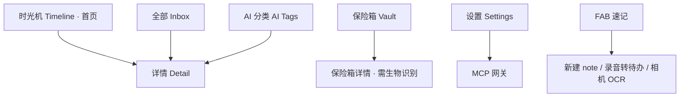

# goodshare UI 设计规范

> 视觉 / 交互 / 组件单一事实源。新增页面、改版、新增组件前先读本规范；与 PRD / V2 需求冲突时以需求文档为准，冲突点回写需求。
> 配套可复用约束见项目 skill `goodshare-ui`。

## 1. 设计原则

- **Material You / Material 3 为视觉基底**：不照搬「文件极客」的**文件管理隐喻**（文件夹 / 清理 / 存储空间）；本 App 是内容 / 时间线 / 笔记中枢 + AI 双态重构 + MCP 网关。
- **内容优先**：详情页同时承载人类态（`human_md`）与机器态（`machine_json`），可显式切换。
- **零阻力吞噬**：FAB「速记」为一级入口（新建 / 录音转待办 / 相机 OCR）。
- **隐私前置**：Vault 与打码在交互中显式呈现；MCP 层物理隔离 Vault（`is_vault=0` 过滤）。
- **分期**：MVP 仅时光机 + 全部 + 详情 + MCP 设置；V2 加 AI 态标记与通用截图解析；保险箱加密、健康/日历聚合推迟 V3（2026-09-27 决策）。

## 2. 视觉系统

### 2.1 取色

- 跟随系统动态取色（Android 12+ `dynamic_color`）；seed fallback 到品牌色 `#6750A4`（M3 baseline 紫）。
- 明 / 暗色跟随系统。禁止硬编码非品牌色。

### 2.2 字体与排版

- 默认 Roboto / 系统字体。标题 T20/B，正文 B14，TL;DR 摘要行强调。
- 双态 Markdown 渲染遵循社区分叉渲染库（见 §8）默认样式 + M3 主题覆盖。

### 2.3 形状 / 间距 / 海拔

- 圆角卡片 16dp；Extended FAB 56dp；间距遵循 8 倍数栅格（8 / 16 / 24）。
- 海拔用 M3 elevation tokens，不自定义阴影值。

## 3. 导航架构

底部 5 个 tab（时光机 / 全部 / AI 分类 / 保险箱 / 设置）+ 中央 FAB，不做其它顶层入口（除非回写需求）。



## 4. 页面清单

### 4.1 时光机（首页）

- 垂直时间轴，按「天」分组；每组串联 `steps` / `calendar_events` / 当天 `ingested_items`。
- 数据源：`daily_metrics` JOIN `inbox_items`（按 `created_at` 日期，`is_vault=0`）；**MVP/V2 阶段 `daily_metrics` 无数据，时光机即「按天分组的内容时间线」**（2026-09-27 决策：与 §4.2 时间轴视图合并，健康/日历 V3 接入后再分化）。
- 组件：`DateHeader` + `ContentCard`（type 图标 + `human_title` + `human_tldr` 缩略）。

### 4.2 全部 Inbox

- **顶部固定区域**放置可滑动 `TabBar`（pinned，随滚动常驻）：**分类视图** / **时间轴视图**（V3 起，见下）；左右滑动切换，二者共享同一数据源 `inbox_items`（`is_vault=0`）。**MVP/V2 仅「分类视图」单 tab**（时间轴与首页时光机重叠，2026-09-27 决策）。
- **分类视图**：按 `item_type`（便签 note · 文档 document · 图片 image · 视频 video · 音频 audio · 链接 url · 聊天 chatlog）分组，每组带 type 头与计数；适合快速定位某类素材。
- **时间轴视图**：按 `created_at` 倒序的连续流，可再按「天」收拢日期头；纯内容时间线，**不含**时光机的健康 / 日历上下文（轻量版）。**V3 起提供**（健康接入后与时光机分化为「纯内容流」对照）。
- 顶部 `FilterChip` 在两种视图内均可叠加筛选（如时间轴视图下只看 chatlog）。
- 点击进入详情。
- **AI 派生类型**：聊天 / 发票截图入库为 `image`，经 AI 处理后重分类为 `chatlog` / `document`；未处理前归「图片」分类。

### 4.3 详情 Detail（模板 + 按类型实现）

- **模板化**：详情页为 `ItemViewTemplate`，由 `ItemViewRegistry.resolve(item_type)` 取对应实现渲染；编辑页为 `ItemEditorTemplate`，由 `ItemEditorRegistry.resolve(item_type)` 取实现。与 V2 需求 §3.8 的 `AiReconstructor` 同构——新增文件类型 = 实现模板 + 注册，框架零改动。
- **通用外壳**（所有类型共享）：顶部固定 3 句 `human_tldr`；「机器态」开关切换查看 `machine_json`（JsonView 折叠树；`machine_json` 为空即 V1 基础模式，显示「暂无机器态」空态）；底部 `BottomSheet` 操作：移入 Vault / 重分类 / 重新处理 / 删除；删除为软删除，30 天内可恢复；「重分类」仅 `source_type='image'` 条目显示（image→chatlog/document 白名单，与 MCP `update_item(item_type)` 同源）。（原「同步到 PC」已移除——架构上无手机→PC 推送通道，2026-09-27 决策；PC→手机写回走 MCP `add_item`。）
- **类型专属区**（模板内由各实现填充）：
  | item_type | 查看实现（View） | 编辑实现（Editor） |
  |---|---|---|
  | note | Markdown 预览 | Markdown 编辑器（模块三便签） |
  | image | 图片 + OCR 文本 | OCR 文本可改 + 重新 OCR |
  | chatlog | 会话气泡流（发言人 / 议题） | 摘要可改 / 剔除条目 |
  | url | 网页摘要卡 + 原文链接 | 标题 / TL;DR 可改 |
  | document / invoice | 结构化字段表单（machine_json 驱动） | 字段编辑（回填 machine_json） |
  | video | 视频播放器 + 转写文本 | 转写文本可改 / 重新转写 |
  | audio | 音频播放器 + 转写文本 | 转写文本可改 / 重新转写 |

### 4.4 保险箱 Vault

- `is_vault=1` 列表；进入需生物识别（`local_auth`）；MCP 不可见。
- 内容默认打码（身份证 / 银行卡号；打码由 AI 管线产出，V2 起生效，V1 基础模式不处理）。

### 4.5 设置 Settings

- 见 §5 设置树。

### 4.6 FAB 速记

- 新建 note / 录音 / 拍照 → 写 `raw_content` + 入 `ai_task_queue`（pending）。**图片 OCR 与录音转写已提前至 v1（2026-09-27 分期调整）**：图片经 ML Kit 端侧识别产出文本（标准 GMS 设备）；录音采集时同步端侧转写（onDevice 探测，不支持则明示仅存音频）；「转待办」提炼随 V2 LLM 管线解锁。

### 4.7 侧边栏（文件类型分类 + 简单查看 / 编辑）

- 左侧 `NavigationDrawer`（AppBar 汉堡入口）。**首项固定为「AI 分类」**（置顶、区别于类型分类，点击跳转底部第 3 个 tab 的 AI 分类多视角页，见 §4.10）；其下再按 `item_type` 列出类型分类，每项带数量徽标，点击分类跳转「全部 · 分类视图」该类型。AI 分类项带「AI」标识与聚类总数，与纯文件类型入口视觉区分。
- **简单查看 / 编辑**：抽屉内点分类可展开该类型最近若干条，单条支持内联快速查看（轻量预览）与快速编辑（改标题 / 标签 / TL;DR），无需进入完整详情页；重编辑落 `raw_content` / `human_md`，可触发 `ai_task_queue` 重处理（可选）。内联编辑属 `ItemActionHandler` 动作集（与 MCP `update_item` 同源），同样受 `edit_locked` 约束（合并项须先解除编辑）。
- **子菜单添加（按类型录入）**：每个分类可展开子菜单，提供「添加」入口，创建该类型记录——便签 → 新建文本（`note`）、文档 → 新建 / 导入文档（`document`）、图片 → 选图 / 拍摄（`image`）、视频 → 选视频 / 拍摄（`video`）、音频 → 选音频 / 录音（`audio`）、url → 粘贴链接、chatlog → 粘贴聊天 TXT（文本类直接建 `chatlog`）。新建经与 FAB / 粘贴相同的摄入路径（写 `raw_content` + 入队），与 MCP `add_item` 同源。
- **AI 派生分类**：聊天 / 发票常来自截图，入库为 `image`；经 AI 管线识别后重分类为 `chatlog` / `document`，归入对应侧边栏分类。未处理截图暂在「图片」。

### 4.8 大模型指令驱动（MCP 动作层）

- PC 端大模型经 MCP 发送的指令，由 App 解析后调用与 UI **同一套 `ItemActionHandler`**（查看 / 编辑 / 删除 / 移入保险箱 / 重新处理），行为完全一致（详见 PRD §7）。
- 即 UI 能做的操作（含侧边栏内联编辑、详情 BottomSheet、FAB 速记），大模型均可通过 `update_item` / `delete_item` / `set_vault` / `reprocess_item` 等工具驱动；Vault 内容对 MCP 物理隔离。

### 4.9 文本收集模式（合并 / 分散）

- **设置项**「文本收集模式」：分散（默认）/ 合并；FAB 速记与粘贴入口显示当前模式。
- **分散模式（默认）**：每次文本收集 = 1 条 `inbox_item`，`collect_mode='scatter'`、`edit_locked=0`，正常编辑。
- **合并模式**：**同一来源 App + 5 分钟内**（阈值可调）的连续文本收集追加进同一 `inbox_item`——`raw_content` 拼接各段，`appendix_json` 记录每段 `{ts,text,source}`，`collect_mode='merge'`、`edit_locked=1`（锁定）；**纯 URL 段不参与合并**（独立成条供 `summarize_url` 处理）；MCP `add_item` 不参与合并，PC 写回永远独立成条（2026-09-27 决策）。
- **查看**：详情渲染合并全文 + 可折叠「附加记录」列表（来源段）。
- **解除编辑**：合并项默认不可编辑；点「解除编辑」（`edit_locked`→0）后方可改；解除后可编辑或按 `appendix_json` 拆分为多条分散项。
- **MCP 写保护**：`update_item` 在 `edit_locked=1` 时拒绝写入，须先 `unlock_edit`（见 PRD §7）。

### 4.10 AI 分类（多视角聚类）

- 底部第 3 个 tab；进入后**顶部两层固定可滑动 `TabBar`**：
  - **第一层 = 视角（perspective）**：主题 / 事件 / 项目 / 人物 … 由 AI 派生、动态生成（非硬编码）。
  - **第二层 = 该视角下的聚类标签**：如主题视角下「团建 / 前端 / 旅行」，事件视角下「2024 发布会 / 周末聚餐」。
- 选中某聚类标签 → 下方列出带该标签的 `inbox_items`（`is_vault=0`），复用 `ContentCard`。
- 与「全部 · 分类视图」（按 `item_type`）的区别：本视图按 **AI 多视角语义聚类** 组织，而非文件类型；同一笔记可同时出现在「主题·前端」与「事件·发布会」。
- 数据来自 `AiReconstructor` 产出的 `facets`（视角→标签映射，见 V2 §3.8）。**`facets` 对 `item_type` 完全无感**：视频 / 图片 / 聊天 / 笔记统一被打标，故视频等富媒体也能拥有自己的主题、事件等类别，与笔记平级参与同一聚类。
- **依赖 AI 打标**（模块二）：MVP 占位无 `facets` 时为「暂无分类」空态；V2 打标生效后才填充。

## 5. 设置树

```text
设置
├─ MCP 网关
│   ├─ 服务开关 / 监听端口
│   ├─ API Token（复制 / 重置）
│   ├─ 已配对客户端列表
│   └─ 连接状态
├─ AI 模式（V2 生效，MVP 灰显；呼应 PRD §6 / V2 §3.7·§3.8）
│   ├─ 离线 AI：自动 / 强制 V1 / 尝试 V2
│   └─ 云端兜底：关（默认） / 开
├─ 隐私与保险箱
│   ├─ FaceID 锁定 Vault
│   └─ 身份证 / 银行卡默认打码（V2 生效）
├─ 数据
│   └─ 导出 / 清空 / 迁移
└─ 关于 / 日志
```

## 6. 组件库（M3 对齐）

- `ContentCard`、`FilterChip`、`TabBar`（顶部固定可滑动视图切换：分类 / 时间轴）、`NavigationDrawer`（文件类型分类 + 内联查看/编辑）、`ExtendedFAB`、`BottomSheet`、`MarkdownView`、`JsonView`、`BiometricGate`。
- 详情 / 编辑采用**模板 + 按类型策略**：`ItemViewTemplate` / `ItemEditorTemplate` 抽象，配 `ItemViewRegistry` / `ItemEditorRegistry` 按 `item_type` 分发（`note`/`image`/`video`/`audio`/`chatlog`/`url`/`document` 各自实现）。
- 卡片操作优先 BottomSheet，不用右滑（更顺手，且避免与列表删除手势冲突）。

## 7. 双态呈现规范

- 人类态（`human_md`）为默认视图；机器态（`machine_json`）需显式切换。
- Vault 内容的机器态对 MCP 屏蔽（服务端 `is_vault=0` 过滤，UI 层不暴露切换入口给外部）。
- 待办交互（V2 起可勾选，MVP 仅渲染）：`human_md` 中 `[ ]` 待办可勾选；勾选状态写独立字段 `todo_state_json`（按待办行内容 hash 关联，不回写 `human_md`），AI 重构（reprocess）后按 hash 重挂、失效项丢弃。

## 8. 实现指针（Flutter）

- 取色：`dynamic_color`；路由：`go_router`；Markdown：flutter_markdown 社区维护分叉（原包已归档停更，如 `flutter_markdown_plus`，实现前核实 pub.dev 现状择优）；状态：`flutter_riverpod`（蓝图 Zustand 等价）；Json 视图：`json_view`；生物识别：`local_auth`。
- 详情 Markdown 与机器态共享同一 `item` 数据，避免双源不一致。

## 9. 分期范围

- **MVP**：时光机 + 全部 + 详情 + MCP 设置（轻量，先把「进得来、看得到、PC 读得到」跑通）。
- **V2**：AI 态标记（处理中/失败态 UI）+ 通用截图解析。
- **V3**：保险箱加密（生物识别 + AES）+ 健康/日历聚合进时光机 + 全部·时间轴视图（与时光机分化）。
