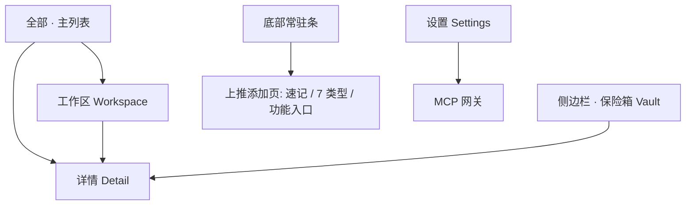

# goodshare UI 设计规范

> 视觉 / 交互 / 组件单一事实源。新增页面、改版、新增组件前先读本规范；与 PRD / V2 需求冲突时以需求文档为准，冲突点回写需求。
> 配套可复用约束见项目 skill `goodshare-ui`。

## 1. 设计原则

- **Material You / Material 3 为视觉基底**：不照搬「文件极客」的**文件管理隐喻**（文件夹 / 清理 / 存储空间）；本 App 是内容 / 时间线 / 笔记中枢 + AI 双态重构 + MCP 网关。
- **内容优先**：详情页同时承载人类态（`human_md`）与机器态（`machine_json`），可显式切换。
- **零阻力吞噬**：**底部常驻条**为一级添加入口（2026-09-29 取代悬浮球）——点即聚焦输入、打字即存，高频类型（拍照 / 选图 / 录音）一步到位，不进面板选类型。
- **隐私前置**：Vault 与打码在交互中显式呈现；MCP 层物理隔离 Vault（`is_vault=0` 过滤）。
- **分期**：MVP 仅时光机 + 全部 + 详情 + MCP 设置；V2 加 AI 态标记与通用截图解析；保险箱加密、健康/日历聚合推迟 V3（2026-09-27 决策）。
- **文档形态**（2026-09-29 拍板，SSOT 见 [content-pipeline.md](content-pipeline.md)）：详情页是**一篇文章**而非仪表盘——标题置顶、正文全宽、chrome 极低、主操作唯一；列表提密度，**弃低密度大卡片**（小红书式色块海报已否决）。富文本由**自建渲染器**呈现（弃 `flutter_markdown_plus`），载体为 Markdown 子集；**存储仍三层，呈现只走富文本**。

## 2. 视觉系统

### 2.1 取色

- 跟随系统动态取色（Android 12+ `dynamic_color`）；seed fallback 到品牌色 `#6750A4`（M3 baseline 紫）。
- 明 / 暗色跟随系统。禁止硬编码非品牌色。

### 2.2 字体与排版

- 默认 Roboto / 系统字体。标题 T20/B，正文 B14，TL;DR 摘要行强调。
- **富文本排版令牌**（2026-09-29，自建渲染器，见 §8 与 [content-pipeline.md](content-pipeline.md) §5）：正文 15.5–16px / 行高 1.65 / 段间距 14；h1 22 w600、h2 18 w600、h3 16 w600；引用左侧 3px 竖线 + 次级色；代码块 `surfaceContainerHighest` + 等宽 + 12 内边距；列表缩进 20；待办为可勾选行（完成态加删除线）。
- 富文本载体为 **Markdown 子集**（块级：标题/段落/引用/列表/代码块/分隔/待办；行内：粗体/斜体/行内码/链接）。不认识的块降级为纯文本段落——**宁可样式平，不可吞内容**。
- **文青风口号（首页空态欢迎 / 类型空态引导 / 关于 / 详情底栏）**：沿用 M3 动态表面，不硬编码底色；排版层用系统衬线兜底（`fontFamily: 'serif'`）+ Light 字重 + 1.5 字间距 + `onSurfaceVariant` 文字色。文案走远端配置 `config.slogans`（见自更新文档），本地默认值兜底，零字体体积。无独立闪屏遮罩，口号自然融入主界面空态。

### 2.3 形状 / 间距 / 海拔

- 圆角卡片 16dp；Extended FAB 56dp；间距遵循 8 倍数栅格（8 / 16 / 24）。
- 海拔用 M3 elevation tokens，不自定义阴影值。

## 3. 导航架构

底部 **3 个 tab（全部 / 工作区 / 设置）** + **底部常驻添加条**（上推展开全屏）+ 侧边栏（低频 / 隐私入口）。**无悬浮球**。

> **2026-09-29 改版（信息结构收敛）**：原 5 tab 中——**时光机**降为主列表的排序/分组维度、**AI 分类**降为筛选维度、**保险箱**移入侧边栏（安全域，不占 tab），并新增**工作区** tab。
> 收敛依据（代码事实）：时光机与「全部」取的是**同一份数据**（均为 `repo.list`），差别只在按天分组；AI 分类本质是标签（且 `ai_tags_page` 现为静态空态占位）；保险箱本质是权限域而非内容分类。
> 悬浮球去除依据：它浮在内容之上形成遮挡，与「chrome 极低」的文档形态基调冲突；其原有职责（全类型添加）由底部常驻条承接。

```text
顶部      ☰ │ 搜索（占主导） │ ＋（菜单：拍照 / 扫描文档 / 导入资源）
底部导航   全部 · 工作区 · 设置
底部常驻条 「记点什么…」              ← 点即聚焦，打字即存（纯速记）
侧边栏     保险箱 · 最近删除 · AI 任务队列（由 ☰ 打开）
主列表     筛选 chips（类型 · 时间 · 标签 …）+ 排序切换
```

**添加入口的分工**（2026-09-29）：
| 入口 | 职责 |
|---|---|
| 顶部 `＋` | **导入资源**：拍照 / 扫描文档 / 导入（图片 · 视频 · 音频 · 文档 …） |
| 底部常驻条 | **速记**：纯文本，点即聚焦、打字即存 |

分工依据：拍照 / 扫描 / 导入都是「把外部资源拿进来」，属同一类动作；速记是「直接写字」，不该与导入混在一个菜单里。底部条因此**不再挂高频图标**（原 📷🖼🎙 已上移到顶部 `＋` 菜单）。



**页面去留**：`inbox_page` 改造为主列表；`timeline_page` / `ai_tags_page` / `vault_page` **删除**（逻辑并入维度与侧边栏）；`settings_page` 保留。
**连带改动**：`SecureWindow`（FLAG_SECURE 防截图）当前绑定 tab 索引 `_vaultIndex = 3`，须改为按「当前是否处于保险箱视图」判定。

## 4. 页面清单

### 4.1 时间维度（原「时光机」页，2026-09-29 降级）

- **不再是独立页面**：`timeline_page` 删除。事实依据——它与「全部」取的是同一份 `repo.list` 数据，唯一差别是多渲染一层「按天分组」头，且 `daily_metrics` 无数据（健康/日历属 V3）。
- 时间由此降为主列表的**两个维度**：①**排序**（创建时间倒序默认 / 正序）②**分组**（按天分组头，可关闭）。
- ⚠️ 代码前提：`Repository.list` 当前排序**硬编码** `orderBy: 'created_at DESC, rowid DESC'`，做排序维度须先给它加排序参数。
- **V3 分化口子保留**：健康 / 日历聚合接入后，时间维度若重新长成独立「时光机」页，本降级不阻碍该路径（勿在改版中把分化堵死）。

### 4.2 全部 · 主列表（首页）

- **定位（2026-09-29 改版）**：唯一内容列表页。原「横滑切换文件类型」的 `PageView` **取消**——类型已降为筛选维度，横滑翻页与 chips 筛选两套并存是重复交互；改为**单列表 + chips 筛选**（选中即过滤，不再翻页）。
- **顶部固定区**：搜索框（标题/正文/标签）+ **筛选 chips 行**（类型 · 时间 · 标签 · 保险箱，可横滑）+ 排序切换（时间倒序默认 / 正序）；pinned 随滚动常驻。
- **筛选维度语义**（原三个 tab 的收敛落点）：
  | 维度 | 过滤依据 | 替代了 |
  |---|---|---|
  | 类型 | `item_type` | 原「全部」页内横滑分类型 |
  | 时间 | `created_at` 范围 + 排序 | 原**时光机** tab（§4.1） |
  | 标签 | `facets` | 原**AI 分类** tab（§4.10） |
  | 保险箱 | `is_vault` | 原**保险箱** tab（§4.4，侧边栏入口亦可达） |
- **空态**：无条目时口号 + 引导；筛选无结果时明示「当前筛选无结果」并给「清除筛选」。
- **列表缩略图**：`ContentCard` 左侧图片条目显示真实缩略图（`BoxFit.cover` 圆角裁切，文件缺失回退 broken_image 图标），其余类型沿用 type 图标。
- **列表密度（2026-09-29 改版）**：弃低密度大卡片——条目为**文档条目行**：标题 1-2 行 w500 + 正文摘要（前 60-80 字，非 TL;DR）+ 元信息行（来源 · 时间 · 标签）；缩略图 56-64px；**去 `Divider`**，靠间距分层。引用中的条目带小标识（区别于已保存，见 [content-pipeline.md](content-pipeline.md) §7）。
- 点击进详情；**页内不再有 ＋ 添加按钮**（添加统一走底部常驻条，见 §4.6）。
- **AI 派生类型**：聊天 / 发票截图入库为 `image`，经 AI 处理后重分类为 `chatlog` / `document`；未处理前归「图片」分类。

### 4.3 详情 Detail（模板 + 按类型实现）

- **模板化**：详情页为 `ItemViewTemplate`，由 `ItemViewRegistry.resolve(item_type)` 取对应实现渲染；编辑页为 `ItemEditorTemplate`，由 `ItemEditorRegistry.resolve(item_type)` 取实现。与 V2 需求 §3.8 的 `AiReconstructor` 同构——新增文件类型 = 实现模板 + 注册，框架零改动。
- **文档形态（2026-09-29 改版，SSOT 见 [content-pipeline.md](content-pipeline.md) §2）**：详情页按「文章」组织，非分区卡片堆叠——①**标题置顶**（`headlineSmall` w600），②其下导语块（原 TL;DR，次级色 + 左侧细线）③正文富文本全宽排版，媒体内联进内容流 ④派生内容（摘要/译文/关键区间）为正文末尾**附录章节**，不叠卡片边框 ⑤机器态收进 AppBar `⋯` 菜单（双态保留但降权）⑥操作收敛：`⋯` 菜单（低频 / 危险）+ **底部基本操作条**（摘要 · 标签 · 工作区 · 分享 · 删除），不做按钮矩阵 ⑦末尾小字「来自 XXX · 时间」。
- **通用外壳（旧，改版前）**：顶部固定 3 句 `human_tldr`；「机器态」开关切换查看 `machine_json`（JsonView 折叠树；`machine_json` 为空即 V1 基础模式，显示「暂无机器态」空态）；底部 `BottomSheet` 操作：移入 Vault / 重分类 / 重新处理 / 删除；删除为软删除，30 天内可恢复；「重分类」仅 `source_type='image'` 条目显示（image→chatlog/document 白名单，与 MCP `update_item(item_type)` 同源）。（原「同步到 PC」已移除——架构上无手机→PC 推送通道，2026-09-27 决策；PC→手机写回走 MCP `add_item`。）
- **操作分层（2026-09-29 定稿）**：操作分三层，基本操作对所有类型固定，不随类型跳动。

  | 层 | 内容 | 位置 |
  |---|---|---|
  | **基本操作**（5 个，全类型通用） | 摘要 · 标签 · 工作区 · 分享 · 删除 | **底部操作条**（删除用 error 色区分，对应 mymind 的 Spaces/Share/Delete） |
  | **类型专属** | 见下表 | 正文末尾一行 chips |
  | **低频 / 危险** | 编辑 · 机器态 · 移入移出保险箱 · 重处理 · 解锁编辑 | AppBar `⋯` 菜单 |

- 基本操作的落点：摘要 = `SummarizeCommand`、标签 = `ExtractTagsCommand`（**命令层均已存在**）；分享（`share_plus`）、软删除已落地；**工作区选择为新建功能**（§4.11）。
- **AI 类操作按钮必须带状态**：进行中（禁用 + 进度）/ 已完成 / 失败带 note，复用现有 `_AiTaskStatusLine` 机制，不新造。摘要与标签是重操作，放底部条须有此状态反馈防误触。
- **「标签」本轮 = AI 提取**（与摘要对称）；**手动编辑标签列为后续项**（`tags` 字段已有、UI 无编辑入口，`todos.md` 已挂「标签管理」待办）。

- **按类型的文档流与操作矩阵**：
  | item_type | 文档流内容 | 内容内联 | 类型专属操作（正文末尾 chips） |
  |---|---|---|---|
  | note | 标题 → 正文富文本 | — | 文本分析、翻译 |
  | url | 标题 → 导语 → 抓取正文 → 末尾「来源 · 时间」 | — | 重新抓取、翻译 |
  | image | 图片全宽 → OCR 文本 → 分类标签 | 标注 | OCR、图片分类、条码扫描、翻译 |
  | video | 播放器 → 转写文本 → 附录：关键区间 | 播放控制 | 转写、切片、提取音轨 |
  | audio | 播放器 → 转写文本 | 播放控制 | 转写、提取音轨、字幕导出 |
  | chatlog | 标题 → 会话 / 正文 → 摘要 | — | 翻译 |
  | document | 文件信息 → PDF 内嵌预览 或 文本正文 | PDF 翻页 | 用其他应用打开 |

  （编辑统一走 `⋯` 菜单，不再按类型分散 Editor 实现表；富文本呈现见 [content-pipeline.md](content-pipeline.md)。）

### 4.4 保险箱 Vault（安全域，2026-09-29 移入侧边栏）

- **定位修正**：保险箱是**安全域**，不是内容分类维度——此前将其归为「筛选维度」的表述已修正。它**不占底部 tab**，入口在**侧边栏**（带锁图标，与「最近删除 / AI 任务队列」等普通入口视觉区分）。
- **已有隔离机制（代码已落地）**：① MCP 物理隔离（`is_vault=0` 过滤，AI 侧完全不可见）② 动作层硬约束：`set_vault(off)` 需生物识别，**AI actor 直接拒绝**（AI 只能移入）③ 防截图 `SecureWindow`（FLAG_SECURE，须由 tab 索引判定改为**按视图判定**）④ 备份排除（快照上删 `is_vault=1` 再 `VACUUM`）。
- **内容默认打码**（2026-09-29 拍板）：进入保险箱视图即默认打码，复用已有 `PrivacyBlurOverlay`。
- **门禁语义**：鉴权发生在「点侧边栏入口」处——不是进入后再验，也不是勾选筛选框时验（后者语义别扭）。
- **详情页复用**：保险箱条目与「全部」复用同一个 `ItemDetailPage`（代码现状），无独立保险箱详情页；早期导航图中的「保险箱详情」分支**已作废**。
- **⚠️ V3 才做**：生物识别门（`local_auth` **尚未引入依赖**）、AES 加密（**当前内容明文存本地**，隔离仅体现在 MCP 与备份层）。文档与 UI 须如实表述，不可让用户误以为已加密。
- 保险箱视图内建议明示安全承诺（如「此内容不进备份、MCP 不可见」），把已有机制翻译成用户能懂的话。

### 4.5 设置 Settings

- 见 §5 设置树。

### 4.6 上推添加页（2026-09-29 取代悬浮球）

- **悬浮球删除**（`lib/ui/floating_ball.dart`）：它浮在内容之上形成遮挡，与「chrome 极低」的文档形态基调冲突；职责由底部常驻条承接。跨 app 系统级悬浮窗（overlay + 悬浮权限）不再考虑。
- **顶部 `＋` 菜单（导入类）**：拍照 / 扫描文档 / 导入（图片 · 视频 · 音频 · 文档 …）。点击弹**下拉菜单**——导入是单一动作，不需要半屏面板。
- **底部常驻条（纯速记，~56px）**：「记点什么…」——**点即聚焦、打字即存**。不再挂图标（原 📷🖼🎙 已上移到 `＋` 菜单）。
- **需要指定类型时**：常驻条可上拖展开为速记页，用于「存成便签 / 存成链接」等场景；默认直接存为便签，不强制选类型。
- **路径硬要求**：速记 = 点条 → 打字 → 存（两步）。原悬浮球是「点球 → 选便签 → 打字」，改版后必须更快。
- **显示范围**：常驻条**仅在 3 个主 tab 页显示，详情页不显示**（详情页保留自己的底部浮动主按钮，避免两层底部元素并存）。
- **遮挡处理**：各列表底部须留出常驻条高度（现有 `bottom: 96` 够用）。
- 添加入口统一走此路径（原「各页内 ＋」早已移除）；便签录入不含录音按钮（录音仅从「录音/音频」类型进入）。
- 新建 note / 录音 / 拍照 → 写 `raw_content` + 入 `ai_task_queue`（pending）。**图片 OCR 已提前至 v1（2026-09-27 分期调整）**：图片经 ML Kit 端侧识别产出文本（标准 GMS 设备）；录音**仅存音频文件**（边录边转写于同日移除，用户拍板；若后续恢复需引入转写引擎，如 ML Kit speech / 云端 ASR）；「转待办」提炼随 V2 LLM 管线解锁。

### 4.7 侧边栏（低频 / 隐私入口，2026-09-29 重排）

- 左侧 `NavigationDrawer`（AppBar 汉堡入口）。定位改为**低频与隐私入口**，**不再承担分类导航**（分类已并入主列表筛选 chips）。
- **内容**：

  | 项 | 说明 |
  |---|---|
  | **保险箱** | **置顶**、带锁图标，视觉上与其余入口区分（安全域，见 §4.4） |
  | 最近删除 | 30 天内可恢复 / 彻底删除 |
  | AI 任务队列 | OCR / 转写 / 抓取任务状态排查 |

- **删除项（已失效或重复）**：AI 分类（降为筛选维度，§4.10）、类型分类（并入主列表 chips）、OCR / 录音 / 链接抓取（是设置开关，不是页面入口）。
- 原「抽屉内内联查看 / 编辑」随分类导航一并取消——分类已不在侧边栏，该交互无承载。

### 4.8 大模型指令驱动（MCP 动作层）

- PC 端大模型经 MCP 发送的指令，由 App 反序列化为 `ItemCommand` 后调用与 UI **同一套 `ItemActionHandler`**（查看 / 编辑 / 删除 / 移入保险箱 / 重新处理），行为完全一致（详见 PRD §7 与 docs/architecture/human-ai-parity.md）。UI 侧按钮置灰只是快路径，**不是安全边界**——同一约束在动作层内再拦一次。
- 即 UI 能做的操作（含侧边栏内联编辑、详情 BottomSheet、FAB 速记），大模型均可通过 `update_item` / `delete_item` / `set_vault` / `reprocess_item` 等工具驱动；Vault 内容对 MCP 物理隔离。

### 4.9 文本收集模式（合并 / 分散）

- **设置项**「文本收集模式」：分散（默认）/ 合并；FAB 速记与粘贴入口显示当前模式。
- **分散模式（默认）**：每次文本收集 = 1 条 `inbox_item`，`collect_mode='scatter'`、`edit_locked=0`，正常编辑。
- **合并模式**：**同一来源 App + 5 分钟内**（阈值可调）的连续文本收集追加进同一 `inbox_item`——`raw_content` 拼接各段，`appendix_json` 记录每段 `{ts,text,source}`，`collect_mode='merge'`、`edit_locked=1`（锁定）；**纯 URL 段不参与合并**（独立成条供 `summarize_url` 处理）；MCP `add_item` 不参与合并，PC 写回永远独立成条（2026-09-27 决策）。
- **查看**：详情渲染合并全文 + 可折叠「附加记录」列表（来源段）。
- **解除编辑**：合并项默认不可编辑；点「解除编辑」（`edit_locked`→0）后方可改；解除后可编辑或按 `appendix_json` 拆分为多条分散项。
- **MCP 写保护**：`update_item` 在 `edit_locked=1` 时拒绝写入，须先 `unlock_edit`（见 PRD §7）。

### 4.10 标签维度（原「AI 分类」页，2026-09-29 降级）

- **不再是独立页面**：`ai_tags_page` 删除（它本就是静态空态占位，不读数据）。降为主列表筛选 chips 中的**标签维度**，按 `facets` 过滤。
- **交互**：chips 行点「标签」→ 展开**视角**（perspective：主题 / 事件 / 项目 / 人物 …，AI 派生动态生成，非硬编码）→ 选聚类标签 → 列表按该标签过滤。同一条目可同时命中多个标签。
- `facets` 由 `AiReconstructor` 产出（V2 §3.8），**对 `item_type` 完全无感**：视频 / 图片 / 聊天 / 笔记统一被打标，富媒体与笔记平级参与聚类。
- **依赖 AI 打标**：无 `facets` 时该维度显示「暂无分类，离线 AI 打标生效后出现」，不做假数据。
- **与「工作区」的区别**：标签是 AI 产出的**属性**（扁平、只能筛选，用户不能创建）；工作区是**容器**（可创建 / 命名 / 增删条目，见 §4.11）。

### 4.11 工作区 Workspace（2026-09-29 新增 tab）

- **定位**：条目集合容器，对应 mymind 的 Spaces。一个条目**可属于多个工作区**（多对多）。
- **两种来源**：① **用户手动聚合**——多选条目归入工作区 ② **AI 聚合**——由 AI 按内容聚类并建议工作区（**V2**，需端侧 LLM / 向量就绪后再做，现在硬做只会出垃圾聚类）。
- **数据模型**：新增 `workspaces`（id/name/created_at）+ `workspace_items`（workspace_id/item_id）两张表。
- **Human-AI 对称性（铁律）**：工作区若 UI 能建，**AI 也必须能建**——否则违反「删掉 UI 只接微信机器人能否不改核心代码」的试金石。必须配套：`WorkspaceCommand`（create/add/remove/rename/delete）走 `ItemActionHandler` + MCP 工具（`create_workspace` / `add_to_workspace` / `list_workspaces`）。
- **多选交互是新增能力**：当前列表点条目直接进详情，**没有多选模式**。要做「手动聚合多个文件」须先做多选（长按进入选择态 + 批量操作栏）。低成本替代：先只做「详情页 → 加入工作区」，不做列表多选。
- **隐私隔离**：Vault 条目可进工作区，但 MCP 侧与工作区列表仍须 `is_vault=0` 过滤，不得开后门。
- 工作区 tab 内容：工作区卡片列表 → 进入该工作区的条目列表（复用主列表组件）。

## 5. 设置树

```text
设置
├─ MCP 网关
│   ├─ 服务开关 / 监听端口
│   ├─ API Token（复制 / 重置）
│   ├─ 已配对客户端列表
│   └─ 连接状态
├─ AI 模式（呼应 PRD §6 / V2 §3.7·§3.8）
│   ├─ 图片 OCR 开关（本机能力检测：无 GMS 小字提示并置灰；默认开，2026-09-27 决策）
│   ├─ 链接离线抓取正文开关（默认开；抓取失败回退原文，2026-09-27 决策）
│   └─ 录音/音频 端侧转写开关（Sherpa-ONNX 离线，无 GMS 依赖；默认开，2026-09-28；
│       副标题随选中模型状态显示：已下载/下载中%/需先下载/失败原因；
│       开关打开且当前档位模型已下载时，重入队存量未转写音频）
├─ 语音转写模型（2026-09-28：三档全接、按需下载，hf-mirror int8 源）
│   ├─ 基础 · 中文（Paraformer-zh，~213MB）
│   ├─ 全能 · 多语种（SenseVoice small，~228MB）
│   ├─ 全球 · Whisper（Whisper small，~360MB）
│   └─ 每档卡片：单选选中态 + 体积 + 下载/进度+取消/重试/清除缓存；
│       选中未下载档仅切换选择，点卡片下载；选中已下载档切换即重入队存量音频
├─ 端侧大模型（2026-09-28：SoC 感知目录，见 docs/design/on-device-llm.md）
│   ├─ 通用 · Qwen2.5-1.5B（~1.5GB，全设备可见）
│   ├─ NPU · 骁龙8至尊版（Gemma3-1B ~658MB，仅 SM8750 设备可见）
│   ├─ NPU · 天玑9400（Gemma3-1B ~986MB，仅 MT6991 设备可见）
│   └─ 每档卡片：选中态 + 体积 + 下载/进度/删除（删除二次确认）；
│       下载后详情页出现「摘要」「提取关键词」按钮（iOS 走系统模型，iOS 26+ 无需下载）
├─ AI 模式（续）
│   ├─ 离线 AI：自动 / 强制 V1 / 尝试 V2（V2 灰显）
│   └─ 云端兜底：关（默认） / 开（V2）
├─ 隐私与保险箱
│   ├─ FaceID 锁定 Vault
│   └─ 身份证 / 银行卡默认打码
├─ 数据
│   ├─ 文本收集模式：分散（默认）/ 合并
│   └─ 最近删除（恢复 / 彻底删除 / 清空）
└─ 关于 / 日志
```

## 6. 组件库（M3 对齐）

- `ContentCard`（文档条目行）、`FilterChip`（筛选维度：类型 / 时间 / 标签 / 保险箱）、`NavigationDrawer`（低频 + 隐私入口，见 §4.7）、**底部常驻条 + 上推添加页**（取代 `ExtendedFAB` 与悬浮球，见 §4.6）、`BottomSheet`、`RichTextView`（**自建富文本渲染器**，取代 `MarkdownView`，见 [content-pipeline.md](content-pipeline.md) §5）、`JsonView`、`PrivacyBlurOverlay`（保险箱默认打码）、`BiometricGate`（V3）。
- 详情 / 编辑采用**模板 + 按类型策略**：`ItemViewTemplate` / `ItemEditorTemplate` 抽象，配 `ItemViewRegistry` / `ItemEditorRegistry` 按 `item_type` 分发（`note`/`image`/`video`/`audio`/`chatlog`/`url`/`document` 各自实现）。
- 卡片操作优先 BottomSheet，不用右滑（更顺手，且避免与列表删除手势冲突）。

## 7. 双态呈现规范

- 人类态（`human_md`）为默认视图；机器态（`machine_json`）需显式切换。
- Vault 内容的机器态对 MCP 屏蔽（服务端 `is_vault=0` 过滤，UI 层不暴露切换入口给外部）。
- 待办交互（V2 起可勾选，MVP 仅渲染）：`human_md` 中 `[ ]` 待办可勾选；勾选状态写独立字段 `todo_state_json`（按待办行内容 hash 关联，不回写 `human_md`），AI 重构（reprocess）后按 hash 重挂、失效项丢弃。

## 8. 实现指针（Flutter）

- 取色：`dynamic_color`；路由：`go_router`；**富文本渲染：自建（`lib/doc/` 归一化 + 自建渲染器，2026-09-29 弃 `flutter_markdown_plus`——停更分叉 + 待办勾选在渲染器架构下无法实现，见 [content-pipeline.md](content-pipeline.md) §5）**；状态：`flutter_riverpod`（蓝图 Zustand 等价）；Json 视图：`json_view`；生物识别：`local_auth`；PDF：`pdfx`（渲染 + 文本提取，引入前核 pub.dev）。
- 详情 Markdown 与机器态共享同一 `item` 数据，避免双源不一致。

## 9. 分期范围

- **MVP**：时光机 + 全部 + 详情 + MCP 设置（轻量，先把「进得来、看得到、PC 读得到」跑通）。
- **V2**：AI 态标记（处理中/失败态 UI）+ 通用截图解析。
- **V3**：保险箱加密（生物识别 + AES）+ 健康/日历聚合进时光机 + 全部·时间轴视图（与时光机分化）。
