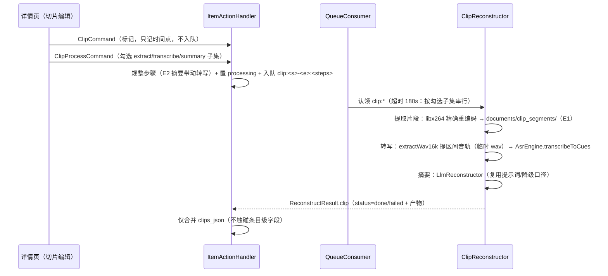

# 视频切片（关键区间）设计

> 视频文件体积大，整片处理（转写/备份/向量化）既慢又浪费。用户以**友好的打点方式**在视频上选取**多个关键区间**（切片），对每个区间做「提取文本（转写）+ 摘要（+ 向量化，二期）」，视频本体不再是需要完整消费的对象。
> 决策拍板于 2026-09-29（@confirm 台账 D1-D3 全清）：D1=切片结果挂**原条目附属记录**（clips_json）；D2=**转写+摘要先行**，向量留接口；D3=**视频源文件不进备份**（见 [s3-backup.md](s3-backup.md)）。
>
> **media-native 改造（2026-10-03）**：提取片段与提区间音轨改走平台原生——片段=media3 Transformer 硬编 trim 导出（`MediaBridge.trimVideo`，替代 libx264 软编），音轨=原生解码+Dart 重采样（`extractWav16k`）；ffmpeg 依赖整体退役（ADR：context/decisions.md「media-native」）。
>
> **同日改版（E1-E3 台账全清，用户重定方向）**：①**标记 ≠ 处理**——标记只记时间点供播放跳转，处理由用户显式触发且可勾选链路子集，止步于片段本身合法（原「登记即入队」废除，回归「重资源动作一律手动」铁律）；②链路扩为四段：**提取视频片段 → 转写 → 摘要（→ 向量二期）**，E1 拍板精确重编码（ffmpeg min → **min_gpl** 变体引入 libx264，APK 增重换逐帧准确剪辑）；③标记语义：**只保留区间标记**（打点供播放跳转 + 由用户显式触发处理）；**整片标记已移除**（2026-10-02 拍板：需求不存在，UI/命令/DB 列/备份分支一并清除）。
>
> **2026-10-01 UI 收敛**：原 §4「切片编辑 BottomSheet」（打点按钮式）UI 退役，选区间交互统一收编到**轻剪辑页**（[video-trim.md](video-trim.md)：双端 scrubber + 按住慢放定点）；本文档的**处理逻辑全部保留**为被调用能力层（`ClipSegment`/`clips_json`/ffmpeg 管线/转写摘要链路原封不动），轻剪辑页出口 B「标记此段转写」走本文档既有 `ClipCommand` 链路。

## 1. 关键决策

| 决策点 | 结论 | 依据 |
|---|---|---|
| 数据归属 | **原条目附属记录**：`inbox_items.clips_json`（schema v10 JSON 列） | 与 appendix/facets 同风格；不产生新条目，收件箱列表不被切片刷屏；与原视频强关联 |
| 任务编码 | 每区间一条队列任务：`clip:<startMs>-<endMs>` | 队列表无参数列，动作串编码与 `translate:<lang>` 同口径；区间粒度=失败隔离粒度 |
| 处理链 | 原生提取：片段 media3 Transformer 硬编 trim / 音轨 `extractWav16k`（16k wav）→ Sherpa ASR（`transcribeToCues` 原语直调）→ LlmReconstructor 摘要 | 三段全部复用既有引擎；直调 ASR 原语避免条目级字幕文件副作用 |
| 产出通道 | `ReconstructResult.clip` 独立通道 → handler 只合并 `clips_json` | **区间结果不得覆盖条目级 human_md / summary_md**（视频条目可能已有整片转写） |
| 向量化 | 二期：按区间序号写 `item_embeddings`（chunk_index=区间序号） | 引擎选型另期拍板；表与备份语义已就绪（vector-embeddings.md） |
| 备份 | 视频源文件不进备份；字幕/译文/切片产物照进 | D3 拍板「只备份关键的东西」；恢复后视频走既有「文件缺失」降级态 |
| 时长边界 | 单区间 [1s, 30min]，区间可多个，同区间不可重复 | 防呆下沉动作层；30min 上限约束 ASR 时长与队列 180s 超时的合理组合 |

## 2. 数据模型

段结构 v2（JSON 列吸收演进，schema 版本不变；v11 曾加整片标记列，2026-10-02 随整片标记一并清除）：

```json
{ "start_ms": 120000, "end_ms": 185000,
  "steps": ["extract","transcribe","summary"],   // 用户勾选的处理范围（E2：摘要带动转写）
  "status": "marked|processing|done|failed",     // 标记 ≠ 完成
  "clip_path": "clip_segments/xxx.mp4",           // 提取产物（相对 documents），止步于片段时唯一产物
  "text": null, "summary": null,
  "note": null, "created_at": 1729 }
```


```text
inbox_items.clips_json（schema v10，JSON 数组）
[ { "start_ms": 120000, "end_ms": 185000,
    "text": "",            # 区间转写文本；空=待处理或失败
    "summary": "",         # 区间摘要；空+text非空=摘要未生成
    "note": "…",           # 失败/空产出原因（人与 AI 同读一份）
    "created_at": 1729...  # 登记时刻
  }, … ]
```

- 登记只落 `clips_json` 空段（status=marked）；处理命令置 processing 并入队，完成/失败由管线回写（失败带 note 可重启）。
- 解析/编解码/合并为纯函数（`lib/ai/video_clips.dart`）：坏段跳过、非 JSON 返回空、按 `start_ms/end_ms` 精确匹配合并。

## 3. 流程



任一环节失败：区间 `note` 写明原因（转写开关关 / 模型未下载 / 未识别出语音 / 摘要未生成…），任务占位完成不置死信——区间仍在列表里可重启。

## 4. UX（播放器打点式）

- 详情页视频区新增「切片」入口 → 切片编辑 BottomSheet：
  - 独立播放器（不复用详情页播放器状态）：播放/暂停 + **「设为起点」「设为终点」**捕获当前播放位置，友好免手输时间戳；
  - 已选区间以列表呈现（起止 + 时长 + 删除），可多区间；
  - 保存 = 逐区间发 `ClipCommand`（重复区间被动作层拒绝并提示）。
- 区间产出展示在详情页「关键区间」区块：每段起止 + 文本 + 摘要 + 状态行（note 优先，与 `_AiTaskStatusLine` 同口径）。

## 5. 代码落点

| 文件 | 职责 |
|---|---|
| `lib/ai/video_clips.dart` | 纯模型与工具：`ClipSegment`、`parseClipsJson/encodeClipsJson`、`isValidClipInterval`、`mergeClipResult`、（命令参数构造函数已随 media-native 退役，提取走 lib/media） |
| `lib/data/db.dart` | schema v10：`clips_json` 列（建表 + 幂等迁移） |
| `lib/data/repository.dart` | `taskClipPrefix` / `clipTaskAction` / `parseClipTaskAction` |
| `lib/action/commands.dart` | `ClipCommand`（op=clip）；`ApplyAiResultCommand` 序列化补 clip（顺带补上 summaryMd 缺口） |
| `lib/action/item_action_handler.dart` | `_clip`（校验+登记+入队）；`_applyAiResult` clip 独立合并通道 |
| `lib/ai/clip_reconstructor.dart` | `ClipReconstructor`：提区间音轨 → ASR → LLM 摘要三段链 |
| `lib/ai/reconstructor.dart` | `ReconstructResult.clip` 字段 |
| `lib/ai/queue_consumer.dart` | clip 任务超时 180s |
| `lib/sync/backup_service.dart` | 白名单排除视频源文件、纳入 subtitles/translations（`collectBackupFiles` 可单测） |

## 6. 测试

- 纯函数：JSON 往返与防御解析、区间边界、动作串往返、合并语义。
- 动作层：登记落空段+入队、重复/非法/非视频拒绝；clip 通道只写 clips_json 不触碰 human_md/summary_md。
- 备份：视频排除、字幕/译文纳入、Vault 派生文件排除。

## 7. 已知限制与后续项

| 项 | 说明 |
|---|---|
| 向量化 | 二期接入嵌入引擎后，按区间序号写 item_embeddings；表/备份语义已就绪 |
| MCP 工具 | `get_item` 尚未回传 clips（AI 读不到切片文本）；接入时随工具表扩容，命名建议 `clip_item`（登记区间） |
| 轨道精度 | `-ss` 输入侧快 seek 对音轨足够精确；若实测偏移再改输出侧精确 seek |
| 长区间 | 30min 上限 × 180s 超时是经验组合；真机长区间实测后按需调 |
| 整片转写并存 | 整片「转写」与切片互不影响（human_md vs clips_json）；UI 文案需区分 |
