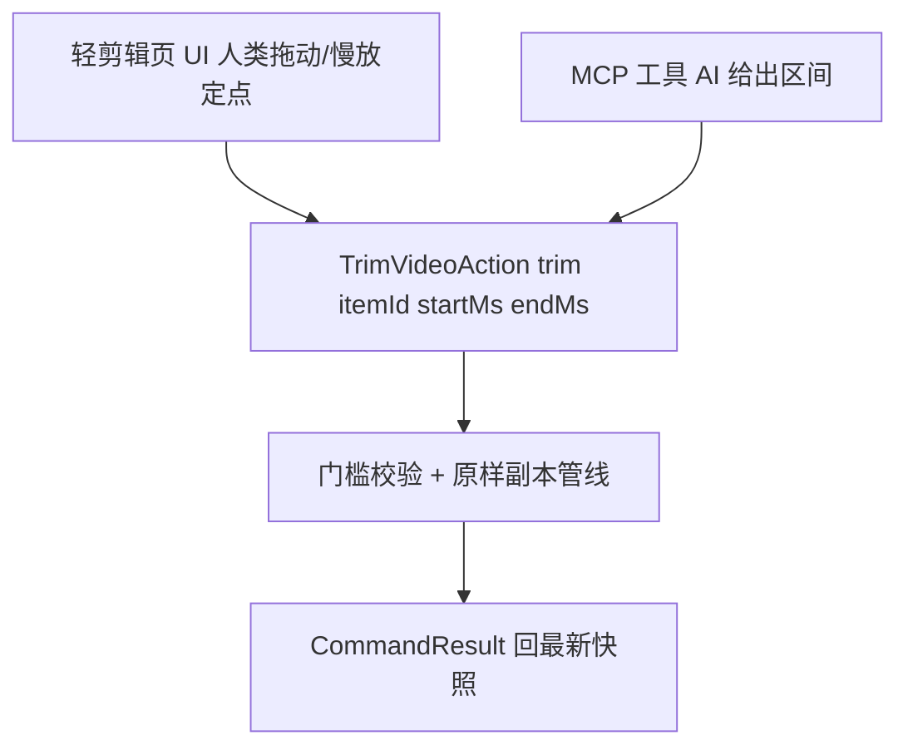

# 轻剪辑页（视频区间选择器）设计

> 超门槛拦截后的引导出口，也是全 App **唯一**的选区间交互面。定位是**区间选择器**，不是缩微剪辑工具：唯一动作是「切」。页面是**纯交互壳**——不持有数据、不写库，区间选完即交命令层。触发场景见 [video-subject.md](video-subject.md)（主体超门槛）与 [note-video.md](note-video.md)（附件超大小）；能力层复用 [video-clips.md](video-clips.md) 逻辑。

## 1. 定位与双出口

```
轻剪辑页（UI 壳：双端 scrubber + 慢放定点 + 区间列表）
   │ 产出区间 [startMs, endMs]（可多个）
   ▼
出口 A：切出原样副本 → TrimVideoAction → 新收集物（过门槛校验、进备份）
出口 B：标记区间 → 既有 ClipCommand → clips_json → 转写/摘要（video-clips 逻辑原封不动）
```

- **同一套选区交互，两个出口**：「切出此段收进来」/「标记此段转写」。
- **多段剪辑＝批次收集模型**（一次进入=一个工作批次，数据/命令层本就多段就绪——血统上游 video-clips 即多区间模型）：
  - 选出区间 → 「收进本次」→ 入**暂存架**（已选片段清单：N 段 · 共 X 分钟）；scrubber 上已选区间以色带呈现，**重叠选择拒绝并高亮冲突**；
  - 暂存架片段可点回跳该区间微调/删除；继续拖出下一段，循环收集；
  - 「完成」→ **逐区间过门槛校验** → 默认产出 **N 个独立条目**（便签「一条一件事」心智），完成时可勾选「合并为一条」（整理偏好非默认）；
  - 软提示纪律：单批次 >10 段提示「内容较多，建议分开几次处理」——批次心智是「这次收集任务」，不做时间线编辑器。
- **取代关系**：video-clips 原「切片编辑 BottomSheet」（「设为起点/设为终点」按钮打点式）UI **退役**，其处理逻辑（`ClipSegment`、`clips_json`、ffmpeg 管线、转写/摘要链路）**全部保留**为被调用能力层。慢放定点手势成为全 App 统一的选区间方式，用户只学一种。
- **功能边界写死**：只做切（拖双端 + 按住慢放精调 + 确认）；不做字幕/变速/拼接/逐帧按钮。理由：切是「引用一段」，心智安全（原件不动）；剪辑能力会绕穿门槛逻辑（用户把原片丢进来慢慢加工）。**多段说明**：多段**收集**（批次模型，上文）是多次切分别产出，不做的是**拼接/合并成一支视频**的编辑能力（「合并为一条」是条目归属组织，非时间线拼接）。

## 2. 产物策略（只收副本，不动原件）

- 产物 = 原件**时间轴裁剪的原样副本**：转码参数照抄原件（分辨率/码率/格式不变），只裁时间轴——「剪切 + 封装」级操作，速度最快、画质零损失。
- **原文件不动**（用户可能只是收一段，原件另有用途）——「只收副本不改原件」是底线。
- 切出的副本**重新过门槛校验**后进收集链路（含备份，见 video-subject §4）。
- ffmpeg 依赖现成：video-clips 已引入 min_gpl 变体（含 libx264），复用 `buildClipExtractArgs` 同款管线。

## 3. 选区间手势（全 App 统一标定）

交互模型：**探测-捕获-回归**三段式，零按钮、无速度跳变、确认与验证合一。

| 参数 | 值 | 依据 |
|---|---|---|
| 慢放触发 | **静止按下** 200-250ms | tap 接触时长中位 100-130ms，意图分岔 200-300ms；scrubber 上精调是高频先验，比系统长按（400-500ms）激进一档 |
| 0ms 即时反馈 | scrubber 高亮/把手放大 | 填住阈值前死区，消「没反应」感 |
| 回退量（in 点） | 1-1.5s（固定，含反应补偿） | 机械过冲 1s + 人的反应延迟 300-500ms |
| 慢放倍率 | 0.5x 起步（0.25x 真机验证后可选项） | 0.5x 已把手指精度放大 2 倍；低倍率解码器兼容风险 |
| 按住期间 | 持续慢放，放完回退段后停住/循环，**绝不正速跳走** | 「按住=慢放」心智承诺不可破 |
| 抬手 | 该帧定为端点，**立即正速续播**（从该点，不跳帧） | 确认与验证合一；再按住=重试覆盖旧点 |
| 包含式补偿 | in 点定点后自动前移 0.3-0.5s；out 点后延 0.3-0.5s | 人的反应延迟是**单向系统性偏差**（定点永远滞后目标），确定性补偿吸收；目标函数=「目标被包含」而非精确命中；可视化藏住补偿，不解释 |
| 拖动中停顿 | ≥500ms 触发慢放且**不回退** | 拖动停顿时目标已在附近，回退丢目标 |
| 北极星指标 | **一次剪对率 ≥85%**（真机埋点） | 校准补偿量与慢放倍率的依据 |

两端 scrubber **同规则复用**（学一次用两处）。**实现侧注意**：`video_player` `setSpeed` 低倍率下部分机型丢帧/黑帧；回退 1s 涉及 backwards seek（H.264 关键帧间隔决定精度），按下手感迟滞 >200ms 手势即毁——真机校准为落地前置。

### 交互时序

1. 手指落下 → 0ms 即时反馈 → 静止 200-250ms → 回退 1-1.5s → 持续慢放；
2. 手指抬起 → 该帧为端点（含包含式补偿，系统静默）→ 从该点正速续播；
3. 不满意 → 再按住重来（覆盖旧点）；两端同规则；
4. 确认「收进来」/「标记转写」→ 走对应出口。

## 4. 独立页面与多入口

独立 `go_router` 路由页（非内嵌组件）——入口不止拦截一个，复用性决定必须是独立页：

| 入口 | 场景 |
|---|---|
| 拦截引导 | 主体/附件超门槛 → 「剪一段收进来」一键进入 |
| 条目操作 | 已收视频「截取片段」（分享其中一段等） |
| AI 发起 | AI 依据转写结果提议区间（见 §5） |

页面**无数据归属是硬纪律**：不写库、不持跨页状态，区间选完即交 Action，页面销毁无残留。

## 5. AI 调用路径（无头对称）

按 `goodshare-arch` Human-AI 对称性硬约束，命令层参数化、两个调用主体共用：



- **AI 的区间提案以「提案态」呈现在本页**：scrubber 高亮 AI 选的区间 + 一句理由（如「这段在讲预算调整」），用户可拖动修正或一键采纳——**严禁静默执行**（AI 切错一次，信任崩塌；提案态复用本页全部交互，本页因此同时是人工剪辑台与 AI 操作确认面板）。
- 与转写链路汇合：视频转写产出时间轴对齐字幕 → AI 精确说出「目标在第 132-178 秒」→ 调本能力执行。转写是眼睛，轻剪辑是执行手。
- 当前落地只需保证**命令层参数化干净**（`trim(itemId, startMs, endMs)`），区间逻辑不长死在 UI 里；MCP 工具注册与提案态 UI 在 AI 接入时补。

## 5.1 音频复用：架构预留，入口不开放

- **不建独立音频剪辑页，也不挂入口**：音频宽约束（直录 30-60min 自动停 / 导入 ≤200MB）几乎无人被门槛拦截→拦截引导场景不存在；便签录音心智是「录一段→转写→文字为主」，无「截取精华片段」的对仗需求。挂入口违背「每个入口都有真实出口」的可达性纪律，且需陪跑门槛校验/产物落库/备份归属/AI 调用全套空转链路的维护；
- **预留本体在架构纪律里**（§4 无数据归属 + 命令层参数化已天然支持）：`TrimAction` 参数泛化（mediaType 区分 video/audio），ffmpeg min_gpl 管线裁音轨与裁视频同族操作（`-ss/-t` 相同，仅输出容器不同）；交互壳媒体无关（scrubber/慢放手势组件注入播放器实例，音频注入 `AudioPlayer` + 波形图——唯一新增件，届时 Job 化提取与封面提取同档约束）；门槛校验同表不同行（音频档 ≤200MB）；
- 未来若真出现音频剪辑诉求（如「一节课录音剪三段重点」），批次模型（§1）+ TrimAction 泛化直接覆盖，零返工接入——「功能完整」的标准是「需要时能低成本长出来」，不是「菜单里样样都有」。

## 6. 代码落点

| 文件 | 职责 |
|---|---|
| 新轻剪辑页（go_router 注册） | 纯交互壳：双端 scrubber + 慢放定点 + 双出口确认 |
| `lib/ai/video_clips.dart` | 能力层复用：`ClipSegment`、`isValidClipInterval`、`buildClipExtractArgs`（原样不动） |
| 新 `TrimVideoAction`（动作层） | 切出副本命令：门槛校验、ffmpeg 裁时间轴、CommandResult 回快照；预留 AI/MCP 调用 |
| 既有 `ClipCommand` / 动作层 | 出口 B 标记转写（原逻辑，仅 UI 来源切换） |
| 详情页视频区 | 「切片」入口从 BottomSheet 改跳轻剪辑页 |
