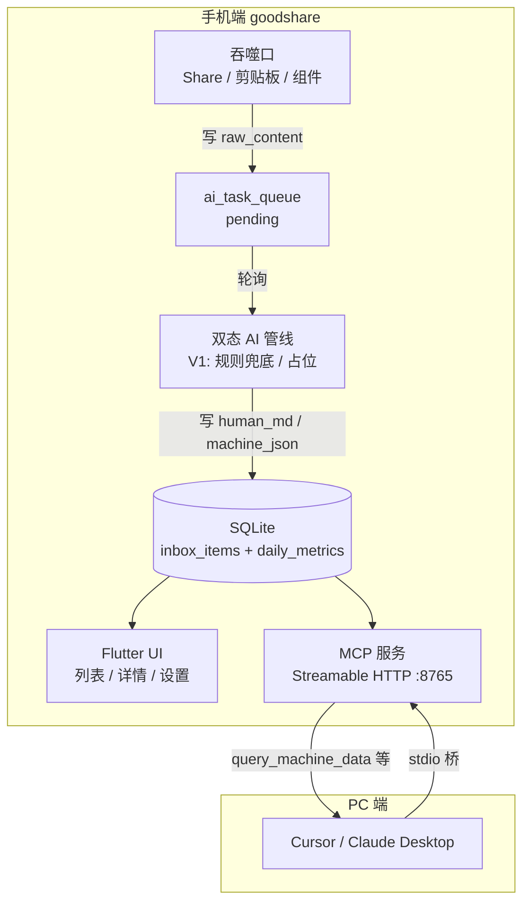
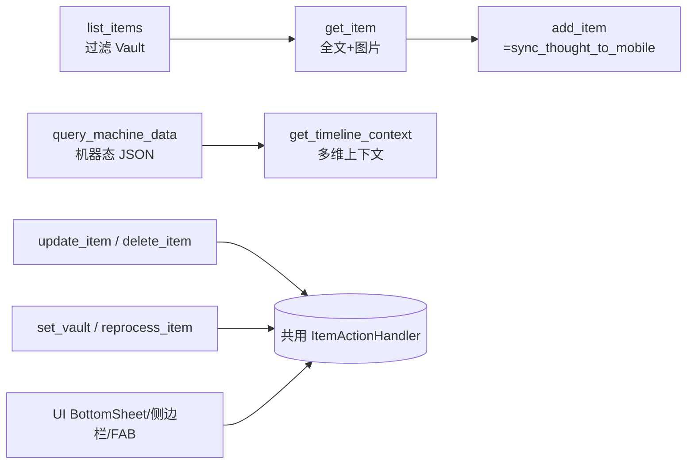
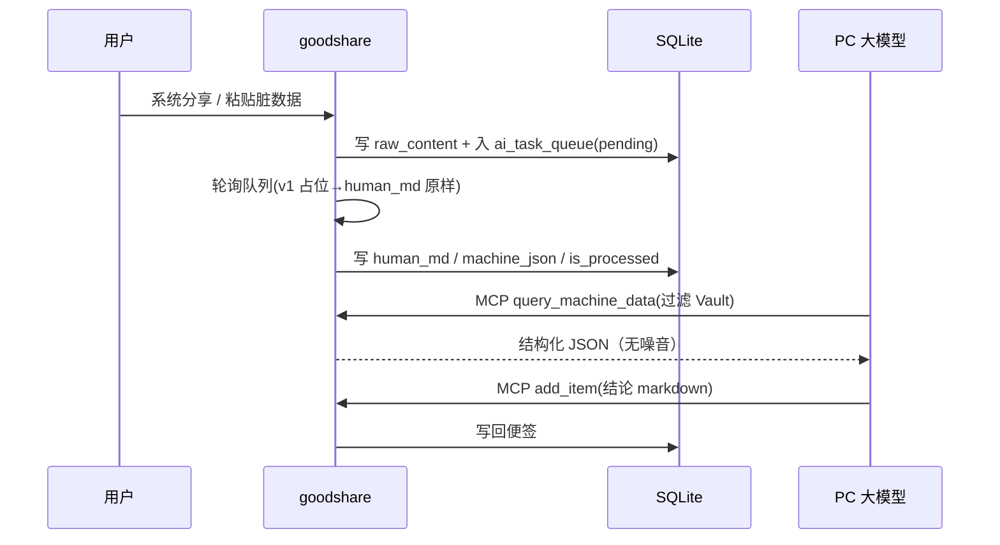

# 拾贝（goodshare）全局产品需求文档 (PRD)

> 版本：V1.0（Actionable Requirements，对齐用户蓝图 V1.0）
> 适用工程：goodshare Flutter 客户端（Android 首发，预留 iOS / 鸿蒙）
> 文档性质：**跨域产品 + 架构需求基准**，代码落点见项目索引 skill `goodshare-index`

## 1. 目的与范围

本文档是 goodshare 的全局需求基准，统一产品愿景、已确认架构决策、数据模型、功能模块、MCP 接口与分期路线图。所有后续设计 / 实现 / 接口文档以本文为准。

**已确认的两项架构决策（来自评估）：**

1. **框架维持 Flutter (Dart)**——保留已写好的 Dart MCP 服务（`lib/mcp/*`）与数据层（`lib/data/*`），不切换 React Native。蓝图第 4 节「优先考虑 RN」被否决。
2. **双态 AI 重构（最难模块）先评估、不急着实现**——v1 仅做「队列占位 + 规则化兜底」，云端 / 本地 LLM 作为可插拔层留到 V2。

## 2. 产品愿景与核心哲学

**端云协同个人数据中转站**：App 本质是「重构器」而非「存储器」。用户把任意格式 / 来源的脏数据（长截图、乱码网页、微信聊天 TXT、语音碎碎念）随意丢入，App 在后台将其「剥皮抽筋」，执行**双态数据重构协议**：

- **Human-Readable（人类友好态）**：排版优美的 Markdown + 3 句 TL;DR + 高亮实体 + `[ ]` 待办，供手机端极速唤醒记忆。
- **Machine-Readable（机器 / AI 友好态）**：强类型 JSON / 知识关系，经 MCP 喂给 PC 端重型大模型，消除幻觉与 Token 浪费。

核心哲学：**Garbage In, Gold Out（乱码进，黄金出）**。

## 3. 技术栈映射（蓝图 RN 建议 → 已确认 Flutter）

| 关注点 | 蓝图建议 | 本工程采用 | 状态 |
|---|---|---|---|
| 框架 | React Native | **Flutter (Dart)** | 已定 |
| 本地 DB | react-native-sqlite-storage | **sqflite**（已依赖） | 已定 |
| 极速检索 | FTS5 | **LIKE 先行，FTS5 延后** | 见 §5.4 |
| 状态管理 | Zustand / Jotai | **provider / riverpod**（`Repository` 已用 `ChangeNotifier`） | 已定 |
| Markdown 渲染 | react-native-markdown-display | **flutter_markdown 社区维护分叉**（原包已归档停更，实现前核实 pub.dev 择优） | V1 |
| Share 接收 | Share Extension | **receive_sharing_intent**（已依赖） | 已定 |
| 录音采集 | — | `record` 类插件（实现前核实 pub.dev 择优） | MVP 采集，V2 接 STT |
| 剪贴板嗅探 | — | `clipboard` / 平台通道 | V2 |
| 健康数据 | HealthKit / Health Connect | `health` 包 | V3 |
| 日历 | 系统日历 | `device_calendar` 包 | V3 |
| 锁屏/桌面组件 | Widgets | `home_widget` 包 | V3 |
| 端侧 AI | ONNX / CoreML | **V2 调用系统自带模型**：iOS Foundation Models / Android AICore Gemini Nano，零下载、不内置；不可用设备回退 V1 | 已定 |
| 加密 Vault | — | **SQLCipher（`sqflite_sqlcipher`）或文件级 AES-256** | V3 |

## 4. 系统架构



**已落地的 MCP 通道**（无需重写）：手机内嵌 `McpServer`（`lib/mcp/mcp_server.dart`）监听 `0.0.0.0:8765` 的 `POST /mcp`，`x-api-key` 鉴权；PC 端经 `mcp-bridge/stdio-bridge.mjs` 桥接 stdio ↔ Streamable HTTP（局域网或 `adb reverse tcp:8765 tcp:8765`）。

## 5. 数据模型（修正版 Schema）

### 5.1 设计原则

严格区分三层：`raw_content`（脏数据）/ `human_md`（人类态）/ `machine_json`（机器态）。所有重构产物与原文分离，便于 AI 重放与隐私隔离。

### 5.2 修正项（相对蓝图 Schema）

1. **FTS5 外容表依赖整数 rowid**：蓝图 `id TEXT PRIMARY KEY` 与 `content_rowid='rowid'` 混用易错位。改为**显式 `rowid INTEGER PRIMARY KEY AUTOINCREMENT`**，`id` 改为独立 TEXT uuid 字段。
2. **外键级联**：`ai_task_queue` 的 `ON DELETE CASCADE` 需在每条连接执行 `PRAGMA foreign_keys=ON`（sqflite 不默认开）。
3. **Vault 加密非 SQLite 原生**：`is_vault=1` 仅标记；真实加密走 SQLCipher 或字段 / 文件级 AES。MCP 侧「物理隔离」由 `WHERE is_vault=0` 天然实现。
4. **FTS5 延后**：MVP 用现有 `LIKE` 检索（`repository.list` 已实现），验证后再建 FTS5 虚拟表，避免低端机 SQLite 缺模块。

### 5.3 核心表（v1 采用）

```sql
-- 1. 核心集散表 (The Core Hub)
CREATE TABLE inbox_items (
    rowid INTEGER PRIMARY KEY AUTOINCREMENT,   -- FTS5 外容表映射用
    id TEXT NOT NULL UNIQUE,                    -- uuid，对外稳定标识
    item_type TEXT NOT NULL,                    -- 逻辑类型，可由 AI 重分类：'url','image','video','audio','chatlog','note','document'（便签=note，文档=document，图片=image，视频=video，音频=audio；'health' 随健康接入 V3 引入）
    source_type TEXT,                            -- 入库原始类型（如截图），入库后不变，供溯源与重分类
    source_app TEXT,                            -- 来源 e.g. 'wechat','safari','clipboard'

    raw_content TEXT,                           -- 原始脏数据层
    raw_file_path TEXT,                         -- 原始图片/文件本地相对路径

    human_title TEXT,                           -- AI 重构标题
    human_tldr TEXT,                            -- AI 3 句摘要
    human_md TEXT,                              -- AI 重构 Markdown（含 Checkbox）

    machine_json TEXT,                          -- 强类型结构化数据

    tags TEXT,                                  -- JSON Array: ["前端","团建"]
    facets_json TEXT,                           -- JSON: 多视角聚类，视角→标签数组（如 {"主题":[...],"事件":[...]}），可空；AI 分类页消费（见 V2 §3.8）
    is_vault INTEGER NOT NULL DEFAULT 0,        -- 0 公开 / 1 私密保险箱
    is_processed INTEGER NOT NULL DEFAULT 0,    -- 0 待处理 / 1 完成 / -1 失败
    collect_mode TEXT NOT NULL DEFAULT 'scatter', -- 'scatter' 分散 / 'merge' 合并（合并判定：同一来源 App + 5 分钟时间窗内的连续文本收集；MCP add_item 不参与合并，永远独立成条）
    appendix_json TEXT,                         -- 合并模式：各段附加记录 [{ts,text,source}]；分散模式 NULL
    edit_locked INTEGER NOT NULL DEFAULT 0,     -- 合并模式默认 1（锁定不可编辑），需 解除编辑 后改
    is_deleted INTEGER NOT NULL DEFAULT 0,      -- 0 正常 / 1 已删（软删除：UI 与 MCP 查询默认过滤；「最近删除」保留 30 天后物理清理）
    deleted_at INTEGER,                         -- 软删除时间戳（毫秒）；30 天保留期以此计算（实现期补列，与设计 §4.9 同源）
    todo_state_json TEXT,                       -- 待办勾选状态（V2）：[{hash,done,ts}]，hash=human_md 待办行内容哈希；不回写 human_md，AI 重构后按 hash 重挂、失效丢弃
    created_at INTEGER NOT NULL                 -- 毫秒时间戳
);
CREATE INDEX idx_inbox_created ON inbox_items(created_at DESC);
CREATE INDEX idx_inbox_vault ON inbox_items(is_vault);

-- 2. 健康与时光机上下文
CREATE TABLE daily_metrics (
    date TEXT PRIMARY KEY,                      -- YYYY-MM-DD
    steps INTEGER NOT NULL DEFAULT 0,
    sleep_minutes INTEGER NOT NULL DEFAULT 0,
    calendar_events_json TEXT
);

-- 3. 后台 AI 任务队列
CREATE TABLE ai_task_queue (
    task_id TEXT PRIMARY KEY,
    item_id TEXT NOT NULL REFERENCES inbox_items(id) ON DELETE CASCADE,
    task_action TEXT,                           -- 'parse_chatlog','ocr_and_extract','summarize_url','transcribe_audio'（V2 音频转写）
    status TEXT NOT NULL DEFAULT 'pending'      -- pending/processing/completed/failed/cancelled（条目软删时关联任务置 cancelled）
);
CREATE INDEX idx_queue_status ON ai_task_queue(status);
```

### 5.4 FTS5（延后，V2 启用）

```sql
CREATE VIRTUAL TABLE search_index USING fts5(
    human_title, human_tldr, human_md,
    content='inbox_items', content_rowid='rowid'
);
```

启用条件：先用 `PRAGMA compile_options` 探测设备 SQLite 是否含 `ENABLE_FTS5`；缺失则回退 `LIKE`。

## 6. 功能模块需求

### 模块一：无阻力吞噬口（Zero-Friction Ingestion）

| 需求 | 优先级 | 说明 |
|---|---|---|
| 系统级 Share 接收 URL / 图片 / 文件 / TXT 聊天记录 | **MVP** | `receive_sharing_intent` 已依赖，需补接收→写 `raw_content`→入队逻辑 |
| 剪贴板智能嗅探 | V2 | 唤醒时校验剪贴板，过滤乱码，高价值 URL 弹窗捕获 |
| 文本收集模式（合并 / 分散，默认分散） | **MVP** | 分散：每次收集 1 条；合并：**同一来源 App + 5 分钟内**的连续文本收集追加为 1 条并附 `appendix_json`，`edit_locked=1`，需 解除编辑 方可改；**纯 URL 段不参与合并**（独立成条供 `summarize_url` 处理）；MCP `add_item` 不参与合并（详见 §5.3 / 设计 §4.9） |
| 锁屏/桌面小组件（录音转待办 / 相机 OCR） | V3 | `home_widget` |
| 静默抓取 Health / 日历 | V3 | `health` + `device_calendar` → 写 `daily_metrics` |

> **AI 派生类型约束**：聊天 / 发票等常来自截图，入库暂记 `source_type='image'`、`item_type` provisional 为 `image`；经 AI 管线（V2 §3.8）识别后重分类为 `chatlog` / `document`（发票），侧边栏「聊天 / 文档」分类以 AI 派生 `item_type` 为准。未处理截图在侧边栏归「图片」。无 AI 可用时（多数 Android），提供手动重分类（详情 BottomSheet）与 MCP `update_item(item_type)` 白名单纠正，避免分类永久滞留「图片」。

### 模块二：端侧 AI 双态重构管线

| 需求 | 优先级 | 说明 |
|---|---|---|
| 入库即触发后台本地队列 | **MVP(脚手架)** | 轮询 `ai_task_queue`，v1 仅占位 |
| 聊天记录降噪（去撤回/拍一拍/表情，识别发言人，议题摘要） | V2 | 规则 + LLM |
| 双态剥离输出（human_md + machine_json） | V2 | 调用系统自带模型（iOS Foundation Models / Android AICore）；不可用时 V1 占位 |
| 自动打标 2–3 个 + 身份证/银行卡默认打码 | V2 | 规则 + LLM |
| 通用截图解析（发票 / 名片 / 聚会计划，OCR→LLM 套领域 Schema） | V2 | ScreenshotParser 通用管线，详见 V2 §4 |

**v1 管线行为（已定）**：队列消费者把 `raw_content` 原样复制进 `human_md`，`machine_json` 置空，`is_processed=1`，保证端到端不卡死；AI 能力以接口 `AiReconstructor` 抽象（详见 V2 §3.8），系统模型 / 占位 / 云端兜底等多实现可插拔替换该消费者，架构不变。

### 模块三：便签编辑器与人类干预

实时离线错别字/语法校验 + Diff 高亮；手动干预 `human_md`；一键文风切换（口语→职场）。**优先级 V2**，最小设计见 V2 §5。

### 模块四：时光机与加密舱

| 需求 | 优先级 | 说明 |
|---|---|---|
| Timeline 视图（按天聚合 收集内容；健康/日历上下文 V3 接入） | V2 | `inbox_items` 按天分组；V3 起 JOIN `daily_metrics` |
| Biometric Vault（长按移入，AES-256，FaceID，MCP 物理隔离） | V3 | SQLCipher / 文件 AES；MCP 默认 `is_vault=0` |
| AI 分类浏览（多视角聚类：主题 / 事件 / 项目…，顶部滑动切换视角与标签） | V2 | 依赖模块二 AI 打标（`facets`）；MVP 占位无视角时为空态 |

### 模块五：PC 端 MCP 桥接网关

见 §7。

## 7. MCP 接口规范

**传输**：Streamable HTTP `POST /mcp`，`x-api-key` 鉴权，无状态（不签发 session id）。端点 `http://<手机LAN_IP>:8765/mcp`，PC 经 `mcp-bridge/stdio-bridge.mjs` 桥接。

**v1 工具集（在现有 `list_items/get_item/add_item` 基础上扩展）：**



**UI 与 MCP 共用动作层（关键约束）**：所有写 / 改操作收敛到 `ItemActionHandler`（view / edit / delete / setVault / reprocess）。**UI 的 BottomSheet、侧边栏内联编辑、FAB 与 MCP 工具调用的是同一套实现**——大模型经 MCP 发指令，App 解析后执行的与用户在手机上点的动作完全一致，杜绝双份逻辑。

| Tool | 入参 | 行为 | 优先级 |
|---|---|---|---|
| `list_items` | `query?, type?, limit?, offset?` | 列/搜条目，时间倒序；**默认排除 `is_vault=1` 与 `is_deleted=1`** | MVP |
| `get_item` | `id` | 全文 + 图片 base64（≤4MB）；`is_deleted=1` 条目不可读 | MVP |
| `add_item` | `content, title?, tags?` | PC→手机写回（即 `sync_thought_to_mobile`） | MVP |
| `query_machine_data` | `query, type?('url'\|'image'\|'video'\|'audio'\|'chatlog'\|'note'\|'document')` | 返回 `machine_json` 结构化数组，**过滤 Vault 与已删条目**；`type` 与 `item_type` 同源（canonical 枚举，见 §5.3），废弃旧 `invoice` 伪类型 | MVP |
| `get_timeline_context` | `date` | 返回 `{ health, events, ingested_items }`；MVP/V2 阶段 `health`/`events` 恒为空（健康/日历 V3 接入） | MVP |
| `update_item` | `id, patch{title?,tldr?,tags?,human_md?,machine_json?,item_type?}` | 编辑（= UI 详情 / 侧边栏编辑），写回并可触发重处理；`machine_json` 落库前须通过对应领域 Schema 校验（如 `invoice.v1`），失败整单拒写；`item_type` 仅允许白名单方向 `image→chatlog/document` 且要求 `source_type='image'`（人工/PC 纠正通道，2026-09-27 决策） | MVP |
| `delete_item` | `id` | 软删除（`is_deleted`→1，关联 `ai_task_queue` 任务取消；30 天后物理清理，期间可恢复） | MVP |
| `set_vault` | `id, on:bool` | 移入 / 移出保险箱（置 `is_vault`；真实加密 V3） | MVP |
| `reprocess_item` | `id` | 重新入 `ai_task_queue`（= UI「重新处理」；MVP 占位管线下为幂等重跑） | MVP |
| `unlock_edit` | `id` | 解除合并项编辑锁（`edit_locked`→0），随后 `update_item` 方可写入 | MVP |

（`execute_action` 统一入口已裁决 MVP 剔除（2026-09-27）：独立工具即结构化接口且各自带校验，避免冗余通用入口扩大校验面；将来确有复合动作需求再引入。）

**隐私硬约束**：所有 Machine-Readable 工具默认 `WHERE is_vault=0 AND is_deleted=0`，Vault 与已删数据物理不可被 PC 大模型读取；`set_vault` 仅改标记，不暴露 Vault 内容。

**编辑锁约束**：`update_item` / `ItemActionHandler.edit` 在 `edit_locked=1`（合并模式默认）时拒绝写入，须先 `unlock_edit`（`edit_locked`→0）；UI 与 MCP 共用同一校验，行为一致。

## 8. 端到端流程



## 9. 分期路线图

- **MVP（本次目标）**：重建 Schema（§5.3，含 `facets_json`；v1 旧表功能未经设计，直接弃旧数据重建、不做迁移）→ Share 入库 + 入队 → 扩展 MCP 机器态工具（§7）→ UI（时光机轻量版［=按天分组内容线］+ 全部·分类视图 + 详情 + MCP 设置页）→ AI 队列脚手架（§6 模块二 v1 行为，仅接口占位）。铁三角：*数据进得来、双态存得下、PC 读得到*。**MVP 不含**：Vault 真加密（V3）、离线双态 AI 重构（V2，仅接口与占位）、AI 多视角聚类（V2，facets 为空时 AI 分类空态）。导航 5 tab 全展示，但 AI 分类 / 保险箱 MVP 为占位空态，V2/V3 填充。
- **V2**：双态 AI 重构（调用系统自带模型：iOS Foundation Models / Android AICore Gemini Nano，零下载；不可用设备回退 V1）、通用截图解析（发票/名片/聚会）、剪贴板嗅探、便签编辑器、Timeline、FTS5 检索。
- **V3**：Vault AES 加密、Health/日历静默抓取、锁屏/桌面组件、鸿蒙适配。

## 10. 风险与开放问题

| 项 | 风险 | 缓解 |
|---|---|---|
| 双态 AI 质量 / 隐私 | 「完全离线」与「高质量」短期互斥 | v1 云端兜底 + 隐私页明示联网；V2 换本地模型 |
| FTS5 设备兼容性 | 低端机 SQLite 缺模块 | 先用 LIKE，探测后启用（§5.4） |
| Vault 加密实现 | SQLite 无原生加密 | SQLCipher 或文件级 AES（V3） |
| `is_processed=-1` 失败重试 | 队列无重试机制 | V2 加退避重试 + 死信 |

**开放问题（待决策）**：① 云端 LLM 供应商与密钥托管方式；② Vault 用 SQLCipher 整库加密还是字段级 AES；③ Timeline 是否预聚合物化视图。
