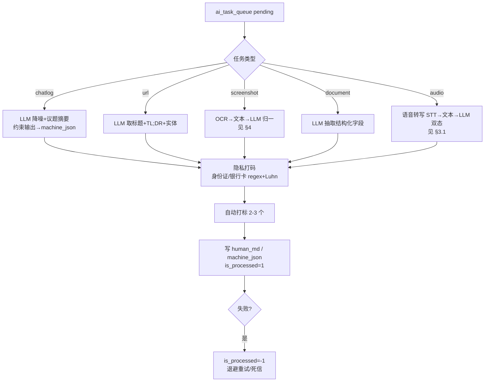
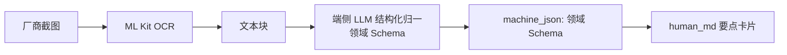

# 拾贝（goodshare）V2 需求文档：离线双态 AI + 通用截图解析

> 版本：V2.0（承接 `product-requirements.md`）
> 范围：将 PRD §6 模块二的「AI 占位」升级为**离线端侧实现**；新增**通用截图解析接口**（发票 / 名片 / 聚会计划等）；覆盖 PRD 模块三便签编辑器最小设计（§5）。多源健康数据接入已决策推迟至 V3（2026-09-27），本文不再覆盖。
> 关联文档：`../product/product-requirements.md`（全局 PRD）、`../architecture/overview.md`（架构）、`../guide/mcp-integration.md`（MCP 接入）。

## 1. 目的与范围

MVP 已跑通「数据进得来 / 双态存得下 / PC 读得到」铁三角，AI 仅占位。V2 目标：

1. **离线双态重构**：用端侧小模型替代云端兜底，完成聊天记录降噪 + 双态剥离 + 自动打标 + 隐私打码，兑现 PRD「完全离线」承诺。
2. **通用截图解析接口**：一套管线解析任意厂商截图（发票 / 名片 / 聚会计划），统一归整为人类态 `human_md` 与机器态 `machine_json`；健康截图场景随健康接入（V3）起用。

## 2. V2 与 MVP 的接口契约

V2 不改变 MVP 的数据模型主干（`inbox_items` 三态字段、`daily_metrics`、`ai_task_queue`），仅**扩展 machine_json 的取值**（健康快照落点随健康接入推迟至 V3）。MCP 工具向后兼容，仅新增 `reparse_item`。

## 3. 模块二升级：离线双态 AI 重构管线

### 3.1 技术选型（系统自带模型，零下载）

> 硬约束：V2 端侧 AI **不下载、不内置任何额外大模型**，仅调用设备厂商提供的系统级 on-device 模型。隐私与离线由系统模型原生保证。

| 平台 | 系统模型 | 接入方式 | 说明 |
|---|---|---|---|
| iOS | **Apple Foundation Models**（`SystemLanguageModel.default`，iOS 26+ / A17+） | Flutter 经 platform channel 或 `flutter_apple_foundation_models` 调用 | 完全端侧、无下载；支持 `Guide` 约束输出（类 GBNF，可锁 JSON Schema） |
| Android | **Gemini Nano via AICore**（`com.google.android.aicore`，Pixel / 部分旗舰 Android 15+） | Jetpack/ML API 或 platform channel | 系统级 on-device；**仅部分设备可用**，缺失则回退 V1（见 §3.7） |
| OCR（通用） | **`google_mlkit_text_recognition`** | Flutter 插件 | **已随 v1 提前落地（2026-09-27 分期调整，标准 GMS 设备，中文脚本）**；截图先 OCR 出文本再喂系统模型；无 GMS 设备待 bundled 变体适配 |
| STT（音频转写，通用） | **`speech_to_text`** | Flutter 插件 | **转写已随 v1 提前落地（2026-09-27 分期调整）**：速记采集时同步端侧转写（onDevice 请求，不支持则 UI 明示仅存音频；Android 系统识别仅实时流，故采集时同步）；仅当系统 STT 支持端侧识别时启用（见 §3.7），长音频分段与文件转写随 V2 LLM 管线增强 |
| 调度 | 复用 `flutter_foreground_task` + `ai_task_queue` | — | 充电/空闲时批处理，避免前台卡顿 |

**关键约束**：系统模型普遍**仅文本、无视觉输入** → 截图解析坚持 OCR-first（§4），不依赖 VLM。结构化输出靠 iOS `Guide`；Android 侧若无语法约束则用「提示词 + JSON 校验/重试」兜底。

### 3.2 为什么离线可行（与 PRD 风险项对应）

PRD §10 风险「完全离线 ↔ 高质量互斥」在 V2 通过**系统模型 + 约束解码 + 任务队列**缓解：系统自带模型对「结构化抽取 / 摘要 / 降噪」类任务足够，且 iOS `Guide` 等机制把输出锁进 Schema，避免幻觉导致 JSON 损坏。质量弱于云端 Haiku，但**零下载、零外泄**是核心卖点，且不受模型体积 / OOM 拖累。

### 3.3 管线流程



### 3.4 数据标注与隐私打码

- **自动打标**：LLM 从内容推断 2–3 个标签写入 `tags`（JSON Array），沿用 MVP 序列化方式。
- **隐私打码**：LLM 产出后必经本地规则层——18 位身份证、银行卡号（Luhn 校验）默认 `****` 打码；打码在端侧完成，原始 `raw_content` 保留但 `human_md/machine_json` 不含明文敏感号。

### 3.5 资源预算与降级

| 维度 | 预算 | 降级策略 |
|---|---|---|
| 模型体积 | **0（不下载/不内置）**，模型由系统拥有 | — |
| 延迟 | 取决于系统模型：Apple A17+ 较快；Gemini Nano 视设备 | 队列异步，不阻塞 UI；闲时/充电批处理 |
| 内存 | App 自身常驻小；模型内存由 OS 管理，不再由本 App 持有 1–2GB | 系统模型不可用时回退 V1（§3.7） |
| 失败 | `is_processed=-1` + 指数退避重试（最多 3 次）→ 死信待人工 | 不阻塞其他队列项 |

### 3.6 移动端落地防御：内存与温控（设备状态感知调度）

> 实战问题（已发现，重构为系统模型场景）：即便不再内置大模型，系统模型推理仍可能在设备低内存 / 过热时被 OS 中断或拒答；且 Android 系统模型碎片化。需在 `ai_task_queue` 调度器中加入**设备状态感知与优雅中断**。

- **模型由 OS 持有**：本 App 不再加载/释放 2GB 权重（该 OOM 风险已消除）；但调用系统模型时应避免在内存/电量紧张时发起，降低被 OS 拒答概率。前台服务（`flutter_foreground_task` dataSync，见 `../architecture/overview.md`）防本进程被回收，与系统模型可用性互补。
- **设备状态感知调度**：充电或电量 ≥ 阈值（建议 40%）才允许加载与推理；低电量时任务停留 `pending` 等待时机；息屏 + 充电时批量处理队列，避免前台交互抢资源。
- **系统内存警告优雅中断**：监听 iOS `didReceiveMemoryWarning` / Android `onTrimMemory`(TRIM_MEMORY_RUNNING_CRITICAL) 与 `ComponentCallbacks2`；触发时：暂停当前系统模型调用 → 任务回滚 `processing→pending` → 释放本地中间缓冲 → **不抛未捕获异常（不崩溃）**；下次调度从 `pending` 续跑。
- **温控节流**：监听 Android `ThermalStatus` / iOS `ProcessInfo.thermalState`；过热（moderate+）暂停推理并提示，降温后恢复。
- **崩溃兜底**：推理外层 `try/catch` 包裹；任何异常均回滚为 `pending`（而非 `-1` 死信），保证 OOM / 中断可自愈重跑。

### 3.7 设备能力门控与 V1 回退

> 分级体验原则：AI 双态重构是**可选增强层**，而非核心依赖。App 的「吞噬口 + 存储 + MCP 网关」始终可用（即 PRD 的 V1 基线，见 `../product/product-requirements.md` §9）；端侧 AI 仅在设备**提供可用系统模型**时解锁，否则回退 V1，且**绝不内置/下载模型**。

- **能力探测（首次启动）**：判系统模型可用性，不判 RAM/存储下载——
  - **iOS**：`SystemLanguageModel.default.isAvailable` 为真（iOS 26+ / A17+ 及以上）→ 解锁；否则 V1。
  - **Android**：AICore / Gemini Nano 可用性查询（`com.google.android.aicore` 能力探测）→ 可用解锁；**不可用设备（绝大多数 Android）直接 V1**，不内置模型。
  - **STT（音频路径独立探测）**：系统 STT 是否支持端侧识别（iOS `requiresOnDeviceRecognition`；Android 端侧识别能力查询）→ 支持才启用音频双态重构，否则音频条目走 V1 占位并在 UI 明示「音频转写不可离线」，不影响其余类型。
  - NPU/芯片由系统模型自身利用，本 App 不感知。
- **运行期路由**：`ai_task_queue` 消费者经 `ReconstructorRegistry.resolve()` 取首个 `isAvailable` 的实现——V2 档走 `SystemModelReconstructor`（§3.8），V1 档走 `PlaceholderReconstructor`（`raw_content` 原样入 `human_md`、`machine_json` 留空、`is_processed=1`），端到端不卡死（与 MVP 占位行为一致）。
- **优雅降级与重评**：档位持久化（`shared_preferences`），「设置」可手动覆盖（强制 V1 / 尝试 V2）；系统模型调用抛错（内存压力 / 不可用）时自动回退 `pending`（与 §3.6 崩溃兜底联动）。系统升级 / 换机后下次启动重测。
- **用户感知**：非 V2 设备，AI 相关入口展示「本机暂不支持离线 AI，已切换基础模式」，避免沉默降级。

### 3.8 AI 能力接口抽象与多实现（可插拔）

> 设计原则：AI 双态重构以**接口**定义能力，具体实现可插拔替换；队列 / UI / MCP 层不耦合任何单一后端。新增一种 AI 后端 = 实现接口 + 注册，消费者零改动。

- **接口契约（Dart 抽象）**：
```dart
/// AI 双态重构能力接口（V2 抽象层）
abstract class AiReconstructor {
  /// 设备是否具备运行该实现的能力（供 §3.7 门控）
  Future<bool> get isAvailable;
  /// 执行双态重构：输入脏数据，产出人类态 / 机器态 / 标签
  Future<ReconstructResult> reconstruct(ReconstructInput input);
}

final class ReconstructResult {
  final String humanMd;                     // 重构后 Markdown
  final Map<String, dynamic>? machineJson;  // 结构化 JSON（可为 null）
  final List<String> tags;                  // 2–3 个自动标签
  final bool masked;                        // 是否已执行隐私打码
  final String? itemType;                   // AI 重分类的逻辑类型（如 image→chatlog），可空表示不改
  final Map<String, List<String>>? facets;  // 多视角聚类：视角→标签（如 {'主题':[...],'事件':[...],'项目':[...]}），可空表示无
}
```
- **实现清单（按优先级）**：
  | 实现 | 档位 | 说明 |
  |---|---|---|
  | `SystemModelReconstructor` | V2 | 调 iOS Foundation Models / Android AICore（§3.1），截图走 OCR-first |
  | `PlaceholderReconstructor` | V1 | 原样复制 `raw_content`→`human_md`、`machine_json` 留空，保证端到端不崩 |
  | `CloudReconstructor`（可选） | 兜底 | 仅当用户显式开启「云端兜底」开关（§8 开放问题②），否则不启用 |
- **路由**：`ai_task_queue` 消费者经 `ReconstructorRegistry.resolve()` 取首个 `isAvailable` 的实现（系统模型优先，缺失回退占位）；§3.6 的内存/温控/崩溃兜底统一在接口调用外层处理。
- **扩展点**：未来接入新后端（厂商 VLM、本地 ONNX 等）仅需新增实现类并注册，管线与 MCP 层不动。

## 4. 通用截图解析接口（ScreenshotParser）

面向**不开放 API 的厂商 App** 截图。核心思路：**不写每家的正则**，而是 OCR → 端侧 LLM 推断结构，天然跨厂商。



| 场景 | 目标 machine_json Schema | 人类态示例 |
|---|---|---|
| 发票 | `invoice.v1`（amount/date/merchant/tax/items） | 报销要点卡片 |
| 名片 | `contact.v1`（name/phone/org/title） | 联系人速记 |
| 聚会计划 | `event.v1`（when/where/attendees/action_items） | 待办 Checklist |

- **入口**：系统分享图片即触发 `task_action='ocr_and_extract'`，LLM 先判定截图领域再套对应 Schema（或并行打分取置信最高）。
- **隐私**：截图 OCR 文本与 LLM 推理全程端侧，不外传。
- **健康场景推迟**：厂商健康 App 截图归一（`health_record.v1`，聚合 `daily_metrics`）随多源健康接入推迟至 **V3**（2026-09-27 决策），届时复用本管线扩展 Schema。

## 5. 便签编辑器（PRD 模块三，最小设计）

PRD §6 模块三承诺的 V2 能力，均依赖 §3.1 系统模型（不可用设备随 §3.7 回退，编辑器保留纯 Markdown 编辑）：

| 能力 | 实现方式 | 说明 |
|---|---|---|
| 离线错别字 / 语法校验 | 系统模型 LLM 校对：选中或保存时送检，返回疑似错误区间 | 端侧、零下载；结果仅高亮提示，不自动改写 |
| Diff 高亮 | 人工编辑与 `human_md` 上版逐行 diff（本地算法，非 AI） | 修改处高亮，可一键还原上版 |
| 一键文风切换 | 系统模型 LLM 改写（口语→职场等预设），产出先 Diff 预览、确认后写入 | 写入 `human_md`（= 人类干预，走 `ItemActionHandler.edit` 同源） |

- 手动干预 `human_md` 为既有编辑路径，本节能力是其 AI 增强；模型不可用/调用失败时降级为纯手动编辑并 UI 明示，不阻塞编辑。

## 6. MCP 接口增量

| 变更 | 说明 |
|---|---|
| 可选 `reparse_item(id)` | 手动重触发某条目双态重构（模型升级后重放） |

（健康相关增量——`query_machine_data` 的 `'health'` 取值、时间线健康样本——随健康接入顺延至 V3。）

其余 MVP 工具保持不变，向后兼容。

## 7. Schema 增量（V2）

- 复用 `inbox_items`，`machine_json` 取值扩展为 `invoice.v1` / `contact.v1` / `event.v1`；`item_type='health'` 与 `health_record.v1` 随健康接入顺延至 V3。
- **无需新建表**，迁移成本最低。

## 8. 风险与开放问题

| 项 | 风险 | 缓解 |
|---|---|---|
| 跨厂商 OCR 漂移 | 个别厂商截图排版怪异 | OCR 文本 + 系统模型容错 + 人工 `reparse_item` 兜底 |
| 系统模型碎片化（Android） | 多数 Android 无统一系统模型，AI 仅 iOS/部分旗舰可用 | 明确 V1 回退基线；不内置模型；UI 明示（§3.7） |
| 系统模型能力受限 | 纯文本 / 上下文短 / JSON 约束弱于 GBNF | OCR-first 截图；提示词 + 校验重试兜底结构化（§3.1） |
| 系统模型中断 / 拒答 | 低内存 / 过热时 OS 拒答或报错 | §3.6 优雅中断 + `try/catch` 回滚 pending 自愈 |
| 能力误判 | 可用性探测不准导致误开 / 漏开 | 手动覆盖开关 + 调用失败自动降档（§3.6/§3.7） |
| 剪贴板嗅探权限 | Android 10+ 仅前台焦点窗口可读剪贴板；iOS 14+ 读取弹系统提示 | 仅 App 前台恢复时读取（合规）；iOS 弹窗配合隐私页明示用途 |
| 无 GMS 设备 OCR 缺口 | 华为/荣耀等无 Play 服务的机器 ML Kit 不可用 | bundled 变体（模型内置 apk）适配待做；先支持标准设备（2026-09-27 决策） |

**开放问题（待决策）**：① Android AICore 不可用时的产品表述（仅 V1 / 提示换机）；② 是否允许「离线失败可临时回落云端」的用户开关（与隐私承诺冲突，需明示）。

## 9. 验收标准

- [ ] 分享一条微信聊天 TXT → 队列离线产出 `human_md`（去噪+议题）+ `machine_json` + 2–3 标签，`is_processed=1`。
- [ ] 分享一张发票 / 名片截图 → OCR→LLM 产出对应领域 Schema（`invoice.v1` / `contact.v1`）。
- [ ] 全程断网可完成上述流程，且无任何对外网络请求（隐私验证）。
- [ ] 身份证/银行卡号在 `human_md/machine_json` 中默认打码。
- [ ] AI 功能开启后，**不触发任何大模型下载**（仅调用系统模型），断网可完成双态重构。
- [ ] 推理中触发系统内存警告 → 当前系统模型调用暂停、任务回滚 `pending`、App 不崩溃，可后续续跑。
- [ ] 仅充电/电量充足时发起系统模型推理；低电量任务停留 `pending` 等待时机。
- [ ] 不支持系统模型的设备（如多数 Android）→ AI 入口提示不可用，核心收集 / MCP 网关仍正常（V1 模式不崩）。
- [ ] 端侧 STT 不可用的设备上，音频条目回退 V1 占位且 UI 明示「音频转写不可离线」，断网验收不受影响。
- [ ] 支持系统模型设备（如 iOS A17+）→ 自动解锁离线 AI，双态重构生效；手动切回 V1 后可恢复基础模式。
